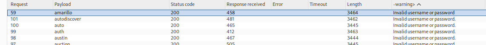
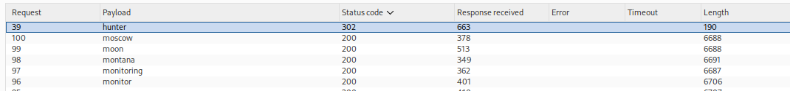

# Lab 04 — Username Enumeration via Subtly Different Responses

## Lab Information

- **Platform:** PortSwigger Web Security Academy
- **Category:** Authentication
- **Lab:** Username enumeration via subtly different responses
- **Difficulty:** Practitioner
- **Vulnerabilities:** Username enumeration and password brute force
- **Status:** Solved

---

## Objective

Enumerate a valid username, brute-force the corresponding password using the provided candidate wordlists, and access the user's account page.

---

## Initial Reconnaissance

I began by testing the application's login functionality and comparing responses for different usernames.

Unlike the previous username-enumeration lab, the application returned the same visible error message for invalid and valid-looking usernames:

```text
Invalid username or password.
```

This meant that simply looking at the displayed error message was not sufficient to identify a valid username.

I therefore inspected the complete HTTP responses in Burp Suite.

---

## Investigating Response Differences

Initial comparison of the responses showed small differences in the HTML.

I noticed that some responses contained:

```html
<body>
    <!-- -->
    <script>
```

while others did not.

I initially considered this to be the username-enumeration signal.

However, when I repeatedly sent the exact same request for `administrator`, the `<!-- -->` marker appeared inconsistently.

This demonstrated that the marker was not a reliable indicator of username validity.

The false lead was therefore discarded.

---

## Using Burp Comparer

I used Burp Comparer to identify the exact differences between responses rather than relying only on response length.

The visible authentication error remained:

```text
Invalid username or password.
```

The subtle difference was eventually identified in the punctuation of the message.

The normal response contained:

```text
Invalid username or password.
```

while the response for the valid username candidate `amarillo` contained:

```text
Invalid username or password
```

The final period was missing.

This provided a reliable username-enumeration signal.

---

## Grep - Extract

Because the difference was very small and buried inside the full HTML response, I used Burp Intruder's **Grep - Extract** functionality.

The relevant authentication error message was extracted from each response so that the results could be compared directly.

The candidate username list was then tested using Intruder.

The extracted response made the anomalous result easier to identify:

```text
Normal:
Invalid username or password.

amarillo:
Invalid username or password
```



---

## Valid Username

The candidate:

```text
amarillo
```

was identified as the valid username.

The subtle difference in the authentication response indicated that the application recognized the username even though the visible error message was intentionally made almost identical to the response for invalid usernames.

---

## Password Brute Force

After identifying the valid username, I changed the Intruder payload position from the username to the password.

The request was configured conceptually as:

```http
POST /login HTTP/2

username=amarillo&password=§test§
```

The provided candidate password list was loaded into Intruder.

The attack was used to identify a response that differed from the normal failed-login responses.



The candidate password:

```text
hunter
```

produced a successful authentication response:

```http
HTTP/2 302 Found
Location: /my-account?id=amarillo
```

The different status code and response behavior indicated that the password was likely correct.

---

## Verification

I verified the credentials by logging in normally through the browser using:

```text
Username: amarillo
Password: hunter
```

The login succeeded and the account page was accessible.

The PortSwigger lab was successfully completed.


---

## Attack Flow

```text
Login page
    ↓
Test invalid usernames
    ↓
Observe apparently identical authentication errors
    ↓
Inspect complete responses
    ↓
Investigate response differences
    ↓
Discard inconsistent <!-- --> marker
    ↓
Identify subtle punctuation difference
    ↓
Use Grep - Extract
    ↓
Enumerate candidate usernames
    ↓
amarillo identified
    ↓
Verify username
    ↓
Use Intruder against password parameter
    ↓
hunter produces successful response
    ↓
Verify credentials through browser
    ↓
Access account page
    ↓
Lab solved
```

---

## Vulnerability

The application is vulnerable to **username enumeration through subtly different responses**.

Although the visible error message appears identical:

```text
Invalid username or password.
```

the application produces a subtle difference in the response for a valid username.

For the valid username, the final period is omitted:

```text
Invalid username or password
```

This allows an attacker to distinguish valid accounts from invalid accounts.

---

## Password Brute Force

Once a valid username was identified, the application's authentication mechanism allowed repeated password attempts.

This allowed the candidate password list to be tested against:

```text
amarillo
```

until the successful password was identified:

```text
hunter
```

---

## Burp Suite Methodology

This lab demonstrated several useful Burp techniques:

```text
HTTP History
    ↓
Identify login request
    ↓
Repeater / manual comparison
    ↓
Investigate response differences
    ↓
Comparer
    ↓
Identify subtle differences
    ↓
Intruder
    ↓
Grep - Extract
    ↓
Extract relevant response content
    ↓
Identify valid username
    ↓
Intruder
    ↓
Password testing
    ↓
Verify successful response
```

A particularly important lesson was that response length alone should not automatically be treated as evidence of a vulnerability.

The underlying response content should be investigated to determine what causes the difference.

---

## Methodology Lessons

### Do not trust the first anomaly

The `<!-- -->` marker initially appeared promising because it correlated with some response-length differences.

However, repeated requests for the same username produced inconsistent results.

The observation was therefore treated as a false lead rather than being assumed to indicate a valid username.

### Isolate the meaningful response component

Instead of comparing entire HTML responses, the authentication error message was extracted using **Grep - Extract**.

This made a one-character difference immediately visible.

### Verify automated findings

Intruder was used to identify candidates, but the result was verified manually before being considered confirmed.

The same principle was applied to the password:

```text
Intruder anomaly
    ↓
Manual login
    ↓
Confirmed access
```

---

## Key Takeaways

1. Username enumeration does not always produce obvious differences.
2. Applications may deliberately return identical visible error messages while still leaking information through the underlying response.
3. Response length can reveal anomalies, but the underlying content should be investigated before treating the anomaly as meaningful.
4. Burp Comparer can help isolate subtle differences between responses.
5. Burp Intruder's Grep - Extract feature can extract specific response content for easier comparison.
6. A single missing character can be enough to enable username enumeration.
7. Inconsistent response differences should be treated as potential noise until reproduced and understood.
8. After identifying a valid username, password testing can be performed against that specific account.
9. Intruder is useful for automation, while Repeater and the browser can be used to verify findings.
10. Successful exploitation should always be confirmed by demonstrating actual account access.
