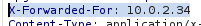
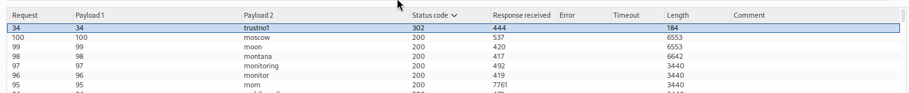

# Lab 05 — Username Enumeration via Response Timing

## Lab Information

- **Platform:** PortSwigger Web Security Academy
- **Category:** Authentication
- **Lab:** Username enumeration via response timing
- **Difficulty:** Practitioner
- **Vulnerabilities:** Username enumeration via response timing, IP-based rate-limit bypass, password brute force
- **Status:** Solved

---

## Objective

Enumerate a valid username using differences in authentication response times, brute-force the user's password using the supplied candidate password list, and access the user's account page.

---

## Initial Reconnaissance

I began by testing the login functionality with valid and invalid credentials and observing the response times.

The initial hypothesis was that the application might process valid usernames differently from nonexistent usernames.

The reasoning was:

```text
Invalid username
    ↓
Username lookup fails
    ↓
Application returns response

Valid username
    ↓
Username lookup succeeds
    ↓
Password verification is performed
    ↓
Application returns response
```

Because password verification can require additional processing, a valid username could potentially produce a consistently slower response.

---

## Establishing a Timing Baseline

I compared repeated requests using:

```text
wiener + wrong password
```

against:

```text
Invalid username + wrong password
```

The observed timings showed that `wiener` generally took longer to process than a clearly invalid username.

Example measurements:

```text
wiener + wrong password:
592
607
601
556
631
670
533
583
621 ms

Invalid username + wrong password:
500
438
402
501
566
498
590
402
583
497 ms
```

The results were not perfectly separated because network and application timing contains noise, but they supported the hypothesis that valid usernames required additional password-processing work.

---

## IP-Based Rate Limiting

During testing, the application eventually returned:

```text
You have made too many incorrect login attempts.
Please try again in 30 minute(s).
```

This demonstrated that the authentication endpoint implemented IP-based brute-force protection.

The lab hint indicated that this protection could be bypassed by manipulating an HTTP request header.

I tested:

```http
X-Forwarded-For: 10.0.0.1
```

and confirmed that the application treated the request as originating from a different client IP.

Changing the `X-Forwarded-For` value allowed the timing enumeration attack to continue without repeatedly triggering the same IP-based rate limit.



---

## Bypassing the Rate Limit

The application was effectively using the client IP as part of its rate-limiting mechanism.

By changing the client-supplied IP value:

```text
Request 1 → X-Forwarded-For: 10.0.0.1
Request 2 → X-Forwarded-For: 10.0.0.2
Request 3 → X-Forwarded-For: 10.0.0.3
...
```

each request was treated as originating from a different IP address.

This allowed the username enumeration attack to be performed without hitting the same IP-based threshold.

---

## Username Enumeration

I configured Burp Intruder using a **Pitchfork** attack.

The two synchronized payload positions were:

```text
Payload 1 → X-Forwarded-For IP value
Payload 2 → Candidate username
```

The IP payload was generated using:

```text
From: 1
To: 101
Step: 1
```

producing:

```text
10.0.0.1
10.0.0.2
10.0.0.3
...
10.0.0.101
```

There were 101 candidate usernames, allowing the two payload lists to be paired one-to-one.

The password was kept constant during username enumeration.

---

## Timing Analysis

The majority of usernames produced response times in the approximate range of:

```text
340–700 ms
```

One candidate stood out significantly:

```text
an → approximately 1377 ms
```

The large timing difference made `an` a strong candidate for a valid username.

Importantly, I did not immediately treat a single slow request as proof.

I sent the `an` request repeatedly through Repeater and confirmed that the elevated response time was reproducible.

Therefore:

```text
Valid username candidate:
an
```

---

## Password Brute Force

After identifying and verifying the username, I switched to the password-enumeration phase.

The attack kept:

```text
username = an
```

constant while changing:

```text
X-Forwarded-For
password
```

The Pitchfork attack synchronized the changing IP values with the candidate passwords so that each password attempt was associated with a different apparent client IP.

The Intruder results identified a successful authentication response for:

```text
Password: trustno1
```

The successful request returned a different response from the normal failed-login requests.



---

## Final Verification

I manually logged in through the browser using:

```text
Username: an
Password: trustno1
```

The login succeeded and the account page was accessible.

The PortSwigger lab was successfully completed.


---

## Attack Flow

```text
Login reconnaissance
        ↓
Establish timing baseline
        ↓
Compare valid and invalid usernames
        ↓
Identify possible timing side channel
        ↓
Rate limiting encountered
        ↓
Identify IP-based brute-force protection
        ↓
Test X-Forwarded-For
        ↓
Confirm rate-limit bypass
        ↓
Pitchfork: changing IP + username
        ↓
Analyze response timing
        ↓
Identify "an" as timing outlier
        ↓
Verify "an" in Repeater
        ↓
Pitchfork: changing IP + password
        ↓
Keep username = an
        ↓
Identify trustno1
        ↓
Verify credentials through browser
        ↓
Access account
        ↓
Lab solved
```

---

## Vulnerabilities

### Username Enumeration via Response Timing

The application processes valid usernames differently from nonexistent usernames.

A valid username causes additional password-verification processing, resulting in a measurable response-time difference.

An attacker can exploit this timing side channel to enumerate valid accounts.

### Weak IP-Based Rate Limiting

The application's brute-force protection relied on a client IP value that could be influenced using:

```http
X-Forwarded-For
```

Because the application trusted this client-controlled header, the apparent source IP could be changed between requests, bypassing the IP-based rate limit.

### Password Brute Force

Once a valid username was identified, the application's authentication mechanism allowed candidate passwords to be tested repeatedly.

The rate-limit bypass allowed the password list to be tested without repeatedly triggering the same IP-based protection.

---

## Burp Suite Techniques Used

### Repeater

Used to:

* Establish timing baselines
* Compare valid and invalid username behavior
* Investigate the rate-limit response
* Test `X-Forwarded-For`
* Verify the `an` timing anomaly
* Confirm the final credentials

### Intruder

Used for:

* Username enumeration
* Timing analysis
* Password brute force

### Pitchfork

Used because two payload values needed to change together:

```text
IP address ↔ username
```

and later:

```text
IP address ↔ password
```

---

## Methodology Lessons

### Establish a baseline before automating

Repeated requests were used to understand normal response-time behavior before launching the larger Intruder attack.

Timing attacks require a baseline because network and server latency can introduce significant noise.

### Do not trust a single timing outlier

A single slow request does not prove that a username is valid.

A candidate should be:

1. Identified as an outlier.
2. Re-tested repeatedly.
3. Compared against the normal timing distribution.
4. Manually verified.

This was done with `an`.

### Check defensive controls before large-scale attacks

The lab's rate limiting was encountered during the authentication testing process.

A better workflow is to identify rate limits and lockout controls before launching a large automated attack.

### Understand what the rate limiter uses as its key

The lab's protection relied on the apparent client IP.

Because the application trusted `X-Forwarded-For`, that value could be manipulated to bypass the protection.

### Separate enumeration from brute force

The attack was performed in two stages:

```text
Username enumeration
        ↓
an
        ↓
Password brute force
        ↓
trustno1
```

This is more efficient than attempting every username/password combination blindly.

---

## Key Takeaways

1. Authentication responses can leak information through timing even when their visible content is identical.
2. A valid username may require additional password-verification processing, creating a measurable timing difference.
3. Timing measurements are noisy, so individual outliers must be verified.
4. A fixed password should be used when testing username timing so that the username is the primary variable.
5. Burp Intruder can automate timing-based username enumeration.
6. Pitchfork is useful when two payload values need to change synchronously.
7. IP-based rate limiting should be identified before launching large authentication attacks.
8. Trusting client-controlled IP headers such as `X-Forwarded-For` can make IP-based rate limiting ineffective.
9. After identifying a valid username, password enumeration can be performed against that account.
10. Automated findings should always be manually verified.
11. Successful authentication is the final confirmation of the discovered credentials.

---

## Credentials Discovered

```text
Username: an
Password: trustno1
```

---

## Final Result

Successfully enumerated the valid username `an`, identified the password `trustno1`, logged into the account, and completed the PortSwigger lab.
