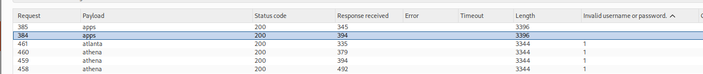
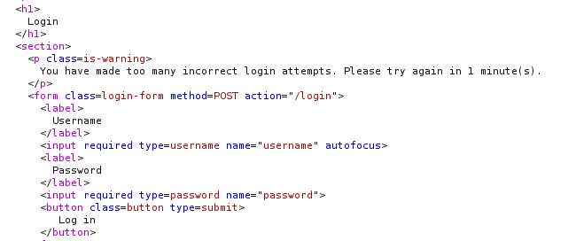
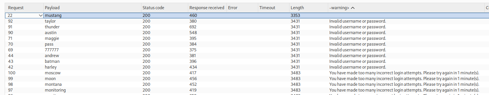
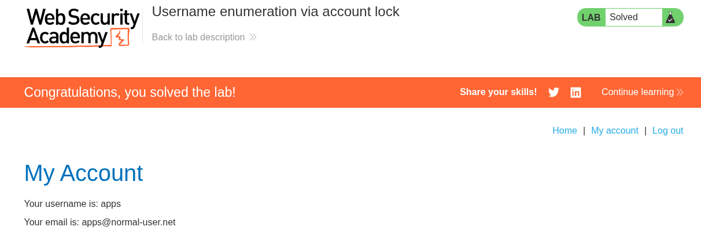

# Lab 07 — Username Enumeration via Account Lock

## Lab Information

- **Platform:** PortSwigger Web Security Academy
- **Category:** Authentication
- **Lab:** Username enumeration via account lock
- **Difficulty:** Practitioner
- **Vulnerability:** Username enumeration through account-lock behavior
- **Status:** Solved

---

## Objective

Enumerate a valid username using the application's account-locking behavior, brute-force the user's password, and access their account page.

The lab provides:

- Candidate usernames
- Candidate passwords

---

## Initial Reconnaissance

I started by inspecting the login functionality.

I submitted an invalid username and password and captured the login request in Burp Suite.

The request was sent to Repeater for further analysis.

I inspected:

- HTTP method
- Request parameters
- Headers
- Cookies/session behavior
- Status code
- Response body
- Response length
- Redirects
- Error messages
- Response behavior across repeated requests

---

## Initial Account-Lock Testing

I first tested repeated failed authentication attempts using a clearly invalid username.

More than 60 requests were sent within approximately one minute.

The application did not produce an account-lock response.

I then repeated the test using a username from the supplied candidate username list, again using an incorrect password.

The responses initially appeared the same and no lockout was observed during the initial manual testing.

This led to the hypothesis that account locking might only apply when the username corresponds to an actual account.

---

## Account-Lock Enumeration

The key hypothesis was:

```text
Invalid username
        ↓
No corresponding account
        ↓
Nothing to lock
        ↓
Normal authentication response

Valid username
        ↓
Account exists
        ↓
Repeated failed authentication
        ↓
Account becomes locked
        ↓
Different response
```

To test this efficiently, I generated a username list where each candidate username appeared five consecutive times.

For example:

```text
user1
user1
user1
user1
user1
user2
user2
user2
user2
user2
...
```

This allowed each candidate username to receive enough consecutive failed attempts to trigger the account-lock behavior if the account existed.

---

## Python Payload Generation

I used Python to generate the repeated username list.

```python
with open('username.txt', 'r') as f:
    usernames = [line.strip() for line in f if line.strip()]


repeated = []
for user in usernames:
    for _ in range(5):
        repeated.append(user)


with open('repeated_usernames.txt', 'w') as f:
    f.write('\n'.join(repeated) + '\n')


print(f"done! total entries: {len(repeated)}")
```

With 101 candidate usernames, this generated:

```text
101 × 5 = 505 requests
```

The resulting file was loaded into Burp Intruder as the username payload.

---

## Burp Intruder — Username Enumeration

The login request was sent to Burp Intruder.

The username parameter was selected as the payload position:

```http
username=§username§&password=example
```

The generated `repeated_usernames.txt` file was used as the payload.

The password remained constant.

The purpose was to cause each candidate username to receive five consecutive failed login attempts.

---

## Enumeration Oracle

Most candidate usernames continued returning the normal authentication response:

```text
Invalid username or password.
```

One username eventually produced a different response:

```text
You have made too many incorrect login attempts.
Please try again in 1 minute(s).
```

The username associated with this response was:

```text
apps
```

This indicated that `apps` corresponded to an existing account because the application was able to lock the account after repeated failed authentication attempts.

The account-lock response therefore acted as the **username enumeration oracle**.



---

## Account-Lock Confirmation

The important behavioral difference was:

```text
Invalid username
        ↓
Invalid username or password.
        ↓
No account lock

apps
        ↓
Repeated incorrect attempts
        ↓
You have made too many incorrect login attempts.
        ↓
Account locked
```

This demonstrated that the application treated valid and invalid usernames differently.



---

## Password Brute Force

After identifying the valid username as:

```text
apps
```

I waited for the temporary account lock to reset.

A new Burp Intruder attack was created using the login request.

This time, I used a **Sniper** attack because only the password parameter needed to be fuzzed.

The request was configured conceptually as:

```http
username=apps&password=§password§
```

The supplied candidate password list was loaded as the payload.

---

## Grep - Extract

I configured Burp Intruder to extract the authentication error message from each response.

The normal failed authentication response contained:

```text
Invalid username or password.
```

The Intruder results showed several different extracted responses.

One password produced **no authentication error message**.

That password was:

```text
mustang
```

The absence of the normal error indicated that `mustang` was a strong candidate for the correct password.



---

## Final Verification

The discovered credentials were:

```text
Username: apps
Password: mustang
```

I manually logged in using these credentials.

The login succeeded and the account page was accessible.

The PortSwigger lab was successfully completed.



---

## Attack Flow

```text
Initial login reconnaissance
        ↓
Test invalid username
        ↓
Test repeated failed attempts
        ↓
Investigate account-lock behavior
        ↓
Hypothesis:
valid accounts may be lockable
        ↓
Repeat each candidate username 5×
        ↓
Compare responses
        ↓
Account-lock response identified
        ↓
Valid username = apps
        ↓
Wait for lock to reset
        ↓
Sniper password attack
        ↓
Grep - Extract authentication errors
        ↓
Password with no error = mustang
        ↓
Manual login verification
        ↓
Lab solved
```

---

## Vulnerability

The application is vulnerable to **username enumeration through account-lock behavior**.

The application responds differently depending on whether a supplied username corresponds to an existing account.

An invalid username does not result in an account being locked, while repeated failed authentication attempts against a valid username eventually cause an account-lock response.

An attacker can therefore distinguish valid usernames from invalid usernames by repeatedly submitting authentication attempts and observing the locking behavior.

---

## Burp Suite Techniques Used

### Repeater

Used to:

* Inspect the login request.
* Establish the normal failed-login response.
* Test repeated authentication attempts.
* Investigate account-lock behavior.
* Compare authentication responses.

### Intruder

Used for:

* High-volume username enumeration.
* Password brute force.

### Sniper

Used during the password phase because only one payload position needed to change:

```text
password=§candidate§
```

### Grep - Extract

Used to extract authentication error messages from password-attempt responses.

The absence of the normal authentication error identified the successful password candidate.

---

## Python

A Python script was used to generate the repeated username payload.

The transformation was:

```text
Candidate usernames
        ↓
Repeat each username 5 times
        ↓
repeated_usernames.txt
```

This provided an alternative to Burp Intruder's Null Payload technique.

A Burp-native alternative would have been to use a Cluster Bomb attack with:

* Payload set 1: candidate usernames
* Payload set 2: Null payloads
* Generate 5 payloads

This would effectively repeat each username five times.

For this lab, I used the Python-generated list instead.

---

## Methodology Lessons

### Account locking can become an enumeration oracle

Account locking is normally a defensive mechanism, but differences in how it is applied can leak information.

The important question was not simply:

> "Can I bypass the account lock?"

It was:

> **"Does the account-lock behavior itself reveal whether the username exists?"**

### Don't assume the lockout mechanism

Initial testing did not reveal the lockout immediately.

Rather than assuming a specific implementation, the behavior was investigated experimentally.

### Use controlled automation

Once the behavior was understood, the candidate username list was repeated systematically so that each username received enough attempts to trigger the lock if it represented a real account.

### Separate username enumeration from password brute force

The attack was performed in two distinct phases:

```text
Username enumeration
        ↓
apps
        ↓
Password brute force
        ↓
mustang
```

This avoids blindly attempting every username/password combination.

### Choose the Intruder attack type based on the problem

Username enumeration required repeated values for each candidate username.

The password phase only required one changing parameter, making **Sniper** appropriate.

### Verify automated findings manually

The Intruder/Grep result identified `mustang` as the likely password.

The final confirmation came from successfully logging in with:

```text
apps:mustang
```

---

## Key Takeaways

1. Account-locking behavior can leak whether a username exists.
2. Invalid usernames may not trigger account locking because there is no account to lock.
3. A valid username can produce a different response after repeated failed authentication attempts.
4. Account-lock responses can therefore act as a username-enumeration oracle.
5. Repeating each candidate username multiple times can expose the lockout behavior.
6. Python can be used to generate custom Burp Intruder payload lists.
7. Burp Intruder's Null Payloads can provide an alternative way to repeat payloads.
8. Once a valid username is identified, password brute force can be performed separately.
9. Sniper is appropriate when only one parameter needs to be fuzzed.
10. Grep - Extract can help identify successful authentication responses by extracting error messages.
11. Automated results should be manually verified before considering credentials confirmed.
12. Defensive mechanisms should be analyzed for information leakage, not automatically treated as obstacles that must be bypassed.

---

## Credentials Discovered

```text
Username: apps
Password: mustang
```

---

## Final Result

Successfully enumerated the valid username `apps` through the account-lock response, identified the password `mustang`, logged into the account, and completed the PortSwigger lab.
