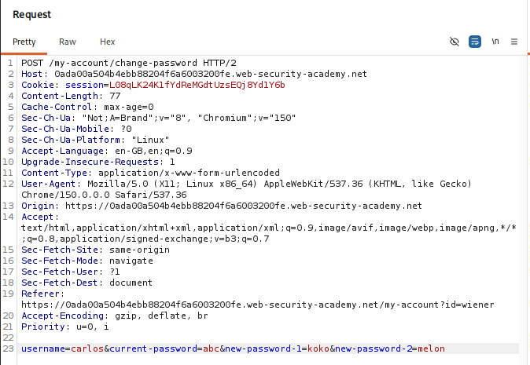
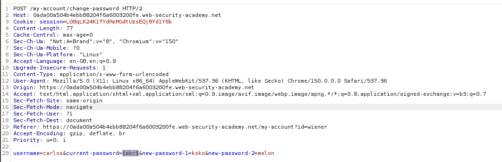
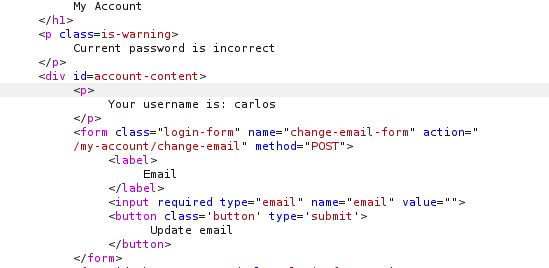
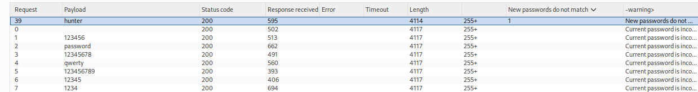
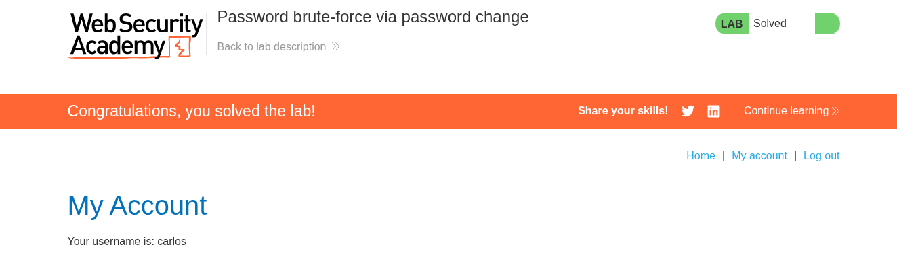

# Lab 12 — Password Brute-Force via Password Change

## Lab Information

- **Platform:** PortSwigger Web Security Academy
- **Category:** Authentication
- **Lab:** Password brute-force via password change
- **Difficulty:** Practitioner
- **Vulnerability:** Password brute-forcing through flawed password-change logic
- **Status:** Solved

---

## Objective

The lab's password-change functionality is vulnerable to brute-force attacks.

The objective was to use the supplied candidate password list to identify Carlos's current password and then access his **My account** page.

Provided credentials:

```text
Username: wiener
Password: peter
```

Victim:

```text
Username: carlos
```

---

## Initial Reconnaissance

I first browsed the application normally as a regular user and investigated the account and password-change functionality.

I logged in as `wiener` and inspected:

```text
GET /my-account?id=wiener
```

After login, I observed two session cookies.

For analysis, I referred to them as:

```text
session1
session2
```

`session2` was generated during login and was required for the password-change functionality.



---

## Password-Change Endpoint

The password-change request was:

```http
POST /my-account/change-password HTTP/2
Host: [LAB-DOMAIN]
Cookie: session=[session2]

username=wiener&current-password=peter&new-password-1=pass1&new-password-2=pass2
```

I tested the endpoint manually in Burp Repeater and recorded the response behavior across various input scenarios.

### Incorrect current password

When the current password was incorrect, the application responded with:

```text
302 Found
Location: /login
```

or:

```text
Current password is incorrect
```

### Mismatched new passwords

When the new password and confirmation password did not match, the application returned:

```http
HTTP/2 200 OK
```

with the error message:

```text
New passwords do not match
```

There was no lockout or rate-limiting enforced when only the new-password fields were mismatched.

This distinct difference in application behavior provided the foundation for constructing a high-fidelity password-validation oracle.

---

## Session Cookie Testing

I tested the two session cookies individually to identify authorization boundaries and session dependencies.

### Removing `session1`

When `session1` was removed while `session2` remained present, the password-change request could still be processed normally by the back-end application.

Crucially, I could also modify the `username` parameter in the POST body to:

```text
username=carlos
```

and receive a response concerning Carlos's current password rather than Wiener's.

For example:

```text
Current password is incorrect
```

This confirmed that the password-change functionality blindly trusted the user-supplied `username` parameter to look up account credentials rather than enforcing the identity bound to the authenticated session.

### Removing `session2`

When `session2` was removed, the password-change functionality was rejected and could no longer be used.

Therefore, the attack retained `session2` while stripping `session1`.

---

## Important Logic Flaw

A critical logic flaw was discovered in the sequential validation order of the password-change routine when:

```text
username=carlos
```

and:

```text
current-password=<candidate>
```

were submitted while the new password fields deliberately did not match:

```text
new-password-1=pass1
new-password-2=pass2
```

The application executed the **current password validation check** before reaching the **new password matching validation check**.

This produced two distinct, deterministic outcomes:

### Wrong candidate password

The current-password check fails immediately:

```text
Current password is incorrect
```

### Correct candidate password

The current-password check succeeds, allowing execution to proceed to the next validation step:

```text
New passwords do not match
```

This created a reliable password-validation oracle that revealed whether any candidate password for Carlos was valid without requiring prior authentication as Carlos.

---

## Why Deliberately Mismatched New Passwords Were Used

The new password fields were deliberately kept different:

```text
new-password-1=pass1
new-password-2=pass2
```

where:

```text
pass1 != pass2
```

This technique was vital because:

1. It prevented the brute-force attack from actually resetting or modifying Carlos's password upon discovering the correct candidate.
2. It forced the application to halt execution and return `New passwords do not match` after successfully verifying the current password.
3. It preserved the victim's original password so that normal authentication could be verified afterward.

The evaluation flow operated as follows:

```text
Candidate current password
        ↓
        ├── Wrong
        │     ↓
        │  "Current password is incorrect"
        │
        └── Correct
              ↓
        "New passwords do not match"
```

---

## Intruder Attack

I sent the password-change request to **Burp Intruder** to automate testing the candidate password wordlist.

Because only the `current-password` parameter needed to change dynamically across iterations, I configured a **Sniper** attack.

The request payload position was configured as:

```http
POST /my-account/change-password HTTP/2
Host: [LAB-DOMAIN]
Cookie: session=[session2]
Content-Type: application/x-www-form-urlencoded

username=carlos&current-password=§candidate-password§&new-password-1=pass1&new-password-2=pass2
```

Configuration details:

* **Attack Type:** Sniper
* **Payload Set:** Simple list (supplied candidate password list)
* **Payload Position:** `current-password`
* **Session State:** Retained `session2`, omitted `session1`
* **Mismatched Fields:** `new-password-1=pass1`, `new-password-2=pass2`



---

## Response Analysis

During the Intruder attack, candidate evaluation was monitored in real time.

All incorrect password candidates returned the standard failure response:

```text
Current password is incorrect
```



However, exactly one candidate produced a distinct response:

* **Status Code:** `HTTP/2 200 OK`
* **Response Body:** `New passwords do not match`



This confirmed that the corresponding candidate successfully passed the current-password validation check for user `carlos`.

I immediately paused the Intruder attack to prevent unnecessary server requests.

---

## Credential Verification

To verify that the discovered candidate was Carlos's actual password rather than an artifact of Intruder anomalies, I tested the credentials through the primary login interface:

```http
POST /login HTTP/2
Host: [LAB-DOMAIN]

username=carlos&password=<discovered-password>
```

The authentication was successful, issuing a legitimate session cookie for Carlos.

I then accessed Carlos's **My account** page:

```text
GET /my-account?id=carlos
```

and successfully completed the lab.



---

## Complete Attack Chain

```text
Normal reconnaissance as wiener
        ↓
Identify password-change endpoint (/my-account/change-password)
        ↓
Analyze session cookies (session1 vs session2)
        ↓
Discover password-change requires only session2
        ↓
Remove session1 while retaining session2
        ↓
Modify username parameter to carlos
        ↓
Observe current-password validation order
        ↓
Use deliberately mismatched new passwords (pass1 != pass2)
        ↓
Create password-validation oracle
        ↓
Send request to Burp Intruder (Sniper)
        ↓
Load candidate wordlist into current-password
        ↓
Identify anomalous response ("New passwords do not match")
        ↓
Recover Carlos's valid password
        ↓
Verify credentials via standard /login
        ↓
Access Carlos's My account page
        ↓
Lab solved
```

---

## Vulnerability & Root Cause Analysis

The application suffered from two interrelated security flaws:

### 1. Insecure Parameter-Based Identity Trust (Broken Object-Level Authorization)

The password-change endpoint accepted the target account name via an untrusted request parameter (`username=carlos`) rather than deriving the identity exclusively from the authenticated server-side session. This allowed authenticated users to target password operations against arbitrary foreign accounts.

### 2. Information Leakage via Flawed Validation Order (Authentication Oracle)

The server executed password validation sequentially rather than atomically:

1. Check if `current-password` matches the stored hash for `username`.
2. If invalid, return `Current password is incorrect`.
3. If valid, compare `new-password-1` with `new-password-2`.
4. If mismatched, return `New passwords do not match`.

By providing mismatched new passwords, an attacker prevented account state modification while receiving a clear confirmation of whether the current password was correct.

---

## Impact

- **Account Takeover:** Full compromise of any user account (including administrative accounts) using wordlist-based password brute forcing.
- **Bypass of Standard Login Defenses:** Attackers can bypass login-page account lockout policies and rate limiting by routing brute-force attempts through secondary authenticated workflows.
- **Silent Credential Harvest:** Deliberate new-password mismatching allows an attacker to discover valid credentials without alerting the victim via unexpected password resets.

---

## Remediation

### 1. Bind Identity to Session State

Never trust client-supplied `username` or `user_id` parameters in password-change, password-reset, or profile-update endpoints. The target user identity must be strictly retrieved from the validated server-side session object:

```python
# Vulnerable
target_user = request.form.get("username")

# Secure
target_user = session.get("authenticated_user")
```

### 2. Implement Atomic Input Validation

Validate new password formatting and confirmation equality **before** performing any database lookups or cryptographic hash verifications. If the new password confirmation fails, terminate the request immediately without evaluating the current password.

### 3. Implement Generic Error Responses and Rate Limiting

Apply strict rate limiting and brute-force protection to password-change endpoints, and return uniform error responses that do not reveal intermediate validation states.

---

## Evidence

### `01-password-change-recon.png`

Burp Repeater showing the password-change request and the session/username behavior discovered during initial reconnaissance.

### `02-password-change-intruder-setup.png`

Burp Intruder configuration showing Sniper attack mode, `username=carlos`, payload position on `current-password`, and deliberately mismatched new passwords.

### `03-carlos-password-found.png`

Intruder results showing the anomalous candidate returning `HTTP 200 OK` with `New passwords do not match`.

### `03b-incorrect-password-response.png`

Supporting baseline response showing the standard `Current password is incorrect` response returned for invalid candidates.

### `04-carlos-account-and-lab-solved.png`

Final evidence showing successful login as Carlos, access to his **My account** page, and the PortSwigger lab marked as solved.

---

## Methodology Lessons

### 1. Recon before brute force

Instead of immediately sending large candidate lists to login endpoints, investigate secondary workflows:

* Request parameters
* Response codes and lengths
* Error messages
* Session cookie requirements
* Parameter trust and authorization boundaries
* Validation execution order

### 2. Exploit execution order as an oracle

Multi-step validations often leak internal state when earlier checks succeed and subsequent checks fail. Identifying the precise validation sequence allows attackers to construct high-signal oracles.

### 3. Non-destructive brute forcing

Deliberately failing a downstream validation check (such as mismatching new passwords) allows password verification without altering the victim's account state or destroying access.

### 4. Independently verify discovered credentials

Always verify candidate passwords against the standard authentication interface (`/login`) to ensure findings are authentic and actionable.

---

## Key Takeaways

1. Password-change functionality must never accept a client-controlled username parameter; identity must be enforced strictly server-side from the session.
2. Sequential validation logic creates response differences that turn secondary features into authentication oracles.
3. Session cookies should be analyzed individually to identify which tokens are strictly validated and which can be omitted.
4. Downstream validation failures can be leveraged to safely test credentials without modifying victim account data.
5. Rate limiting and brute-force defenses must be applied consistently across all authentication-related endpoints, not just the primary login page.
6. Burp Intruder Sniper is optimal when brute-forcing a single parameter in a structured request.
7. Discovered credentials should always be confirmed through normal login workflows to complete the attack chain.

---

## Final Result

Successfully exploited the password-change logic flaw and sequential validation oracle to brute-force Carlos's current password using the supplied candidate wordlist, identified the correct credential via the `New passwords do not match` response difference, verified the credential via standard login, accessed Carlos's **My account** page, and completed the PortSwigger lab.
