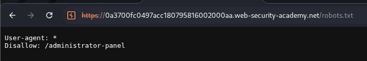
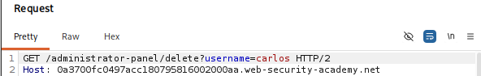
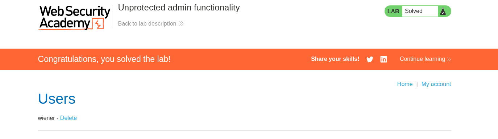
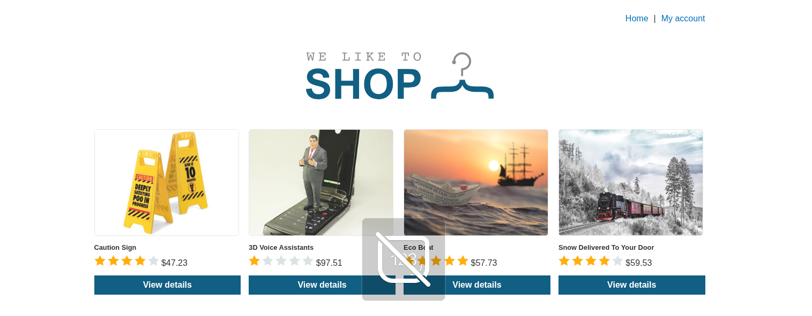

# Lab 01 — Unprotected Admin Functionality

## Lab Information

- **Platform:** PortSwigger Web Security Academy
- **Category:** Access Control
- **Lab:** Unprotected admin functionality
- **Vulnerability:** Broken Access Control / Unprotected Administrative Functionality
- **Status:** Solved

---

## Objective

Delete the user `carlos` from the application.

---

## Initial Reconnaissance

The application presented a shopping interface containing products, prices, ratings, a `My account` section, and product detail pages.

During normal application exploration, no administrative functionality was exposed through the visible interface.

I then inspected the application's `robots.txt` file.



The response contained:

```text
User-agent: *
Disallow: /administrator-panel
```

This revealed the existence of the `/administrator-panel` endpoint.

> `robots.txt` is not an access-control mechanism. It only provides instructions to web crawlers.

---

## Discovering the Administrative Panel

I navigated to:

```text
/administrator-panel
```

The endpoint returned:

```text
HTTP/2 200 OK
```

The administrative panel was accessible without requiring administrator authentication.

The panel displayed users including:

* `weiner`
* `carlos`

This indicated that administrative functionality was exposed to a normal user.

No screenshot was taken at this stage, so this observation is documented based on the behavior observed during the lab.

---

## Identifying the Privileged Action

The administrative panel contained functionality to delete users.

When attempting to delete `carlos`, Burp Proxy intercepted the following request:

```http
GET /administrator-panel/delete?username=carlos HTTP/2
Host: [LAB-DOMAIN]
```



The request can be broken down as:

```text
HTTP method:       GET

Path:              /administrator-panel/delete

Parameter name:    username

Parameter value:   carlos
```

The endpoint performs a privileged administrative action based on the supplied username.

---

## Exploitation

The application did not enforce appropriate authorization checks on the administrative endpoint.

A normal user could therefore access the administrative functionality and invoke the user-deletion action.

I forwarded the intercepted request through Burp Proxy.

The user `carlos` was successfully deleted and the PortSwigger lab was marked as solved.



---

## Vulnerability

The application suffers from **broken access control**, specifically an **unprotected administrative function**.

A normal user can directly access an administrator-only endpoint because the application fails to properly enforce authorization.

The important issue is not that the endpoint was hidden. The issue is that the server did not verify whether the requesting user was authorized to perform the administrative action.

---

## Attack Flow

```text
Normal user
     ↓
Application reconnaissance
     ↓
robots.txt
     ↓
/administrator-panel discovered
     ↓
Admin panel accessible
     ↓
Delete functionality discovered
     ↓
GET /administrator-panel/delete?username=carlos
     ↓
No authorization check
     ↓
Carlos deleted
```

---

## Impact

An unauthorized user could access administrative functionality.

Depending on the application's available administrative operations, broken access control could allow actions such as:

* deleting users
* modifying users
* accessing administrative data
* changing application settings
* performing other privileged operations

In this lab, the demonstrated impact was the **unauthorized deletion of another user**.

---

## Remediation

Administrative functionality should be protected by **server-side authorization checks**.

The application should verify that the authenticated user has the required administrative role before allowing access to administrative endpoints or actions.

A secure flow should look like:

```text
Request
   ↓
Authentication check
   ↓
Authorization / role check
   ↓
Is user an administrator?
   ├── Yes → perform action
   └── No  → reject request
```

Administrative URLs should not rely on obscurity, hidden links, or `robots.txt` to prevent unauthorized access.

---

## Evidence

### Screenshot 1 — Lab Homepage



Shows the application's normal shopping interface.

### Screenshot 2 — robots.txt


Shows the discovery of:

```text
/administrator-panel
```

### Screenshot 3 — Delete Request


Shows the intercepted request:

```http
GET /administrator-panel/delete?username=carlos HTTP/2
```

### Screenshot 4 — Lab Solved


Shows successful completion of the PortSwigger lab.

---

## Key Takeaways

1. Hidden functionality is still functionality and must be protected by server-side authorization.
2. `robots.txt` can reveal interesting application paths, although it is not an access-control mechanism.
3. HTTP History can help map application functionality.
4. Burp Proxy can intercept requests before they reach the server.
5. Query parameters can control application actions and should be examined carefully.
6. Authorization must be enforced on the server, not just through the application's visible interface.
7. A normal user accessing administrator functionality is an example of **vertical privilege escalation**.
8. An endpoint being difficult to discover does not make it secure.
