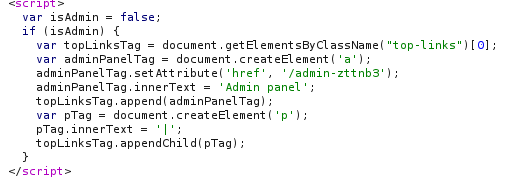
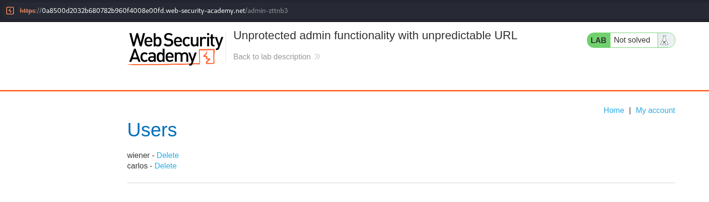
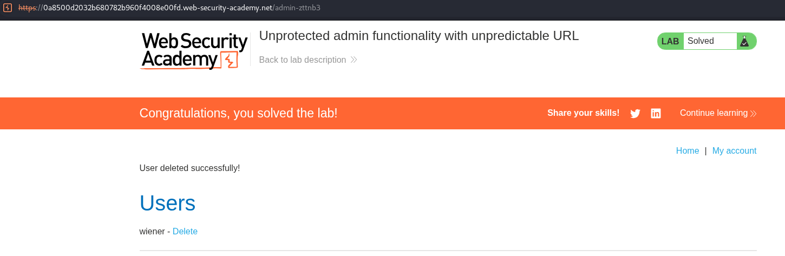

# Lab 02 — Unprotected Admin Functionality with Unpredictable URL

## Lab Information

- **Platform:** PortSwigger Web Security Academy
- **Category:** Access Control
- **Lab:** Unprotected admin functionality with unpredictable URL
- **Vulnerability:** Broken Access Control / Unprotected Administrative Functionality
- **Status:** Solved

---

## Objective

Access the administrator panel and delete the user `carlos`.

---

## Initial Reconnaissance

I explored the application normally and inspected the HTTP responses using Burp Suite.

While reviewing a response, I found client-side JavaScript containing:

```javascript
var isAdmin = false;

if (isAdmin) {
   var topLinksTag = document.getElementsByClassName("top-links")[0];
   var adminPanelTag = document.createElement('a');
   adminPanelTag.setAttribute('href', '/admin-zttnb3');
   adminPanelTag.innerText = 'Admin panel';
   topLinksTag.append(adminPanelTag);
   var pTag = document.createElement('p');
   pTag.innerText = '|';
   topLinksTag.appendChild(pTag);
}
```

The JavaScript revealed the otherwise non-obvious administrative endpoint:

```text
/admin-zttnb3
```



---

## Understanding the Discovery

The variable `var isAdmin = false;` appears to control whether the Admin panel link is displayed in the client-side interface. However, hiding the link does not provide server-side access control.

The important discovery was the administrative URL `/admin-zttnb3`. Although the URL is unpredictable, it was disclosed in the application's response. This demonstrates why an unpredictable or hidden URL should not be treated as a security mechanism.

---

## Accessing the Administrative Panel

I manually requested:

```text
/admin-zttnb3
```

The server returned the administrative panel without requiring administrator authorization. The panel exposed administrative functionality, including user management and the ability to delete users. The user `carlos` was present in the panel.



---

## Exploitation

The administrative functionality was accessible to a user who was not authorized as an administrator. I used the exposed administrative panel to delete the user `carlos`.

The lab was then successfully completed.



---

## Vulnerability

The application suffers from **broken access control** because the administrative functionality is not properly protected by server-side authorization.

The administrative URL is difficult to predict, but this does not make the functionality secure. Furthermore, the URL is exposed in client-side JavaScript, making it discoverable by inspecting the application's responses.

The fundamental security problem is that the server does not properly verify whether the requesting user is authorized to perform administrative actions.

---

## Attack Flow

```text
Explore application
        ↓
Inspect HTTP response
        ↓
Find client-side JavaScript
        ↓
Discover /admin-zttnb3
        ↓
Request administrative endpoint
        ↓
Admin panel accessible
        ↓
Delete Carlos
        ↓
Lab solved
```

---

## Impact

An unauthorized user can access administrative functionality.

In this lab, the demonstrated impact was:

- Discovery of the administrative endpoint
- Unauthorized access to the admin panel
- Ability to delete another user

In a real application, similar unrestricted administrative functionality could potentially allow user management, account modification, access to sensitive information, configuration changes, or other privileged administrative actions.

---

## Remediation

Administrative functionality should be protected using **server-side authorization checks**. The application should verify that the authenticated user has the appropriate administrative role before allowing access to the administrative endpoint.

```text
Request
   ↓
Authentication
   ↓
Authorization check
   ↓
Is user an administrator?
   ├── Yes → Allow access
   └── No  → Reject request
```

Administrative functionality should not rely on hidden links, unpredictable URLs, client-side variables, or `robots.txt`. These can help obscure functionality but cannot replace proper authorization.

---

## Key Takeaways

1. An unpredictable URL is not an access-control mechanism.
2. Client-side JavaScript can reveal otherwise hidden application functionality.
3. Hidden administrative links do not protect administrative endpoints.
4. Server-side authorization must be enforced when the endpoint is requested.
5. Burp HTTP History and response inspection can help discover hidden functionality.
6. Administrative functionality should be protected regardless of whether the URL is easy or difficult to discover.
