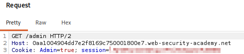
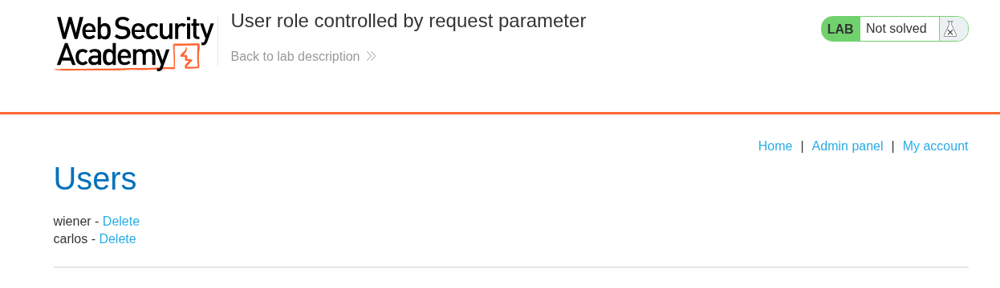
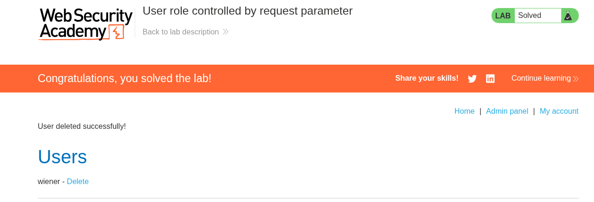
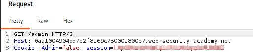

# Lab 02 — User Role Controlled by Request Parameter

## Lab Information

- **Platform:** PortSwigger Web Security Academy
- **Category:** Access Control
- **Lab:** User role controlled by request parameter
- **Vulnerability:** Broken Access Control / Client-Controlled Authorization (Role Controlled by Cookie)
- **Status:** Solved

---

## Objective

Gain access to the administrator panel and use the administrative functionality to delete the user `carlos`.

---

## Initial Reconnaissance

The application was explored as a normal user.

After logging in as:

```text
Username: wiener
Password: peter
```

the requests generated by the application were inspected using Burp Suite.

An interesting cookie was identified:

```http
Cookie: Admin=false
```

The application also used the following account request:

```http
GET /my-account?id=wiener HTTP/2
```

The query parameter was:

```text
Parameter name:  id
Parameter value: wiener
```

The `Admin=false` cookie was particularly interesting because it appeared to represent the user's administrative status.

---

## Forming a Hypothesis

The application was sending the following value from the client:

```text
Admin=false
```

This led to the hypothesis that the application might be relying on this client-controlled value when determining whether the user has administrative privileges.

To test this, the value was changed in Burp Repeater:

```http
Cookie: Admin=false
```

to:

```http
Cookie: Admin=true
```

The request returned:

```text
HTTP/2 200 OK
```

However, the `/my-account` page did not visibly change.

This did not provide enough evidence to confirm that the cookie controlled authorization.

---

## Testing the Protected Admin Endpoint

The `/admin` endpoint was then requested normally while using the original:

```http
Cookie: Admin=false
```

The server responded with:

```text
HTTP/2 401 Unauthorized
```

and indicated that only administrators could access the page.

This established an authorization boundary.

---

## Bypassing the Authorization Check

The `/admin` request was sent to Burp Repeater and the following value was changed:

```http
Cookie: Admin=false
```

to:

```http
Cookie: Admin=true
```

The rest of the request was left unchanged.

The modified request was:

```http
GET /admin HTTP/2
Host: [LAB-DOMAIN]
Cookie: Admin=true
```

The request was then tested through Burp Proxy by modifying the intercepted request before forwarding it.



The server responded with:

```text
HTTP/2 200 OK
```

and the browser displayed the administrative panel.



This confirmed that the application was trusting the client-controlled `Admin` cookie when determining whether the user had administrator privileges.

---

## Exploitation

The normal user was able to obtain administrator privileges by changing:

```text
Admin=false
```

to:

```text
Admin=true
```

The administrative panel then became accessible.

The panel provided functionality to manage users, including the ability to delete users.

The user `carlos` was deleted using the administrative functionality, completing the lab.



---

## Vulnerability

The application suffers from **broken access control** because it relies on a client-controlled cookie to determine the user's administrative privileges.

The browser can modify:

```http
Cookie: Admin=false
```

to:

```http
Cookie: Admin=true
```

The server then treats the user as an administrator.

This is insecure because authorization decisions must be enforced using trusted server-side state rather than values that the client can freely modify.

---

## Attack Flow

```text
Normal user
     ↓
Login as wiener
     ↓
Cookie contains Admin=false
     ↓
Request /admin
     ↓
401 Unauthorized
     ↓
Modify Admin=false → Admin=true
     ↓
Request /admin again
     ↓
200 OK
     ↓
Admin panel accessible
     ↓
Administrative functionality
     ↓
Delete Carlos
```

---

## Impact

An attacker who can modify the client-controlled authorization value can potentially elevate their privileges from a normal user to an administrator.

This can provide access to sensitive administrative functionality.

In this lab, the demonstrated impact was:

* Unauthorized access to the administrator panel
* Administrator-level functionality
* Ability to delete another user

In a real application, similar flaws could potentially allow:

* User management
* Account modification
* Access to sensitive administrative data
* Configuration changes
* Other privileged operations

---

## Remediation

The application should never rely on a client-controlled value such as:

```http
Cookie: Admin=true
```

to determine authorization.

Authorization should be enforced **server-side** using trusted session state and server-side role information.

A secure design would be:

```text
Request
   ↓
Identify authenticated session
   ↓
Retrieve user's role from trusted server-side state
   ↓
Authorization check
   ↓
Is the user an administrator?
   ├── Yes → Allow
   └── No  → Reject
```

Changing a client-side cookie should never be sufficient to elevate privileges.

---

## Evidence

### Screenshot 1 — Lab Homepage


Shows the normal application before attempting privilege escalation.

### Screenshot 2 — Admin Access Denied



Shows the `/admin` request with the original `Admin=false` value and the resulting `401 Unauthorized` response.

### Screenshot 3 — Modified Admin Cookie


Shows the intercepted `/admin` request after changing:

```text
Admin=false
```

to:

```text
Admin=true
```

### Screenshot 4 — Administrative Panel


Shows that the modified request resulted in access to the administrator panel.

### Screenshot 5 — Lab Solved


Shows successful completion of the PortSwigger lab.

---

## Key Takeaways

1. Authorization decisions must not rely on values controlled by the client.
2. Cookies can contain values that appear to represent roles or privileges, but their presence does not make them trustworthy.
3. Burp can be used to modify client-controlled values before they reach the server.
4. Testing the protected endpoint is more useful than only observing whether a modified value changes the normal page.
5. A `401 Unauthorized` response established the original access-control boundary.
6. Changing `Admin=false` to `Admin=true` and receiving `200 OK` with the admin panel demonstrated the authorization bypass.
7. This is a form of **vertical privilege escalation**.
8. Authorization must be enforced using trusted server-side state.
