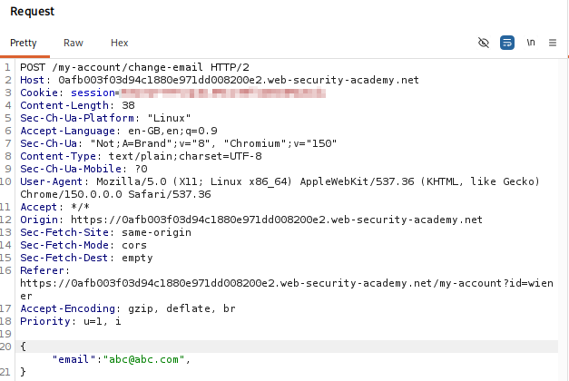
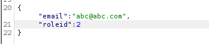
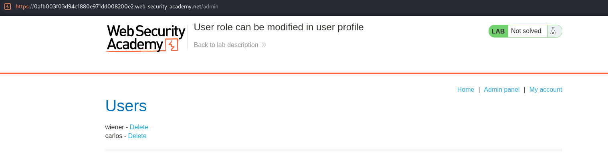
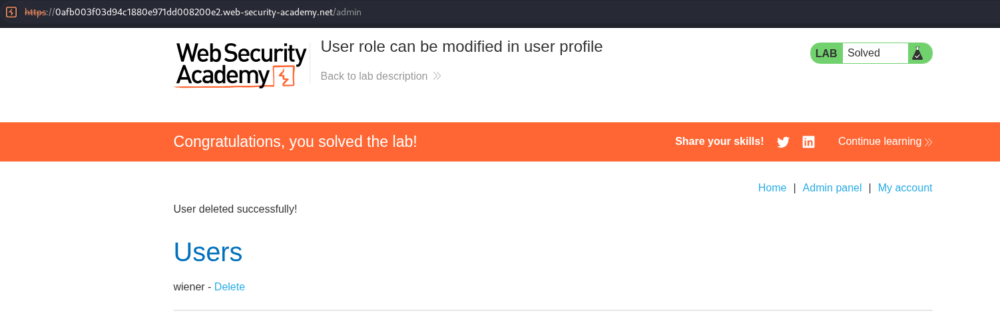

# Lab 04 — User Role Can Be Modified in User Profile

## Lab Information

- **Platform:** PortSwigger Web Security Academy
- **Category:** Access Control
- **Lab:** User role can be modified in user profile
- **Vulnerability:** Broken Access Control / Mass Assignment
- **Status:** Solved

---

## Objective

Access the administrator panel and use it to delete the user `carlos`.

The application only allows users with `roleid = 2` to access the administrator panel.

Credentials provided by the lab:

```text
Username: wiener
Password: peter
```

---

## Initial Reconnaissance

I logged into the application as the normal user `wiener`. I then used the normal profile functionality and selected the option to change my email address to `abc@abc`.

Burp Suite captured the request generated by this action. The request used JSON to submit the profile information.



---

## Identifying the Vulnerability

The profile-update request accepted user-controlled JSON data. After sending the request to Burp Repeater, I tested whether additional fields could be supplied.

The lab specifies that `roleid = 2` corresponds to an administrator. I therefore added the following field to the JSON request:

```json
{
  "email": "abc@abc",
  "roleid": 2
}
```

The request was accepted by the application.



---

## Privilege Escalation

After the modified profile request was processed, I attempted to access:

```text
/admin
```

The administrator panel was now accessible. This demonstrated that modifying the `roleid` field had changed the privileges associated with my account.

The application had allowed a normal user to modify a security-sensitive attribute of their own account.



---

## Exploitation

The attack flow was:

```text
Login as wiener
      ↓
Change email normally
      ↓
Inspect JSON request
      ↓
Send request to Repeater
      ↓
Add "roleid": 2
      ↓
Send modified request
      ↓
Role changed to administrator
      ↓
Access /admin
      ↓
Delete Carlos
      ↓
Lab solved
```

The user `carlos` was then deleted from the administrator panel.



---

## Vulnerability

The application allows a user to modify a security-sensitive account attribute through a profile-update request.

The `roleid` field controls the user's privilege level, but the application fails to prevent a normal user from supplying or modifying this value. This is an example of broken access control and can also be described as **mass assignment**: the application automatically binds user-supplied parameters to internal object properties without properly restricting which properties can be modified.

```text
Normal user
     ↓
Profile update
     ↓
User-controlled JSON
     ↓
"roleid": 2
     ↓
Administrator privileges
```

---

## Impact

A normal user can modify their own role and escalate their privileges to administrator.

In this lab, this resulted in:

- Administrator privileges
- Access to `/admin`
- Access to user-management functionality
- Ability to delete another user

In a real application, similar flaws could potentially allow attackers to modify user roles, account permissions, ownership, security settings, or other internal account attributes.

---

## Remediation

The application should explicitly define which account attributes a normal user is allowed to modify. A normal profile-update request might allow:

```json
{
  "email": "user@example.com"
}
```

but should reject or ignore security-sensitive fields such as:

```json
{
  "roleid": 2
}
```

Authorization-sensitive properties should be controlled exclusively by trusted server-side administrative functionality. A secure approach is to use an explicit allowlist:

```text
Allowed:     email, name, phone
Not allowed: roleid, permissions, isAdmin
```

The server should also verify authorization whenever a user's role or privileges are changed.

---

## Key Takeaways

1. Profile-update functionality should not allow users to modify security-sensitive attributes.
2. JSON request bodies should be inspected for unexpected or privileged fields.
3. Mass assignment can occur when applications automatically accept user-supplied fields and map them to internal object properties.
4. Burp Repeater is useful for testing whether additional parameters are accepted.
5. A change to a security-sensitive parameter should be tested against the protected functionality it is expected to affect.
6. Changing `roleid` to `2` resulted in administrator access in this lab.
7. Authorization-sensitive attributes should be controlled by trusted server-side logic.
