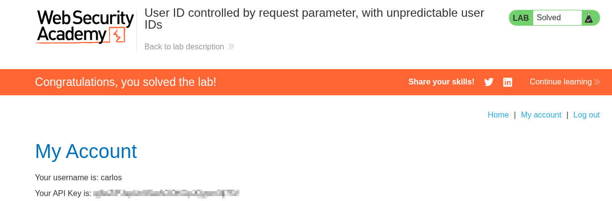

# Lab 06 — User ID Controlled by Request Parameter, with Unpredictable User IDs

## Lab Information

- **Platform:** PortSwigger Web Security Academy
- **Category:** Access Control
- **Lab:** User ID controlled by request parameter, with unpredictable user IDs
- **Vulnerability:** Broken Access Control / IDOR
- **Privilege Escalation:** Horizontal
- **Status:** Solved

---

## Objective

Find the GUID belonging to `carlos`, access his account page, obtain his API key, and submit it as the lab solution.

The lab provides:

```text
Username: wiener
Password: peter
```

---

## Initial Reconnaissance

I logged into the application as the normal user `wiener` and explored the profile and blog functionality.

The application uses GUIDs rather than predictable usernames to identify users. While viewing a blog author's profile, I observed a `userId` parameter containing a GUID, for example:

```text
/blogs?userId=<admin-GUID>
```

This showed that blog functionality could expose the GUID associated with a user. The normal account request also used a GUID in its `id` parameter:

```http
GET /my-account?id=<wiener-GUID> HTTP/2
```


---

## Discovering Carlos's GUID

I searched the application blog content for a post created by `carlos`. The post titled `Fake News` was associated with Carlos. Viewing the author's profile exposed a URL containing his GUID:

```text
/blogs?userId=<carlos-GUID>
```

This provided a way to discover Carlos's otherwise unpredictable user identifier.


---

## Testing the Access Control

The normal account request returned the authenticated user's account information, including an API key. I sent the request to **Burp Repeater** and changed only the user identifier from Wiener's GUID to Carlos's GUID:

```http
GET /my-account?id=<carlos-GUID> HTTP/2
```

No other part of the request was intentionally changed.


---

## Result

The server returned Carlos's account information while the request used my authenticated session. The response contained Carlos's API key.


The API key was submitted to the PortSwigger lab as the solution.



---

## Vulnerability

The application suffers from **broken access control** resulting in an **IDOR-style vulnerability**. Although it uses unpredictable GUIDs instead of usernames, it still trusts a user-controlled identifier when determining which account should be returned:

```text
GET /my-account?id=<user-GUID>
        ↓
Return account belonging to that GUID
```

The application does not sufficiently verify whether the authenticated user is authorized to access the requested account.

---

## Why Unpredictable IDs Do Not Prevent the Vulnerability

GUIDs make direct guessing more difficult, but the application exposes them elsewhere. In this lab, blog functionality revealed user identifiers through URLs such as `/blogs?userId=<GUID>`.

The security problem is not whether the identifier can be guessed. The security problem is that the server does not perform an authorization check after the identifier is obtained.

---

## Horizontal Privilege Escalation

This is **horizontal privilege escalation**: a normal user accesses another normal user's resources without becoming an administrator.

```text
Wiener
  ↓
Authenticated session
  ↓
Carlos's GUID
  ↓
Carlos's account
  ↓
Carlos's API key
```

---

## Attack Flow

```text
Login as wiener
        ↓
Explore application
        ↓
Discover that blog profiles expose user GUIDs
        ↓
Find Carlos's “Fake News” post
        ↓
Obtain Carlos's GUID
        ↓
Identify /my-account?id=<GUID>
        ↓
Send request to Burp Repeater
        ↓
Replace Wiener's GUID with Carlos's GUID
        ↓
Send request
        ↓
Carlos's account returned
        ↓
Carlos's API key exposed
        ↓
Submit API key
        ↓
Lab solved
```

---

## Impact

An attacker can access another user's account information despite not being authorized to do so. In this lab, the exposed information included Carlos's account information and API key.

In a real application, similar vulnerabilities could expose personal information, account details, private documents, API keys, tokens, order history, or other sensitive user data.

---

## Remediation

The application must perform server-side authorization checks for every requested resource. It should not assume that possession of a valid user ID or GUID means the requester is authorized to access that account.

```text
Request
   ↓
Identify authenticated user
   ↓
Identify requested resource
   ↓
Check authorization
   ↓
Does the authenticated user have permission?
   ├── Yes → Return resource
   └── No  → Reject request
```

Sensitive user identifiers should also not be unnecessarily exposed through unrelated application functionality. However, making identifiers unpredictable is not sufficient; proper authorization checks are still required.

---

## Key Takeaways

1. Unpredictable identifiers do not prevent IDOR vulnerabilities.
2. User identifiers can be discovered through other application functionality.
3. Burp HTTP History can help identify how features expose user identifiers.
4. Burp Repeater can test whether a discovered identifier accesses another user's resource.
5. Authorization must be checked server-side for every requested resource.
6. Accessing another user's resource at the same privilege level is horizontal privilege escalation.
7. IDOR is fundamentally an authorization problem, not simply an identifier-prediction problem.
8. Difficult-to-guess identifiers must never replace proper access control.
