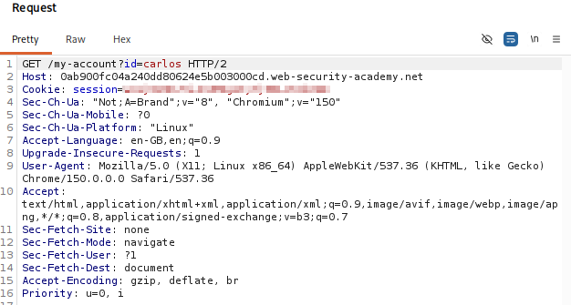
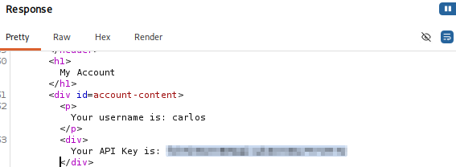

# Lab 07 — User ID Controlled by Request Parameter with Data Leakage in Redirect

## Lab Information

- **Platform:** PortSwigger Web Security Academy
- **Category:** Access Control
- **Lab:** User ID controlled by request parameter with data leakage in redirect
- **Vulnerability:** Broken Access Control / Sensitive Data Leakage
- **Privilege Escalation:** Horizontal
- **Status:** Solved

---

## Objective

Obtain the API key belonging to the user `carlos` and submit it as the solution.

The lab provides:

```text
Username: wiener
Password: peter
```

---

## Initial Reconnaissance

I logged into the application as the normal user `wiener` and explored the product, account, change-email, and login functionality. I inspected the requests generated by these actions using Burp Suite HTTP History.

---

## Identifying the Vulnerable Behavior

I tested whether the account page could be accessed using another user's identifier by requesting Carlos's account directly:

```http
GET /my-account?id=carlos HTTP/2
```

Instead of directly returning the account page, the server responded with:

```http
HTTP/2 302 Found
Location: /login
```

However, inspecting the complete HTTP response in Burp revealed that the response body still contained Carlos's account information.



---

## Data Leakage in the Redirect Response

The redirect response contained:

```http
HTTP/2 302 Found
Location: /login
```

but the response body also contained account data:

```html
<h1>My Account</h1>
<div id=account-content>
    <p>Your username is: carlos</p>
    <div>Your API Key is: ...</div>
</div>
```

The browser would normally follow the `Location: /login` header, which can make the leaked information difficult to notice during normal browsing. Burp Suite allowed the complete response body to be inspected.



---

## Result

Although the server instructed the browser to redirect to `/login`, sensitive information belonging to Carlos was present in the body of the `302` response. The leaked information included Carlos's API key.

The API key was submitted to the PortSwigger lab as the solution.


---

## Vulnerability

The application contains a horizontal access-control vulnerability combined with sensitive information leakage in a redirect response.

```text
GET /my-account?id=carlos
        ↓
302 Found
Location: /login
        ↓
Response body still contains
Carlos's account information
        ↓
Sensitive API key exposed
```

The redirect does not prevent sensitive data from being included in the HTTP response.

---

## Why the Redirect Does Not Protect the Data

A `302 Found` response tells the browser to make another request using the URL specified by the `Location` header. However, an HTTP redirect response can still contain a response body.

Burp Suite allows the original `302` response and its body to be inspected before the redirect is followed.

---

## Horizontal Privilege Escalation

The attacker remains a normal user but accesses another user's information:

```text
Wiener
  ↓
Request Carlos's account
  ↓
Carlos's information
```

The important difference is that the sensitive information is leaked within a redirect response.

---

## Attack Flow

```text
Login as wiener
        ↓
Explore application
        ↓
Test /my-account?id=carlos
        ↓
302 Found
        ↓
Location: /login
        ↓
Inspect complete response in Burp
        ↓
Find Carlos's account information
        ↓
Find Carlos's API key
        ↓
Submit API key
        ↓
Lab solved
```

---

## Impact

An attacker can obtain sensitive information belonging to another user. In this lab, the exposed information included Carlos's username and API key.

In a real application, similar information leakage could potentially expose API keys, authentication tokens, personal information, account information, password-reset information, or other sensitive data.

---

## Remediation

The application should perform authorization checks **before generating the account information**. If the authenticated user is not authorized to access the requested account, the application should not generate or include that account's sensitive information anywhere in the response.

```text
Request
   ↓
Identify authenticated user
   ↓
Identify requested account
   ↓
Authorization check
   ↓
Authorized?
   ├── Yes → Return account information
   └── No  → Reject request
             ↓
             Do not include sensitive account data
```

If a redirect is required, the response should not contain sensitive information in its body.

---

## Key Takeaways

1. A `302` redirect response can still contain a response body.
2. Burp Suite allows the complete redirect response to be inspected.
3. Sensitive information must not be generated or included in an unauthorized response, even if the browser is redirected elsewhere.
4. A redirect does not replace proper authorization.
5. HTTP status codes and headers should be analyzed together with the response body.
6. Horizontal access-control vulnerabilities can result in sensitive information leakage.
7. When testing access control, inspect the complete HTTP response rather than relying only on what the browser displays.
