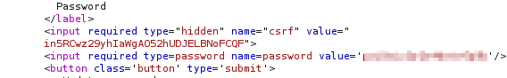
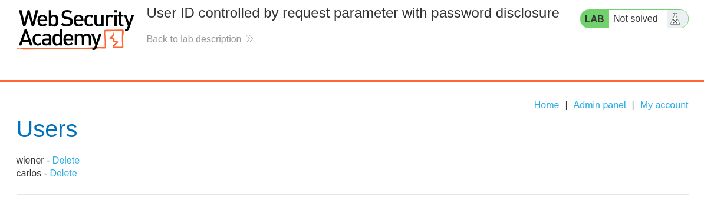
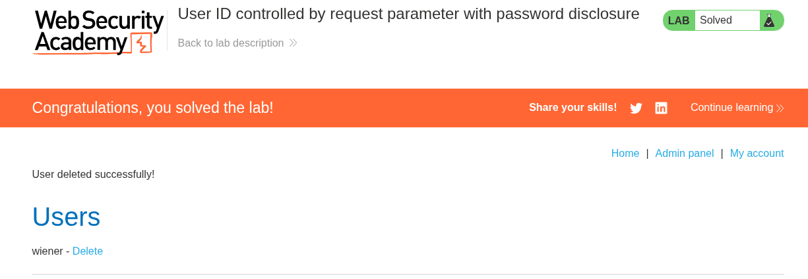
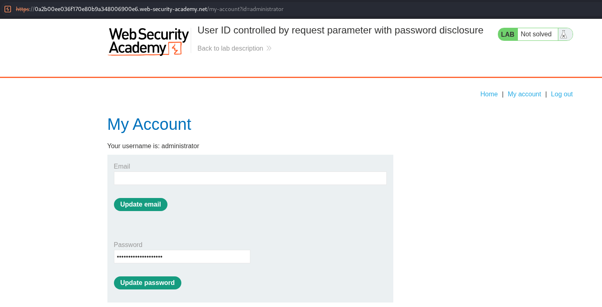

# Lab 08 — User ID Controlled by Request Parameter with Password Disclosure

## Lab Information

- **Platform:** PortSwigger Web Security Academy
- **Category:** Access Control
- **Lab:** User ID controlled by request parameter with password disclosure
- **Vulnerability:** Broken Access Control / Sensitive Information Disclosure
- **Privilege Escalation:** Horizontal
- **Status:** Solved

---

## Objective

Retrieve the administrator's password, use it to access the administrative functionality, and delete the user `carlos`.

The lab provides:

```text
Username: wiener
Password: peter
```

---

## Initial Reconnaissance

I logged into the application as the normal user `wiener` and inspected the account functionality using Burp Suite.

The account page contained the current user's password in the HTML response. Although the browser displayed the password as a masked input, the actual value was present in the HTTP response.

```text
Browser:
password → ••••••••

HTTP response:
password → actual value
```

A password input being masked is only a presentation feature; it does not protect the value if the value is included in the HTML response.

---

## Testing Administrative Endpoints

I first tested the `/admin` endpoint:

```http
GET /admin
```

The server responded with:

```http
HTTP/2 302 Found
Location: /login
```

I then tested another administrative-looking endpoint:

```http
GET /administrator
```

This request returned `HTTP/2 200 OK` and the administrator's account page.

---

## Password Disclosure

The `/administrator` response contained the administrator's password directly in the HTML. Burp allowed the underlying response to be inspected even though the browser rendered the password field as masked.



The response exposed a credential that should never have been disclosed to the client.

---

## Obtaining Administrator Access

I used the recovered administrator credentials to authenticate as the administrator. The administrator account then provided access to the functionality required by the lab.



The administrative functionality was used to delete `carlos`.



---

## Additional Observation

The `/admin` endpoint returned a redirect to `/login`, but `/administrator` returned the administrator account page with a `200 OK` response.



This demonstrated that `/admin` was not the endpoint used to obtain the administrator's account information.

---

## Vulnerability

The application exposes an existing password in the HTML of an account page and has insufficient access control around the administrator's account functionality.

The critical issue is that a password should never be returned to the client, especially in plaintext within an HTML form field.

```text
Administrator account
        ↓
/administrator
        ↓
200 OK
        ↓
Account HTML
        ↓
Password included in response
        ↓
Password exposed to the client
```

---

## Password Masking Is Not Security

An input such as:

```html
<input type="password" value="password">
```

is rendered by the browser as a masked field, but the actual value remains in the HTML response. Anyone able to inspect the response can retrieve it.

The application should not send an existing password to the browser at all.

---

## Impact

The vulnerability can expose user credentials directly to an attacker. In this lab, the administrator's password was exposed and used to access administrative functionality and delete another user.

In a real application, password disclosure could result in account takeover, privilege escalation, access to sensitive data, administrative access, or further compromise where passwords are reused.

---

## Remediation

Applications should **never return existing plaintext passwords to the client**. Passwords should be stored using an appropriate password-hashing algorithm and should not be recoverable in their original form.

When a user wants to change their password, the application should provide a password-change mechanism rather than returning the existing password.

```text
Incorrect:

GET /account
        ↓
Return existing password


Correct:

GET /account
        ↓
Return account information
        ↓
Do not return password

Password change:
        ↓
Submit new password
        ↓
Server securely hashes and stores it
```

Administrative functionality should also have proper server-side authorization checks.

---

## Attack Flow

```text
Login as wiener
        ↓
Explore application
        ↓
Test /admin
        ↓
302 → /login
        ↓
Discover /administrator
        ↓
200 OK
        ↓
Administrator account page
        ↓
Password exposed in HTML response
        ↓
Use administrator credentials
        ↓
Access administrative functionality
        ↓
Delete Carlos
        ↓
Lab solved
```

---

## Key Takeaways

1. Password fields being visually masked does not make the underlying value secret.
2. Burp Suite can reveal sensitive information contained in HTML responses.
3. Existing passwords should never be returned to the client.
4. Passwords should be securely hashed and should not be recoverable in plaintext.
5. A `200 OK` response should still be inspected for sensitive information.
6. Testing alternative application endpoints can reveal unintended administrative functionality.
7. Sensitive credentials exposed through an account page can lead to account takeover and privilege escalation.
8. Administrative functionality must be protected by proper server-side authorization.
