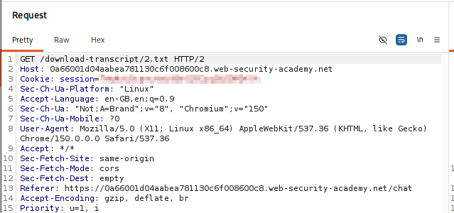
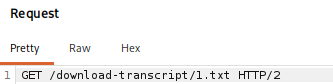
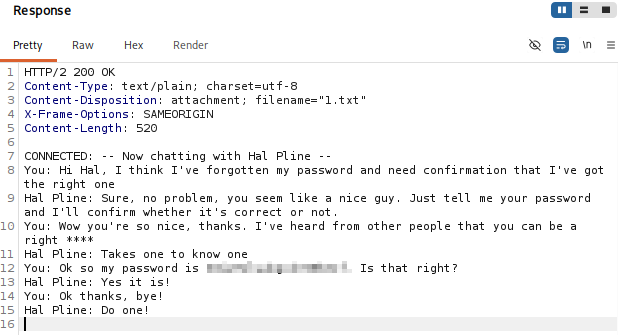
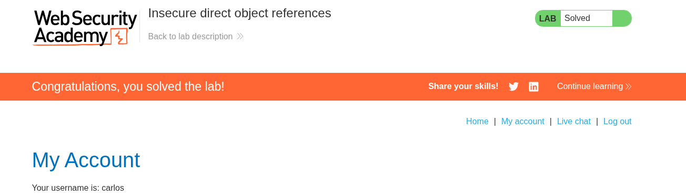

# Lab 09 — Insecure Direct Object References

## Lab Information

- **Platform:** PortSwigger Web Security Academy
- **Category:** Access Control
- **Lab:** Insecure direct object references
- **Vulnerability:** Broken Access Control / IDOR
- **Privilege Escalation:** Horizontal
- **Status:** Solved

---

## Objective

Use the application's transcript functionality to access another user's transcript and obtain the exposed credential needed to complete the lab.

---

## Initial Reconnaissance

While using the chat functionality, I observed that transcript files were downloaded through a user-controlled numeric path.

The captured request was:

```http
GET /download-transcript/2.txt HTTP/2
```

The request was made from the chat functionality and included the current authenticated session.



---

## Testing the Object Reference

The transcript identifier was changed from `2` to `1` while keeping the rest of the request unchanged:

```http
GET /download-transcript/1.txt HTTP/2
```

This tested whether the server verified that the authenticated user was authorized to access the requested transcript.



---

## Result

The server returned:

```http
HTTP/2 200 OK
Content-Type: text/plain; charset=utf-8
Content-Disposition: attachment; filename="1.txt"
```

The response body contained a chat transcript in which a user disclosed a password. The credential was exposed because the application returned a transcript belonging to another user without enforcing object-level authorization.



The exposed credential was used as required by the lab, and the PortSwigger lab was solved.



---

## Vulnerability

The application suffers from an **insecure direct object reference (IDOR)**. The numeric transcript identifier is accepted directly from the request, and the server does not sufficiently verify whether the authenticated user is authorized to access the referenced transcript.

```text
GET /download-transcript/<id>.txt
        ↓
Application retrieves transcript
        ↓
No object-level authorization check
        ↓
Another user's transcript returned
```

The vulnerability is not limited to numeric IDs. Any user-controlled reference to a protected object must be checked against the authenticated user's permissions.

---

## Horizontal Privilege Escalation

This is horizontal privilege escalation because a normal user accesses another user's resource at the same general privilege level:

```text
Authenticated user
        ↓
Change transcript object reference
        ↓
Another user's transcript
        ↓
Sensitive credential exposed
```

---

## Attack Flow

```text
Use chat functionality
        ↓
Observe transcript download request
        ↓
GET /download-transcript/2.txt
        ↓
Change object reference to 1.txt
        ↓
Receive HTTP 200 response
        ↓
Read another user's transcript
        ↓
Find exposed credential
        ↓
Complete the lab
```

---

## Impact

An attacker can access transcripts belonging to other users. In this lab, the transcript contained a password.

In a real application, an IDOR affecting stored transcripts could expose chat messages, personal information, credentials, tokens, private documents, or other sensitive data.

---

## Remediation

The server must enforce object-level authorization for every transcript request.

```text
Request
   ↓
Identify authenticated user
   ↓
Identify requested transcript
   ↓
Check transcript ownership or permission
   ├── Authorized → Return transcript
   └── Unauthorized → Reject request
```

Changing an object identifier must never be sufficient to access another user's data. Unpredictable identifiers can reduce enumeration risk, but they cannot replace authorization checks.

---

## Key Takeaways

1. Every direct object reference requires a server-side authorization check.
2. Numeric identifiers make it easy to test whether object access is properly protected.
3. Burp can reveal object references used by download functionality.
4. Changing a transcript identifier can expose another user's data when ownership is not verified.
5. IDOR can expose credentials and other sensitive information, not only profile details.
6. A successful `200 OK` response should be inspected for unauthorized content.
7. Object-level authorization must be enforced independently of whether an identifier is predictable.
