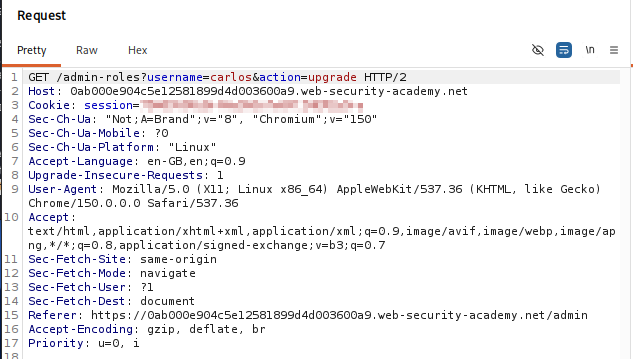
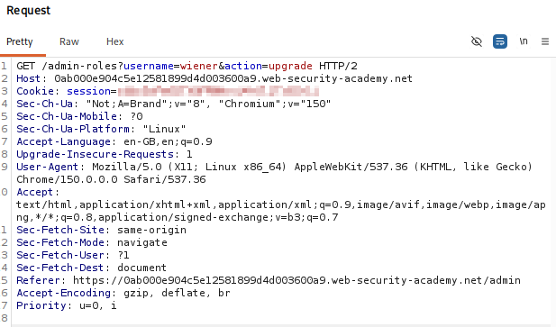
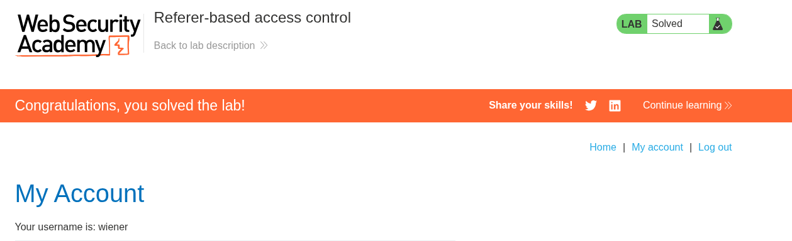

# Lab 13 — Referer-Based Access Control

## Lab Information

- **Platform:** PortSwigger Web Security Academy
- **Category:** Access Control
- **Lab:** Referer-based access control
- **Difficulty:** Practitioner
- **Vulnerability:** Broken Access Control / Referer-Based Access Control Bypass
- **Privilege Escalation:** Vertical (Normal User to Administrator)
- **Status:** Solved

---

## Objective

Log in as the normal user `wiener` and exploit the flawed access controls to promote the account to administrator.

The lab provides the following credentials:

```text
Administrator:
Username: administrator
Password: admin

Normal user:
Username: wiener
Password: peter
```

---

## Reconnaissance

I first logged in using the administrator credentials (`administrator:admin`) to examine how legitimate user promotion requests were processed.

Navigating to the administrator panel at `/admin` and promoting the user `carlos` generated the following HTTP request:

```http
GET /admin-roles?username=carlos&action=upgrade HTTP/2
Host: [LAB-DOMAIN]
Cookie: session=[ADMIN-SESSION-COOKIE]
Referer: https://[LAB-DOMAIN]/admin
```

The server processed the promotion and responded with:

```http
HTTP/2 302 Found
Location: /admin
```



Inspection of the request revealed that the application was relying on the client-supplied `Referer` header (`https://[LAB-DOMAIN]/admin`) to determine whether the request originated from an authorized administrative page.

---

## Testing Referer-Based Access Control

Because HTTP request headers are entirely under client control, relying on `Referer` for authorization constitutes an insecure design pattern.

To test whether the application enforced authorization based on the `Referer` header rather than the user's authenticated session:
1. I logged out of the administrator account.
2. I authenticated as the low-privileged user `wiener:peter`.
3. In Burp Repeater, I constructed the role-upgrade request using Wiener's active session cookie.
4. I changed the target username from `carlos` to `wiener`.
5. I preserved the administrative `Referer` header: `https://[LAB-DOMAIN]/admin`.

The resulting request was:

```http
GET /admin-roles?username=wiener&action=upgrade HTTP/2
Host: [LAB-DOMAIN]
Cookie: session=[WIENER-SESSION-COOKIE]
Referer: https://[LAB-DOMAIN]/admin
```



---

## Privilege Escalation & Verification

The server accepted the request, returned `HTTP/2 302 Found`, and promoted `wiener` to administrator.

I then accessed the `/admin` interface using Wiener's session and confirmed full administrator privileges and role management functionality. The lab was successfully completed.



---

## Vulnerability Analysis

The vulnerability is a **Broken Access Control** flaw resulting from **Referer-Based Authorization**.

### Root Causes
1. **Reliance on Client-Controlled Headers:** The application's access-control filter checked whether the incoming `Referer` header contained `/admin` rather than checking if the authenticated session belonged to an administrator.
2. **Confusing Origin with Authorization:** The developers assumed that if a request appeared to originate from `/admin`, it must have been dispatched by an authenticated administrator viewing the admin panel in their browser.
3. **Absence of Server-Side Role Validation:** The controller action handling `/admin-roles` executed the role change directly without verifying user permissions against the server-side session store or database.

```text
[ Flawed Referer-Based Control ]
Incoming Request ──> [ Inspect Referer Header ]
                           │
                           ├── Referer contains "/admin" ──> [ Allow Privileged Action ] (VULNERABLE!)
                           └── Referer does NOT contain "/admin" ──> [ 403 Forbidden ]
```

---

## Attack Flow

```text
[ Attacker / Low-Privilege User ]
          │
          │ 1. Observe Admin Promotion Request:
          │    GET /admin-roles?username=carlos&action=upgrade
          │    Referer: https://[LAB-DOMAIN]/admin
          │
          │ 2. Authenticate as Normal User (wiener)
          │
          │ 3. Craft & Send Malicious Request:
          │    GET /admin-roles?username=wiener&action=upgrade
          │    Cookie: session=[WIENER-SESSION]
          │    Referer: https://[LAB-DOMAIN]/admin
          │         │
          │         ▼
          │    [ Access-Control Filter ]
          │    (Validates Referer == "/admin" ──> Passes Check)
          │         │
          │         ▼
          │    [ Backend Controller ]
          │    (Executes role promotion for 'wiener')
          │         │
          │         ▼
          │    302 Redirect to /admin
          │
          │ 4. Access /admin as Wiener (Administrator Privileges Confirmed)
          ▼
    [ Lab Solved ]
```

---

## Impact

An unauthenticated or low-privileged user can bypass access-control mechanisms and elevate their privileges to administrator (**Vertical Privilege Escalation**):

```text
Low-Privileged User (wiener) ──[ Spoofed Referer ]──> Full Administrator
```

In production environments, Referer-based access-control vulnerabilities can allow attackers to:
- Bypass access restrictions on administrative portals, user management, and internal dashboards.
- Perform unauthorized data modifications, account takeovers, and role upgrades.
- Execute sensitive business logic actions without proper authorization.

---

## Remediation

### 1. Never Use HTTP Headers for Access Control
Authorization decisions must never depend on client-controlled headers such as `Referer`, `Origin`, or `User-Agent`.

### 2. Enforce Server-Side Role-Based Access Control (RBAC)
Validate the user's role and permissions directly from the server-side session store or database on every request to a privileged endpoint:

```text
Incoming Request
       ↓
Extract Session Cookie
       ↓
Look Up User in Server Session Store
       ↓
Verify Administrator Role (e.g., user.hasRole("ROLE_ADMIN"))
       ├── Authorized   ──> Execute Role Promotion
       └── Unauthorized ──> Return 403 Forbidden
```

### 3. Use Safe HTTP Verbs for State-Changing Operations
State-changing actions (such as promoting users) should use `POST`, `PUT`, or `DELETE` requests rather than `GET`, combined with robust anti-CSRF protections (SameSite cookies and CSRF tokens).

---

## Key Takeaways

1. **Client-Controlled Data Cannot Be Trusted:** Any header sent by the client (`Referer`, `Origin`, custom headers) can be easily forged or modified in Burp Suite.
2. **Referer is Informational, Not Authoritative:** The `Referer` header indicates where the browser claims it came from, not who is making the request.
3. **Session-Bound Authorization:** True authorization is only achieved by validating the authenticated session against server-managed permission models.
4. **Header Manipulation Testing:** During assessments, inspect headers associated with privileged requests and test whether stripping or spoofing them alters authorization outcomes.
5. **State Changes via GET:** State-changing administrative operations should never be implemented via `GET` requests.
