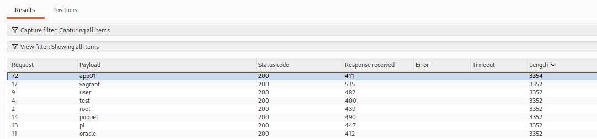
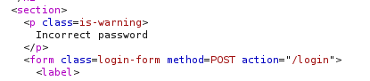
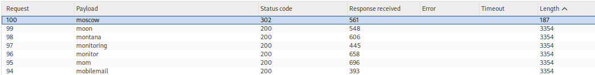

# Lab 01 — Username Enumeration via Different Responses

## Lab Information

- **Platform:** PortSwigger Web Security Academy
- **Category:** Authentication
- **Lab:** Username enumeration via different responses
- **Difficulty:** Apprentice
- **Vulnerabilities:** Username enumeration and password brute force
- **Status:** Solved

---

## Objective

Enumerate a valid username, brute-force the corresponding password using the provided candidate wordlists, and access the user's account page.

---

## Initial Reconnaissance

I opened the application's login page and submitted invalid credentials to observe the normal authentication response.

The login functionality returned different responses depending on whether the supplied username existed.

The initial manual testing did not produce an obvious difference in status code or response length for the usernames I tested.

Because the lab provided separate candidate lists for usernames and passwords, I used Burp Suite Intruder to automate the testing.

---

## Username Enumeration

I sent the login request to **Burp Intruder**.

The username was selected as the payload position:

```http
POST /login HTTP/2

username=§test§&password=test
```

The attack used:

* **Attack type:** Sniper
* **Payload type:** Simple list
* **Payload:** Provided candidate usernames
* **Payload positions:** Username only



Initially, the response status codes and response lengths appeared to be the same for the candidate usernames.

However, one candidate, `app01`, showed a different response time.

I investigated this candidate manually in Burp Repeater instead of relying only on the timing difference.

---

## Confirming the Valid Username

I tested `app01` with an incorrect password.

The response contained:

```text
Invalid password
```

Whereas invalid usernames returned:

```text
Invalid username
```

This confirmed that `app01` was a valid username.



The authentication behavior could therefore be summarized as:

```text
Invalid username
    ↓
Username does not exist

Invalid password
    ↓
Username exists
```

This represents a **username enumeration vulnerability** because the application reveals whether an account exists through different responses.

---

## Password Brute Force

After identifying the valid username:

```text
app01
```

I returned to Burp Intruder and changed the payload position from the username to the password.

The request became:

```http
POST /login HTTP/2

username=app01&password=§test§
```

I used:

* **Attack type:** Sniper
* **Payload type:** Simple list
* **Payload:** Provided candidate passwords
* **Payload position:** Password only



The candidate password:

```text
moscow
```

produced a different status code and response length from the other password attempts.

This indicated that the correct password had been found.

---

## Valid Credentials

The resulting credentials were:

```text
Username: app01
Password: moscow
```

I used these credentials to log in through the application.

The account page was successfully accessible and the lab was completed.


---

## Attack Flow

```text
Login page
    ↓
Observe authentication responses
    ↓
Send login request to Intruder
    ↓
Enumerate candidate usernames
    ↓
app01 produces different response behavior
    ↓
Verify app01 in Repeater
    ↓
"Invalid password" instead of "Invalid username"
    ↓
Valid username identified
    ↓
Run Intruder against password parameter
    ↓
moscow produces different status/length
    ↓
Valid credentials identified
    ↓
Login as app01
    ↓
Access account page
    ↓
Lab solved
```

---

## Vulnerability 1 — Username Enumeration

The application reveals whether a username exists by returning different messages:

```text
Invalid username
```

versus:

```text
Invalid password
```

An attacker can use this distinction to build a list of valid accounts.

### Impact

Username enumeration can make subsequent attacks easier, particularly:

* Password brute forcing
* Credential stuffing
* Password spraying
* Targeted phishing

---

## Vulnerability 2 — Password Brute Force

After identifying a valid username, the application's authentication mechanism allowed repeated password attempts without sufficient protection.

This allowed the candidate password list to be tested until the correct password was identified.

### Impact

An attacker who knows or discovers a valid username can systematically test candidate passwords and potentially gain account access.

---

## Burp Suite Workflow

This lab demonstrated the following Burp workflow:

```text
Proxy / HTTP History
        ↓
Identify login request
        ↓
Intruder
        ↓
Automate username testing
        ↓
Identify anomalous response
        ↓
Repeater
        ↓
Manually verify username
        ↓
Intruder
        ↓
Automate password testing
        ↓
Identify successful response
        ↓
Browser
        ↓
Verify account access
```

Intruder was used for repetitive testing, while Repeater was used to manually verify the interesting result.

---

## Key Takeaways

1. Authentication responses should not reveal whether a username exists.
2. Different error messages such as `Invalid username` and `Invalid password` can enable username enumeration.
3. Response status, length, content, and timing can all be useful indicators when analyzing automated authentication attempts.
4. A timing difference should be treated as an indication requiring verification, not automatically as proof of a valid username.
5. Burp Intruder can automate testing of large candidate lists.
6. Burp Repeater is useful for manually verifying interesting Intruder results.
7. After identifying a valid username, password testing can be performed against that specific account.
8. Authentication endpoints should implement protections against repeated password-guessing attempts.
