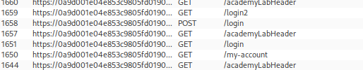
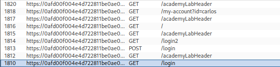
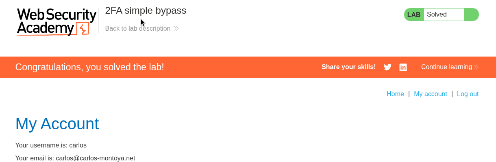

# Lab 02 — 2FA Simple Bypass

## Lab Information

- **Platform:** PortSwigger Web Security Academy
- **Category:** Authentication
- **Lab:** 2FA simple bypass
- **Difficulty:** Apprentice
- **Vulnerability:** Two-factor authentication bypass
- **Status:** Solved

---

## Objective

Access Carlos's account page without having access to his 2FA verification code.

The lab provides:

```text
Wiener:
Username: wiener
Password: peter

Carlos:
Username: carlos
Password: montoya
```

---

## Initial Reconnaissance

I first tested the authentication flow using my own account, `wiener`.

The normal authentication process consisted of two requests.

### First Authentication Step

The username and password were submitted to:

```http
POST /login HTTP/2

username=wiener&password=peter
```

The response established a session and redirected the authentication flow to the second step.

### Second Authentication Step

The application then sent the MFA verification code to:

```http
POST /login2 HTTP/2

mfa-code=0982
```

This established the intended authentication flow:

```text
Username + Password
        ↓
/login
        ↓
2FA verification
        ↓
/login2
        ↓
Account page
```



---

## Initial Hypotheses

Before attempting to bypass the MFA mechanism, I considered several possible attack paths:

* Whether an MFA code could be reused or cross-used between users
* How many MFA attempts were permitted
* Whether MFA codes expired
* Whether the MFA code could potentially be brute-forced

I also submitted an incorrect MFA code to observe the application's behavior.

The application returned:

```text
HTTP/2 500 Internal Server Error
```

However, this was not immediately treated as an exploitable vulnerability because a server error alone does not demonstrate an authentication bypass.

---

## Investigating the Authentication State

Instead of immediately attempting to brute-force the MFA code, I investigated what the application considered an authenticated session after the first authentication step.

After successfully submitting the username and password, but before completing MFA, I manually navigated to:

```text
/my-account
```

The application allowed access to the account page without requiring successful completion of the MFA step.

This demonstrated that the application had already established sufficient authenticated state after the first factor.

The intended flow was:

```text
/login
   ↓
/login2
   ↓
/my-account
```

However, the application also allowed:

```text
/login
   ↓
/my-account
```



---

## Verifying the Vulnerability with Carlos

The same behavior was then tested using the victim's credentials:

```text
Username: carlos
Password: montoya
```

After submitting the valid credentials, I did not complete the MFA verification.

Instead, I directly accessed:

```text
/my-account
```

The application allowed access to Carlos's account page without requiring the second authentication factor.

The lab was successfully completed.



---

## Vulnerability

The application incorrectly establishes an authenticated state after successful username/password authentication without enforcing completion of the second authentication factor before allowing access to protected resources.

The intended authentication flow is:

```text
First Factor
    ↓
Second Factor
    ↓
Authenticated Session
    ↓
Protected Account
```

The vulnerable flow is:

```text
First Factor
    ↓
Authenticated Session
    ↓
Protected Account
```

The second authentication factor is therefore not actually enforced as a prerequisite for accessing the account.

---

## Attack Flow

```text
Login with Carlos's credentials
        ↓
POST /login
username=carlos
password=montoya
        ↓
Application accepts first factor
        ↓
2FA verification requested
        ↓
Skip MFA
        ↓
Request /my-account directly
        ↓
Application grants access
        ↓
Carlos's account accessed
        ↓
Lab solved
```

---

## Impact

An attacker who obtains a user's username and password can bypass the intended second authentication factor and access the user's account.

This effectively reduces the authentication requirement from:

```text
Username + Password + 2FA
```

to:

```text
Username + Password
```

The vulnerability therefore defeats the additional security provided by two-factor authentication.

---

## Remediation

The application should not consider a user fully authenticated until all required authentication factors have been successfully completed.

A secure authentication state should distinguish between:

```text
Password authenticated
```

and:

```text
Fully authenticated
```

Protected resources such as `/my-account` should only be accessible after successful completion of the MFA step.

Conceptually:

```text
POST /login
        ↓
Credentials valid
        ↓
MFA required
        ↓
POST /login2
        ↓
MFA valid?
   ├── No → Remain unauthenticated / MFA pending
   └── Yes → Establish fully authenticated session
                         ↓
                     /my-account
```

Authorization checks for protected resources should verify that the session has completed the complete authentication process.

---

## Burp Suite Workflow

This lab demonstrated the following Burp workflow:

```text
Browser
   ↓
Proxy / HTTP History
   ↓
Identify authentication requests
   ↓
Observe /login → /login2 workflow
   ↓
Investigate session state
   ↓
Request protected resource directly
   ↓
Verify whether MFA is actually enforced
```

Burp HTTP History was particularly useful for understanding the sequence of authentication requests and identifying the `/login2` MFA endpoint.

---

## Key Takeaways

1. Do not assume that reaching an MFA page means MFA is actually enforced.
2. Map the complete authentication state machine.
3. Test protected resources after the first authentication factor but before MFA completion.
4. A server-side `500 Internal Server Error` is an observation, not automatically an exploitable vulnerability.
5. Authentication state should distinguish between partially authenticated and fully authenticated sessions.
6. Protected resources must independently verify that all required authentication factors have been completed.
7. When testing MFA, do not focus only on the MFA code itself; investigate whether the application actually requires the MFA step.
8. A successful authentication-flow bypass can be more significant than attempting to brute-force an MFA code.
