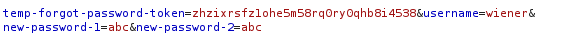
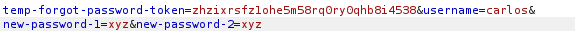
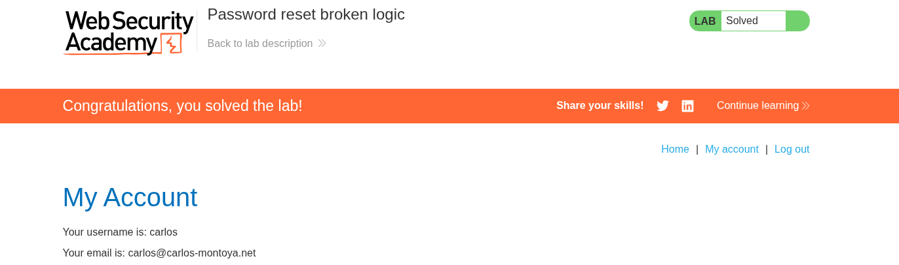

# Lab 03 — Password Reset Broken Logic

## Lab Information

- **Platform:** PortSwigger Web Security Academy
- **Category:** Authentication
- **Lab:** Password reset broken logic
- **Difficulty:** Apprentice
- **Vulnerability:** Broken password-reset logic
- **Status:** Solved

---

## Objective

Reset Carlos's password, log in to his account, and access his **My account** page.

The lab provides:

```text
Your credentials:
Username: wiener
Password: peter

Victim:
Username: carlos
```

---

## Initial Reconnaissance

I first investigated the normal password-reset workflow using my own account.

While reviewing the requests in Burp HTTP History, I identified the request responsible for actually changing the password.

The request contained both a temporary password-reset token and a username:

```http
POST /forgot-password?temp-forgot-password-token=<token>

temp-forgot-password-token=<token>&username=wiener&new-password-1=<password>&new-password-2=<password>
```

The important parameters were:

```text
temp-forgot-password-token
username
new-password-1
new-password-2
```

The presence of both the reset token and a client-supplied username was the first significant observation.



---

## Initial Hypothesis

The initial hypothesis was:

> Is the password-reset token actually bound to the account it was issued for, or does the application independently trust the `username` parameter when determining whose password should be changed?

The intended relationship should be:

```text
Wiener's reset token
        ↓
Wiener's account
        ↓
Wiener's password
```

I wanted to determine whether the application instead allowed:

```text
Wiener's reset token
        +
username=carlos
        ↓
Carlos's password
```

---

## Testing the Password Reset Request

I initially tested the normal password-reset functionality for Carlos.

A request such as:

```http
POST /forgot-password HTTP/2

username=carlos
```

caused the application to send the reset link to Carlos's email.

Because I did not have access to Carlos's email, this alone could not be used to complete the reset.

Therefore, I returned to the original hypothesis and tested whether a valid reset token from my own account could be used together with a different username.

---

## Manipulating the Username Parameter

I obtained a valid password-reset token through Wiener's password-reset flow and sent the final password-reset request to Burp Repeater.

I kept the reset token unchanged but modified:

```text
username=wiener
```

to:

```text
username=carlos
```

while supplying a new password.

Conceptually, the modified request was:

```http
POST /forgot-password?temp-forgot-password-token=<WIENER_TOKEN>

temp-forgot-password-token=<WIENER_TOKEN>&username=carlos&new-password-1=<new-password>&new-password-2=<new-password>
```



The application accepted the request and returned:

```http
HTTP/2 302 Found
Location: /
```

The redirect alone did not prove that the password had been changed, so I verified the actual impact by attempting to authenticate as Carlos.

---

## Impact Verification

I attempted to log in as:

```text
Username: carlos
Password: <new password>
```

The login succeeded.

This confirmed that the password-reset request using **Wiener's reset token** had successfully changed Carlos's password.

I then accessed Carlos's account page and confirmed that the lab was solved.



---

## Attack Flow

```text
Wiener requests password reset
        ↓
Valid reset token generated for Wiener
        ↓
Capture final password-reset request
        ↓
Send request to Burp Repeater
        ↓
Keep Wiener's reset token
        ↓
Change username from Wiener → Carlos
        ↓
Submit attacker-controlled new password
        ↓
Server accepts request
        ↓
Login as Carlos with new password
        ↓
Access Carlos's account
        ↓
Lab solved
```

---

## Vulnerability

The password-reset functionality does not properly bind the reset token to the account for which it was issued.

The application accepts:

```text
Valid reset token
+
Client-controlled username
+
New password
```

and uses the supplied username to determine which account's password should be changed.

This allows a reset token obtained for one account to be used to reset another user's password.

---

## Security Impact

An attacker who can obtain a valid password-reset token for their own account can potentially use it to reset another user's password by modifying the username parameter.

This results in account takeover:

```text
Attacker's valid reset token
        ↓
Change target username
        ↓
Set target's password
        ↓
Authenticate as target
        ↓
Account takeover
```

---

## Why the Vulnerability Exists

The application appears to treat the reset token and username as separate pieces of client-supplied information rather than securely associating the token with the intended account.

The secure design should conceptually enforce:

```text
Reset Token
    ↓
Server-side association
    ↓
Specific User
    ↓
Password Reset
```

rather than allowing:

```text
Reset Token + username parameter
                ↓
          Password Reset
```

---

## Methodology

This lab demonstrated an important password-reset testing methodology:

```text
1. Map the complete password-reset workflow.
2. Identify the request that actually changes the password.
3. Identify all parameters involved.
4. Determine which values identify the target account.
5. Determine which values prove authorization to perform the reset.
6. Test whether those values are properly bound together.
7. Modify one value at a time.
8. Verify the actual impact by authenticating with the resulting credentials.
```

The key question was not simply:

> "Can I manipulate the username?"

It was:

> **"Is the reset token securely bound to the user whose password is being changed?"**

---

## Key Takeaways

1. Password-reset tokens must be securely bound to the intended account.
2. Client-controlled usernames should not determine which account a reset token can modify.
3. A valid reset token should only authorize a password change for the account to which it was issued.
4. A `302` response alone does not prove that a password reset succeeded.
5. Always verify the actual security impact by attempting authentication with the resulting credentials.
6. Password-reset workflows should be tested as a sequence of requests rather than treating the reset page as a single feature.
7. When testing security controls, identify the relationship between authorization tokens and the resources/accounts they authorize.
8. A password-reset flaw that allows changing another user's password can result in complete account takeover.
