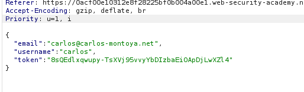

# Lab 01 — Authentication Bypass via OAuth Implicit Flow

**Platform:** PortSwigger Web Security Academy  
**Category:** Authentication / OAuth 2.0  
**Difficulty:** Apprentice  
**Status:** Completed

---

## Overview

This lab demonstrates an authentication bypass caused by flawed validation in an OAuth implicit flow.

The application uses an OAuth-based social media service for authentication. The vulnerability occurs because the client application accepts user identity information such as the username and email address from the client without properly validating that this information corresponds to the authenticated OAuth account.

The objective was to authenticate as the victim user `carlos` without knowing his password.

---

## Objective

Log in to Carlos's account.

**Target account:**

```text
Username: carlos
Email: carlos@carlos-montoya.net
```

The lab provides the following legitimate credentials for the normal OAuth authentication flow:

```text
Username: wiener
Password: peter
```

---

## Initial Reconnaissance

I first went through the application's authentication flow normally.

I entered the provided credentials:

```text
wiener:peter
```

After submitting the credentials, the application redirected me to the OAuth/social-media authorization flow.

The OAuth service requested permissions, which I approved.

After authorization, I was redirected back to the target application and successfully logged in.

At this point, I had confirmed the normal authentication flow before attempting to identify any weaknesses.

---

## Burp Suite Analysis

I intercepted and reviewed the requests generated during the authentication process using Burp Suite.

Rather than immediately modifying requests, I inspected the OAuth flow request-by-request to understand where authentication information was being exchanged and how the application established the authenticated session.

One request stood out:

```http
POST /authenticate HTTP/2
```

This request was sent after the OAuth token had been generated.

On inspecting the request body, I noticed that values related to the authenticated user's identity were being supplied by the client, including:

```text
username
email
token
```

This raised the following question:

> Does the application actually verify that the supplied username and email belong to the account represented by the OAuth token?

---

## Exploitation

I kept the valid OAuth token obtained during my own authentication flow.

I then modified the client-controlled identity values so that they referred to Carlos instead.

Conceptually, the request changed from:

```text
username = wiener
email    = <Wiener's email>
token    = <valid OAuth token>
```

to:

```text
username = carlos
email    = carlos@carlos-montoya.net
token    = <same valid OAuth token>
```

The OAuth token itself was not changed.

I then forwarded the modified request.

The application accepted the modified identity information and authenticated me as Carlos.

---

## Result

After sending the modified request, I was successfully logged into Carlos's account.

The PortSwigger lab was also marked as solved.

This demonstrated that the application was trusting client-supplied identity information instead of securely associating the authenticated OAuth identity with the account being created.

---

## Vulnerability Explanation

The fundamental issue is improper validation of the OAuth authentication response.

A secure OAuth authentication implementation should establish the user's identity from trusted information associated with the OAuth authorization/token rather than blindly trusting identity parameters supplied by the client.

In this lab, the application effectively trusted:

```text
Client → username
Client → email
Client → OAuth token
```

without adequately verifying that:

```text
OAuth token ↔ username ↔ email
```

all represented the same user.

Because of this, a legitimate token belonging to my own OAuth session could be combined with another user's identity information.

This resulted in an authentication bypass.

---

## Attack Flow

```text
1. Authenticate normally as Wiener
        ↓
2. Complete OAuth authorization
        ↓
3. Receive OAuth token
        ↓
4. Application sends POST /authenticate
        ↓
5. Inspect client-controlled identity parameters
        ↓
6. Keep the original OAuth token
        ↓
7. Change username/email to Carlos
        ↓
8. Application accepts modified identity
        ↓
9. Authenticated as Carlos
```

---

## Burp Suite Request

The important request identified during testing was:

```http
POST /authenticate HTTP/2
```

The key observation was that authentication-related identity values were present in the request and could be modified on the client side.

The successful modification is shown in:



---

## Successful Authentication

After forwarding the modified request, the application authenticated me as Carlos and the lab was successfully completed.


---

## Key Takeaways

* OAuth authentication should not automatically be assumed to be secure simply because an OAuth token is present.
* Always inspect the complete authentication flow in Burp Suite.
* Client-controlled identity parameters should be treated as untrusted input.
* OAuth tokens must be securely associated with the authenticated identity.
* Authentication decisions should be based on trusted identity information rather than arbitrary username/email values supplied by the client.
* Understanding the normal authentication flow makes it much easier to identify where trust boundaries exist.
* A valid authentication token does not make surrounding client-controlled parameters trustworthy.

---

## Tools Used

* Burp Suite Community Edition
* PortSwigger Web Security Academy
* Web browser

---

## Skills Demonstrated

* OAuth authentication flow analysis
* Authentication testing
* Burp Suite HTTP request interception
* Client-side parameter tampering
* Authentication bypass identification
* Trust-boundary analysis
* Web application security testing

---

## Lab Status

**Solved ✅**

PortSwigger Web Security Academy — Authentication Bypass via OAuth Implicit Flow
